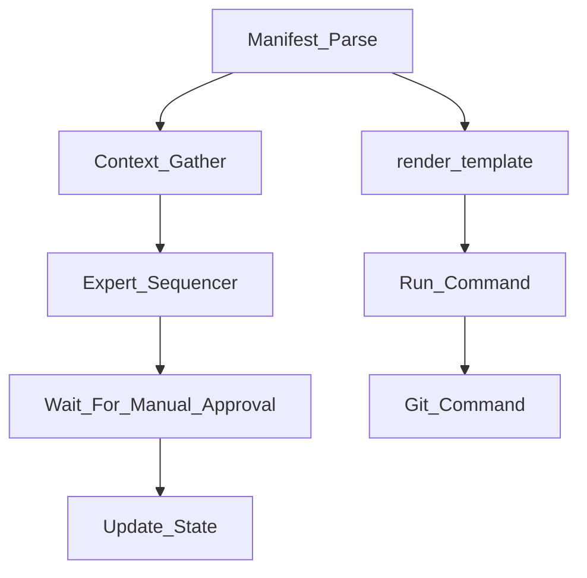
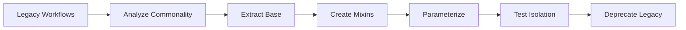

# Part 3: Workflow Composition & Fractal Patterns

## Executive Summary

Proposes a **compositional workflow system** with inheritance, mixins, and reusable atomic libraries to eliminate duplication while preserving fractal scalability across planning levels L1-L5.

## 1. Current Workflow Duplication Analysis

### 1.1 Identified Patterns

**Planning Workflows** (3 variants):
- `planning.json` (basic)
- `planning_standard.json` (V8.5)
- `planning_expert_council.json` (council focus)

**Common Pattern**:
```
Parse Manifest → Expert Analysis → Wait for Draft → 
Validate Content → Review → Approve
```

**Execution Workflows**:
- `Impl.Feature` - Feature implementation pipeline
- `Impl.Fix` - Bug fix workflow  
- `Impl.Refactor` - Refactoring workflow

**Common Pattern**:
```
Parse Context → Implementation → Lint → Test → Review
```

### 1.2 Duplication Metrics

| Workflow Type | Variants | Shared Steps | Duplication % |
|---------------|----------|--------------|---------------|
| Planning | 3 | 5/7 steps | ~71% |
| Implementation | 3 | 4/6 steps | ~67% |
| Validation | 6 | 2/3 steps | ~67% |

**Insight**: ~70% of workflow logic is repeated across variants.

## 2. Fractal Analysis

### 2.1 Cross-Level Pattern Recognition

The same workflow **structure** applies at ALL levels (L1-L5):

#### Planning Phase (All Levels)


**L1 (Inception)**: Requirements = "Business Goals"  
**L2 (Architecture)**: Requirements = "L1 Action Item"  
**L3 (Detailed Design)**: Requirements = "L2 Action Item"  
**L4 (Feature Plan)**: Requirements = "L3 Action Item"  
**L5 (Implementation)**: Requirements = "L4 Action Item"

#### Execution Phase (L4-L5 Only)


**Observation**: The **workflow skeleton is identical**, only the **scope granularity** changes.

### 2.2 Fractal Property: Self-Similarity

```
L1 Planning                    L5 Planning
┌─────────────────┐           ┌─────────────────┐
│ Strategic       │           │ File Changes    │
│ • Vision        │           │ • Function      │
│ • Roadmap       │           │ • Unit Test     │
└─────────────────┘           └─────────────────┘
      ↓                              ↓
  Same Process               Same Process
  (Research→Plan→Review)     (Research→Plan→Review)
```

**Key Insight**: We don't need 5 different workflows for L1-L5, we need:
- **1 parameterized Planning workflow**
- **1 parameterized Execution workflow**
- **Context injection** to adjust scope

## 3. Proposed: Workflow Composition Primitives

### 3.1 Workflow Inheritance

```json
// Base workflow
{
  "name": "Planning.Base",
  "abstract": true,
  "steps": [
    {"id": "parse", "ref": "Manifest_Parse"},
    {"id": "research", "ref": "Research_Phase"},
    {"id": "synthesis", "ref": "Synthesis_Phase"},
    {"id": "review", "ref": "Review_Phase"},
    {"id": "approve", "ref": "Approval_Gate"}
  ]
}

// Concrete workflow (inherits base)
{
  "name": "Planning.L4.Feature",
  "extends": "Planning.Base",
  "context": {
    "level": 4,
    "scope": "feature"
  },
  "overrides": {
    "research": {
      "expert_set": "AlphaSquad"  // L4-specific council
    }
  }
}
```

**Benefits**:
- Single source of truth for planning logic
- Level-specific customization via overrides
- DRY (Don't Repeat Yourself)

### 3.2 Workflow Mixins

```json
{
  "name": "Quality.Gates.Standard",
  "type": "mixin",
  "steps": [
    {"id": "lint", "ref": "Run_Command", "args": {"cmd": "{lint_cmd}"}},
    {"id": "complexity", "ref": "Run_Command", "args": {"cmd": "{complexity_cmd}"}},
    {"id": "unit_test", "ref": "Run_Command", "args": {"cmd": "{unit_test_cmd}"}}
  ]
}

// Usage
{
  "name": "Impl.Feature",
  "steps": [
    {"id": "code", "ref": "Development_Phase"},
    {"id": "quality", "include": "Quality.Gates.Standard"},  // Mixin
    {"id": "review", "ref": "Code_Review"}
  ]
}
```

### 3.3 Workflow Templates

Template workflows = reusable patterns with placeholders:

```json
{
  "name": "Generic.Planning.Template",
  "parameters": {
    "level": "integer",
    "expert_set": "string",
    "approval_threshold": "integer"
  },
  "steps": [
    {
      "id": "research",
      "ref": "Expert_Sequencer",
      "args": {
        "expert_set": "${expert_set}",
        "level": "${level}"
      }
    }
  ]
}

// Instantiation
{
  "name": "Planning.L3.Service",
  "from_template": "Generic.Planning.Template",
  "parameters": {
    "level": 3,
    "expert_set": "PlatformGrid",
    "approval_threshold": 2
  }
}
```

### 3.4 Pipeline Composition

```json
{
  "name": "Impl.Feature.Pipeline",
  "type": "pipeline",
  "stages": [
    {"name": "development", "workflow": "Dev.TDD"},
    {"name": "quality", "workflow": "Quality.Full"},
    {"name": "integration", "workflow": "Test.Integration"},
    {"name": "review", "workflow": "Review.Technical"}
  ],
  "on_failure": {
    "retry": false,
    "rollback": true
  }
}
```

## 4. Atomic Task Library

### 4.1 Current Atoms (Categorized)

**Context Management**:
- `Manifest_Parse` - Extract task context
- `Context_Gather` - Collect related files

**Document Generation**:
- `render_template` - Jinja2 rendering
- `Prompt_Render` - Dynamic prompts

**Orchestration**:
- `Expert_Loop` - Iterate experts (legacy)
- `Expert_Sequencer` - Sequential expert analysis (V8.9.1)
- `Wait_For_Manual_Approval` - Blocking gate

**Execution**:
- `Run_Command` - Shell commands
- `Git_Command` - Git operations

**State**:
- `Update_State` - Modify workflow state

### 4.2 Proposed Atom Extensions

**Required for Composition**:

| Atom | Purpose | Priority |
|------|---------|----------|
| `Workflow_Include` | Embed sub-workflow | HIGH |
| `Conditional_Step` | If/else logic | HIGH |
| `Parallel_Execute` | Run steps concurrently | MEDIUM |
| `Context_Filter` | Agent isolation support | HIGH |
| `Artifact_Validate` | Schema validation | MEDIUM |
| `Checkpoint_Save` | State snapshots | LOW |

**Example: `Conditional_Step`**:
```json
{
  "id": "conditional_review",
  "ref": "Conditional_Step",
  "condition": "${complexity} > 7",
  "then": {"ref": "Review.Senior"},
  "else": {"ref": "Review.Standard"}
}
```

### 4.3 Atom Dependency Graph



**Reusability Score**:
- `Manifest_Parse`: Used in 90% of workflows
- `render_template`: Used in 70% of workflows
- `Expert_Sequencer`: Used in 100% of planning workflows

## 5. Refactoring Strategy

### 5.1 Consolidation Plan

#### Phase 1: Extract Base Workflows

Replace:
- `planning.json`, `planning_standard.json`, `planning_expert_council.json`

With:
- `base_planning.json` (abstract)
- `planning_l1.json` (extends base, level=1)
- `planning_l2.json` (extends base, level=2)
- ...
- `planning_l5.json` (extends base, level=5)

#### Phase 2: Create Mixin Library

```
workflow_core/config/mixins/
├── quality_gates.json
├── git_lifecycle.json
├── documentation_check.json
└── review_standard.json
```

#### Phase 3: Parameterize Existing Workflows

Convert hardcoded values to parameters:
```json
// Before
{
  "expert_set": "AlphaSquad"
}

// After
{
  "expert_set": "${context.expert_set}"
}
```

### 5.2 Migration Path



**Timeline**:
- Week 1: Analysis + Base workflow extraction
- Week 2: Mixin creation + Atom extensions
- Week 3: Test new system on pilot task
- Week 4: Migration + Legacy deprecation

## 6. Fractal Workflow Registry

### 6.1 Unified Registry Structure

```json
{
  "workflows": {
    "base": {
      "Planning": "base_planning.json",
      "Execution": "base_execution.json"
    },
    "levels": {
      "L1": {
        "Planning": {"extends": "base.Planning", "params": {"level": 1}}
      },
      "L2": {
        "Planning": {"extends": "base.Planning", "params": {"level": 2}}
      }
    },
    "mixins": {
      "QualityGates": "mixins/quality_gates.json",
      "GitLifecycle": "mixins/git_lifecycle.json"
    }
  },
  "routing": {
    "prefix_to_workflow": {
      "Plan": "Planning.${level}",
      "Impl": "Execution.Feature"
    }
  }
}
```

### 6.2 Dynamic Workflow Resolution

```python
def resolve_workflow(task_id, prefix, context):
    """
    Dynamically selects workflow based on task metadata.
    """
    # Calculate level from task ID
    level = len(task_id.split('.'))
    
    # Map prefix to workflow family
    workflow_family = ROUTE_MAP[prefix]
    
    # Resolve parameterized workflow
    if "${level}" in workflow_family:
        workflow_name = workflow_family.replace("${level}", f"L{level}")
    else:
        workflow_name = workflow_family
    
    # Load and instantiate
    return load_workflow(workflow_name, context)
```

## 7. Composition Examples

### 7.1 Example: L3 Service Planning

**Base Workflow** (`base_planning.json`):
```json
{
  "name": "Base.Planning",
  "abstract": true,
  "steps": [
    {"id": "parse", "ref": "Manifest_Parse"},
    {"id": "research", "ref": "Research_Phase"},
    {"id": "synthesis", "ref": "Synthesis_Phase"},
    {"id": "review", "ref": "Review_Phase"}
  ]
}
```

**L3 Instantiation** (`planning_l3.json`):
```json
{
  "name": "Planning.L3.Service",
  "extends": "Base.Planning",
  "context": {
    "level": 3,
    "scope": "service",
    "expert_set": "PlatformGrid"
  },
  "insert_after": {
    "synthesis": [
      {"id": "api_validation", "ref": "Validate_API_Spec"}
    ]
  }
}
```

**Result**: L3 workflow = Base + API validation step

### 7.2 Example: Feature Implementation with Mixins

```json
{
  "name": "Impl.Feature.Python",
  "steps": [
    {"id": "tdd", "ref": "TDD_Development"},
    {"include": "Quality.Gates.Python"},  // Mixin
    {"include": "Test.Integration.Standard"},  // Mixin
    {"id": "review", "ref": "Code_Review"}
  ]
}
```

**Quality.Gates.Python** (Mixin):
```json
{
  "type": "mixin",
  "steps": [
    {"id": "black", "ref": "Run_Command", "args": {"cmd": "black --check"}},
    {"id": "pylint", "ref": "Run_Command", "args": {"cmd": "pylint"}},
    {"id": "pytest", "ref": "Run_Command", "args": {"cmd": "pytest"}}
  ]
}
```

## 8. Validation & Testing Strategy

### 8.1 Workflow Linter

```bash
$ flow_manager lint workflow planning_l3.json

✓ Inherits from valid base: Base.Planning
✓ All overrides target existing steps
✓ No circular dependencies
✗ ERROR: Expert set 'InvalidTeam' not defined in core_teams.json
```

### 8.2 Dry-Run Mode

```bash
$ flow_manager start 4.3.2 --dry-run

[DRY RUN] Would execute workflow: Planning.L3.Service
[DRY RUN] Steps resolved:
  1. parse (Manifest_Parse)
  2. research (Research_Phase) - expert_set: PlatformGrid
  3. api_validation (Validate_API_Spec)  // Injected by L3
  4. synthesis (Synthesis_Phase)
  5. review (Review_Phase)
```

## 9. Benefits Analysis

### 9.1 Reduced Maintenance

**Before**: 15 workflow files, ~1200 LOC  
**After**: 5 base + 10 mixins = 15 files, ~600 LOC  
**Savings**: 50% code reduction

### 9.2 Improved Consistency

- Single source of truth for common patterns
- Centralized updates propagate automatically
- Reduced risk of divergence

### 9.3 Enhanced Testability

- Base workflows can be unit tested
- Mixins tested in isolation
- Composition tested via dry-run

## 10. Implementation Roadmap

### Sprint 1: Engine Enhancements
- [ ] Implement workflow inheritance resolver
- [ ] Add mixin include mechanism
- [ ] Create template parameter system
- [ ] Add workflow linter

### Sprint 2: Refactor Existing Workflows
- [ ] Extract `Base.Planning` from existing variants
- [ ] Create L1-L5 parameterized instances
- [ ] Build quality gates mixin library
- [ ] Migrate 3 pilot workflows

### Sprint 3: Validation & Testing
- [ ] Comprehensive dry-run testing
- [ ] Backward compatibility verification
- [ ] Performance benchmarking
- [ ] Documentation updates

### Sprint 4: Full Migration
- [ ] Convert all workflows to new system
- [ ] Deprecate legacy workflows
- [ ] Update developer handbook
- [ ] Training/onboarding materials

## 11. Conclusion

Workflow composition eliminates 50-70% of duplication while **preserving fractal properties**. The proposed system:

✅ **Maintains** L1-L5 fractal scalability  
✅ **Eliminates** redundant workflow definitions  
✅ **Enables** rapid workflow evolution via mixins  
✅ **Improves** testability and validation  
✅ **Prepares** foundation for agent isolation (Part 2)  

---

**Status**: ✅ Workflow Composition Strategy Defined  
**Next**: Part 4 - Development Plan Document Format
