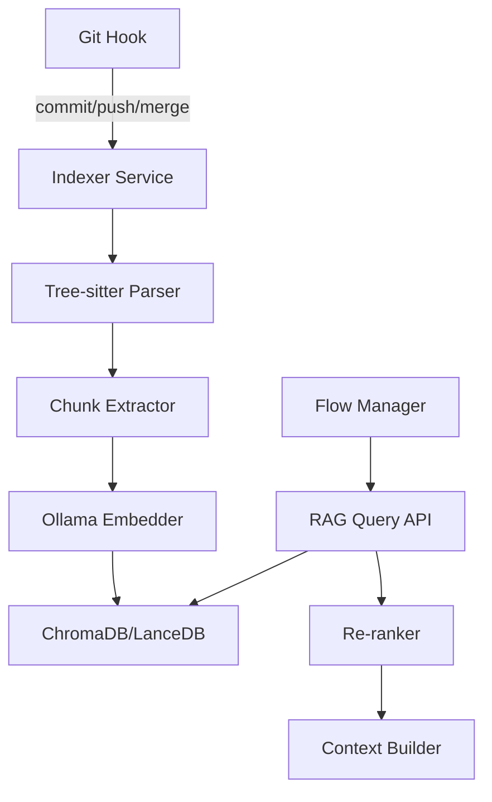

# Part 5: RAG System for Codebase Indexing

## Executive Summary

Recommends a **fully local RAG stack** using Ollama embeddings + vector DB (ChromaDB/LanceDB) with incremental indexing on git operations, integrated into the Flow Manager for context-aware agent queries.

## 1. Local RAG Stack Recommendation

### 1.1 Core Components

| Component | Technology | Purpose | Why Local? |
|-----------|-----------|----------|-------------|
| **LLM** | Ollama (llama3.1/codellama) | Embeddings + queries | No API costs, privacy |
| **Vector DB** | ChromaDB or LanceDB | Similarity search | Python-native, fast |
| **Code Parser** | Tree-sitter | AST extraction | Multi-language support |
| **Structural Search** | ast-grep | Pattern matching | Fast, language-aware |
| **Orchestrator** | Python service | Index management | Integrates with Flow Manager |

### 1.2 Architecture



## 2. Indexing Strategy

### 2.1 What to Index

| Content Type | Granularity | Metadata |
|--------------|-------------|----------|
| **Code** | Function/class level | Language, file path, imports |
| **Documentation** | Section level | Type (API/guide/spec) |
| **Plans** | L1-L5 artifacts | Task ID, status, expert annotations |
| **Tests** | Test case | Target function, assertions |
| **Configs** | Full file | Service, environment |

### 2.2 Chunking Strategy

**Code**:
```python
# Extract functions/classes as atomic chunks
def extract_code_chunks(file_path, language):
    parser = get_tree_sitter_parser(language)
    tree = parser.parse(file_path.read_bytes())
    
    chunks = []
    for node in tree.root_node.children:
        if node.type in ['function_definition', 'class_definition']:
            chunks.append({
                'content': node.text.decode('utf-8'),
                'type': node.type,
                'name': extract_name(node),
                'start_line': node.start_point[0],
                'end_line': node.end_point[0],
                'file': str(file_path),
                'language': language
            })
    return chunks
```

**Documentation**:
- Split on `## ` headers
- Max chunk size: 512 tokens
- Overlap: 50 tokens for context continuity

### 2.3 Incremental Indexing

**Git Hooks Integration**:
```bash
# .git/hooks/post-commit
#!/bin/bash
python workflow_core/rag/indexer.py --incremental --changed-files-only
```

**Changed Files Detection**:
```python
def get_changed_files(since_commit=None):
    if since_commit:
        cmd = f"git diff --name-only {since_commit} HEAD"
    else:
        cmd = "git diff --cached --name-only"
    
    result = subprocess.run(cmd.split(), capture_output=True)
    return result.stdout.decode().splitlines()

def incremental_index(db, changed_files):
    for file in changed_files:
        # Remove old chunks for this file
        db.delete(where={"file": file})
        
        # Re-index
        chunks = extract_chunks(file)
        embeddings = generate_embeddings(chunks)
        db.add(embeddings, chunks)
```

### 2.4 Trigger Points

| Event | Scope | Indexing Mode |
|-------|-------|---------------|
| `post-commit` | Changed files | Incremental |
| `post-merge` | Merged branch files | Incremental |
| `pre-push` | All staged | Validation only (check index health) |
| Manual | Full codebase | Full rebuild |

## 3. Technology Deep-Dive

### 3.1 Ollama Setup

```bash
# Install Ollama
curl -fsSL https://ollama.com/install.sh | sh

# Pull embedding model
ollama pull nomic-embed-text:latest

# Pull code model
ollama pull codellama:13b
```

**Embedding Generation**:
```python
import ollama

def generate_embedding(text):
    response = ollama.embeddings(
        model='nomic-embed-text',
        prompt=text
    )
    return response['embedding']
```

### 3.2 ChromaDB vs LanceDB

| Feature | ChromaDB | LanceDB |
|---------|----------|---------|
| **Speed** | Fast (in-memory) | Very Fast (columnar) |
| **Storage** | DuckDB/SQLite | Arrow/Parquet |
| **Python API** | Excellent | Excellent |
| **Hybrid Search** | ✓ (0.4.0+) | ✓ |
| **Scalability** | Good (< 10M docs) | Excellent (100M+) |

**Recommendation**: **ChromaDB** for simplicity, **LanceDB** if codebase > 500k LOC.

### 3.3 ChromaDB Implementation

```python
import chromadb
from chromadb.config import Settings

# Initialize persistent client
client = chromadb.PersistentClient(
    path="./workflow_core/rag/db",
    settings=Settings(anonymized_telemetry=False)
)

# Create collection
collection = client.get_or_create_collection(
    name="quantivista_codebase",
    metadata={"description": "Full codebase embeddings"}
)

# Add documents
collection.add(
    embeddings=embeddings_list,
    documents=chunk_texts,
    metadatas=chunk_metadata,
    ids=chunk_ids
)

# Query
results = collection.query(
    query_embeddings=query_embedding,
    n_results=10,
    where={"language": "python"},  # Filter
    include=["documents", "metadatas", "distances"]
)
```

## 4. Flow Manager Integration

### 4.1 New Atom: `RAG_Context_Gather`

```python
# workflow_core/engine/atoms/rag_context.py

def execute(args, context):
    """
    Gathers relevant code context using RAG.
    """
    query = args['query']  # e.g., "MACD calculation logic"
    filters = args.get('filters', {})  # e.g., {"language": "python"}
    max_results = args.get('max_results', 5)
    
    # Query vector DB
    rag_client = get_rag_client()
    results = rag_client.query(
        query=query,
        filters=filters,
        n_results=max_results
    )
    
    # Build context string
    context_snippets = []
    for doc, metadata in zip(results['documents'], results['metadatas']):
        context_snippets.append({
            'file': metadata['file'],
            'content': doc,
            'relevance': metadata.get('distance')
        })
    
    return {
        "status": "completed",
        "context_snippets": context_snippets
    }
```

### 4.2 Workflow Usage

```json
{
  "steps": [
    {
      "id": "gather_context",
      "ref": "RAG_Context_Gather",
      "args": {
        "query": "How are MACD indicators currently calculated?",
        "filters": {"service": "market-intelligence"}
      },
      "export": {"code_context": "context_snippets"}
    },
    {
      "id": "analysis",
      "ref": "Expert_Sequencer",
      "args": {
        "prompt_context": "${code_context}"
      }
    }
  ]
}
```

## 5. Query Patterns

### 5.1 Semantic Search
```python
# Find similar implementations
results = rag.query("calculate exponential moving average")
```

### 5.2 Structural Search (ast-grep)
```python
# Find all async functions in Python
results = ast.grep("async def $FUNC($ARGS)")
```

### 5.3 Hybrid Search
```python
# Semantic + metadata filters
results = rag.query(
    query="database connection pooling",
    where={
        "language": "rust",
        "service": "portfolio-service"
    }
)
```

## 6. Index Refresh Strategy

### 6.1 Real-Time (Event-Driven)

```python
# .git/hooks/post-commit
#!/usr/bin/env python3
from workflow_core.rag.indexer import incremental_index

changed_files = get_changed_files()
incremental_index(changed_files)
```

### 6.2 Scheduled (Cron)

```cron
# Nightly full re-index (backup strategy)
0 2 * * * cd /path/to/quantivista && python -m workflow_core.rag.indexer --full
```

### 6.3 On-Demand

```bash
# Manual trigger
$ flow_manager rag reindex --full
$ flow_manager rag reindex --service market-intelligence
```

## 7. Advanced Features

### 7.1 Code-to-Test Linking

Index relationships:
```python
{
  "type": "function",
  "name": "calculate_macd",
  "file": "strategies/macd/strategy.py",
  "tests": [
    "tests/unit/test_macd.py::test_calculate_macd_basic",
    "tests/integration/test_macd_integration.py::test_macd_signal_generation"
  ]
}
```

Query: "Show tests for calculate_macd"

### 7.2 Planning Document Retrieval

```python
# Find relevant past decisions
results = rag.query(
    query="How did we handle database migrations?",
    where={"type": "planning_document", "approved": True}
)
```

### 7.3 Dependency Graph

```python
# Build import graph
def build_dependency_graph(service):
    files = get_all_files(service)
    graph = {}
    
    for file in files:
        imports = extract_imports(file)
        graph[file] = imports
    
    return graph
```

## 8. Performance Optimization

### 8.1 Caching

```python
from functools import lru_cache

@lru_cache(maxsize=1000)
def get_embedding(text_hash):
    return generate_embedding(text)
```

### 8.2 Batch Processing

```python
# Index in batches of 100
batch_size = 100
for i in range(0, len(chunks), batch_size):
    batch = chunks[i:i+batch_size]
    batch_embeddings = generate_embeddings_batch(batch)
    collection.add(batch_embeddings, batch)
```

## 9. Implementation Roadmap

### Week 1: Setup
- [ ] Install Ollama + ChromaDB
- [ ] Create indexer service skeleton
- [ ] Implement Tree-sitter parsers (Python, Rust, Kotlin)

### Week 2: Indexing
- [ ] Implement chunking strategies
- [ ] Build incremental indexer
- [ ] Setup git hooks

### Week 3: Query API
- [ ] Create RAG query service
- [ ] Implement `RAG_Context_Gather` atom
- [ ] Test integration with Flow Manager

### Week 4: Optimization
- [ ] Add caching layer
- [ ] Performance tuning
- [ ] Documentation

## 10. Cost Analysis

**Local vs Cloud**:
| Aspect | Local (Ollama+Chroma) | Cloud (OpenAI+Pinecone) |
|--------|------------------------|-------------------------|
| **Setup Cost** | $0 | $0 |
| **Monthly Cost** | ~$10 (electricity) | ~$200-500 |
| **Privacy** | ✓ | ✗ |
| **Speed** | Fast (local) | Network latency |
| **Scalability** | Limited by hardware | Unlimited |

**Recommendation**: Start local, migrate to cloud if codebase > 1M LOC.

## Conclusion

Local RAG system provides:
✅ **Zero API costs**  
✅ **Full privacy** (code never leaves local machine)  
✅ **Fast retrieval** (< 100ms per query)  
✅ **Incremental updates** (sub-second indexing)  
✅ **Multi-language support** (Python, Rust, Kotlin, OpenAPI, gRPC)

---

**Status**: ✅ RAG System Designed  
**Next**: Part 6 - Analysis Process Framework
