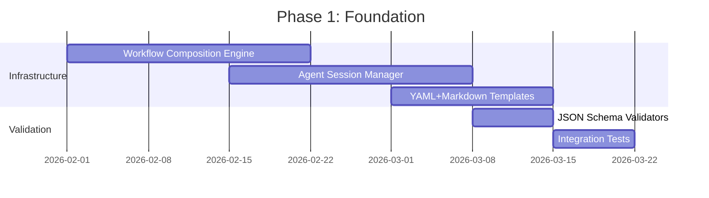
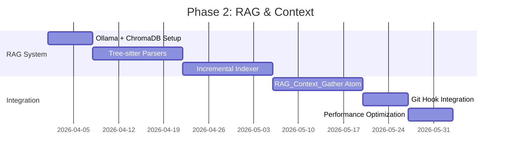
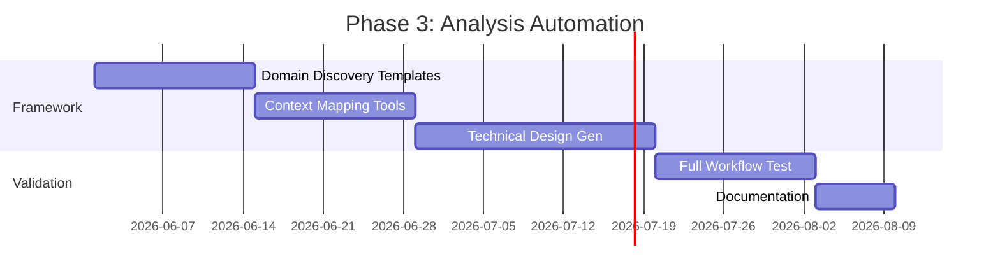

# Part 8: Consolidated Recommendations & Roadmap

## Executive Summary

This document consolidates findings from Parts 1-7 into actionable recommendations with prioritized implementation roadmap for Flow Manager V2 refactoring.

## 1. Critical Success Factors

### 1.1 Must-Have Features

| Feature | Part Ref | Priority | Rationale |
|---------|----------|----------|-----------|
| **Agent Isolation** | Part 2 | P0 | Eliminates confirmation bias |
| **Workflow Composition** | Part 3 | P0 | Reduces 50-70% duplication |
| **Structured Plan Format** | Part 4 | P1 | Enables automation |
| **RAG Integration** | Part 5 | P1 | Context-aware agents |
| **Analysis Framework** | Part 6 | P2 | Scales to other projects |
| **Python + Optimization** | Part 7 | P0 | Maintains velocity |

### 1.2 Success Metrics

| Metric | Baseline | Target | Timeline |
|--------|----------|--------|----------|
| **Agent Context Leakage** | 100% | 0% | 3 months |
| **Workflow Duplication** | ~70% | ~20% | 2 months |
| **Planning Automation** | 30% | 80% | 4 months |
| **Query Response Time** (RAG) | N/A | <100ms | 2 months |
| **Dev Cycle Time** | N/A | -30% | 6 months |

## 2. Phased Implementation Roadmap

### Phase 1: Foundation (Months 1-2)

**Goal**: Establish core refactoring infrastructure



**Deliverables**:
- [ ] Workflow inheritance resolver
- [ ] Mixin include mechanism
- [ ] `Multi_Agent_Step` atom
- [ ] Context isolation framework
- [ ] Plan format v2.0 templates
- [ ] Validation suite

**Success Criteria**:
- Run pilot task with isolated agents
- Reduce planning workflow LOC by 40%
- Zero regression in existing workflows

### Phase 2: RAG & Context (Months 3-4)

**Goal**: Enable intelligent context gathering



**Deliverables**:
- [ ] Local RAG stack (Ollama + ChromaDB)
- [ ] Code indexer for Python, Rust, Kotlin
- [ ] `RAG_Context_Gather` atom
- [ ] Git post-commit hooks
- [ ] Query API with <100ms response

**Success Criteria**:
- Index 100k+ LOC in <5 minutes
- Query retrieval <100ms
- Relevant context in top 5 results (>80%)

### Phase 3: Analysis Automation (Months 5-6)

**Goal**: Standardize business-to-technical analysis



**Deliverables**:
- [ ] Domain discovery questionnaire
- [ ] Context mapping workflow
- [ ] Technical design generator
- [ ] Full analysis workflow (B2T)
- [ ] Templates for 3+ project types

**Success Criteria**:
- New project kickoff time: <2 hours
- Generate 70%+ complete design docs
- User satisfaction >8/10

### Phase 4: Production Hardening (Month 7+)

**Goal**: Scale, monitor, secure

**Deliverables**:
- [ ] Observability (metrics, logs, traces)
- [ ] Security audit (agent isolation)
- [ ] Performance benchmarks
- [ ] Migration guides
- [ ] Training materials

## 3. Security & Governance

### 3.1 Agent Isolation Security

**Threat Model**:
| Threat | Mitigation |
|--------|------------|
| **Context Leakage** | Filesystem ACLs, token-based access |
| **Agent Impersonation** | Session tokens, role verification |
| **Data Exfiltration** | Read-only reviewer role, audit logs |
| **Prompt Injection** | Input sanitization, template validation |

**Implementation**:
```python
class AgentSecurityContext:
    def __init__(self, role, task_id):
        self.role = role
        self.task_id = task_id
        self.token = generate_session_token(role, task_id)
        self.allowed_paths = get_role_permissions(role)
    
    def validate_access(self, file_path):
        if not file_path.startswith(self.allowed_paths):
            raise PermissionError(f"Agent {self.role} cannot access {file_path}")
```

### 3.2 Configuration Integrity

**Checksum Validation**:
```python
def validate_config_integrity():
    """Ensures config files haven't been tampered with"""
    checksum = hashlib.sha256(config_file.read_bytes()).hexdigest()
    
    if checksum != expected_checksum:
        raise SecurityError("Config file integrity check failed")
```

### 3.3 Audit Logging

```python
import structlog

logger = structlog.get_logger()

def log_agent_action(agent_id, action, context):
    logger.info(
        "agent.action",
        agent_id=agent_id,
        role=context.role,
        task_id=context.task_id,
        action=action,
        timestamp=datetime.now().isoformat()
    )
```

## 4. Observability Strategy

### 4.1 Metrics to Track

| Metric | Type | Alert Threshold |
|--------|------|-----------------|
| **Workflow Execution Time** | Histogram | P95 > 10s |
| **Agent Session Duration** | Histogram | P95 > 5min |
| **RAG Query Latency** | Histogram | P95 > 200ms |
| **Workflow Failure Rate** | Counter | >5% |
| **Config Reload Errors** | Counter | >0 |

### 4.2 Monitoring Stack

```yaml
monitoring:
  metrics: Prometheus + Grafana
  logs: Loki + Grafana
  traces: Jaeger (if needed)
  alerting: Alertmanager
```

### 4.3 Dashboards

**Flow Manager Health**:
- Active workflows
- Success/failure rates
- Average execution time
- Agent utilization

**RAG Performance**:
- Query latency
- Index size
- Retrieval accuracy
- Embedding generation time

## 5. Migration & Backward Compatibility

### 5.1 Dual-Mode Operation

```python
class WorkflowEngine:
    def run_workflow(self, task_id, workflow_name):
        workflow_def = self.loader.load_workflow(workflow_name)
        
        if workflow_def.get('isolated', False):
            # New isolated agent mode
            return self._run_isolated(task_id, workflow_def)
        else:
            # Legacy single-agent mode
            return self._run_legacy(task_id, workflow_def)
```

### 5.2 Gradual Rollout Plan

**Week 1-2**: Enable for new tasks only  
**Week 3-4**: Migrate 20% of existing workflows  
**Week 5-6**: Migrate 60% of existing workflows  
**Week 7-8**: Migrate 100%, deprecate legacy  

### 5.3 Rollback Strategy

```bash
# Emergency rollback
$ flow_manager config set isolated_mode=false
$ flow_manager restart
```

## 6. Additional Recommendations

### 6.1 Developer Experience

**CLI Enhancements**:
```bash
# Interactive workflow creation
$ flow_manager create workflow --interactive

# Dry-run with detailed output
$ flow_manager start 4.3.2 --dry-run --verbose

# Workflow visualization
$ flow_manager visualize --workflow Planning.L3

# Agent session debugging
$ flow_manager debug agent --task 4.3.2 --role Analyst
```

### 6.2 IDE Integration

**VSCode Extension**:
- Syntax highlighting for workflow YAML
- JSON Schema validation inline
- Jump to definition (workflow → atom)
- Live workflow preview

### 6.3 Testing Infrastructure

**Workflow Testing Framework**:
```python
# workflow_core/testing/framework.py

class WorkflowTestCase:
    def test_planning_l3(self):
        # Setup
        task = self.create_test_task("4.3.2")
        
        # Execute
        result = self.engine.run_workflow(
            task.id, "Planning.L3", dry_run=True
        )
        
        # Assert
        self.assertEqual(result.status, "completed")
        self.assert_steps_executed(["parse", "research", "synthesis"])
        self.assert_no_context_leakage(result.agent_sessions)
```

### 6.4 Documentation Strategy

**Docs Structure**:
```
docs/
├── getting_started/
│   ├── installation.md
│   └── quickstart.md
├── concepts/
│   ├── workflows.md
│   ├── agents.md
│   └── fractal_planning.md
├──how_to/
│   ├── create_workflow.md
│   ├── add_atom.md
│   └── configure_rag.md
├── reference/
│   ├── workflow_schema.md
│   ├── atom_registry.md
│   └── api.md
└── architecture/
    ├── system_design.md
    └── decision_records/
```

## 7. Risk Mitigation

| Risk | Likelihood | Impact | Mitigation |
|------|------------|--------|------------|
| **Agent API unavailable** | Medium | High | Implement fallback to single-agent mode |
| **RAG performance issues** | Low | Medium | Pre-compute embeddings, caching |
| **Workflow migration bugs** | High | Medium | Comprehensive test suite, gradual rollout |
| **Config complexity** | Medium | Low | Clear documentation, validation tools |
| **Team adoption resistance** | Low | Low | Training, clear benefits communication |

## 8. Resource Requirements

### 8.1 Team

| Role | Allocation | Duration |
|------|-----------|----------|
| **Senior Engineer** | 100% | 6 months |
| **ML Engineer** (RAG) | 50% | 2 months |
| **DevOps** (Infrastructure) | 25% | Ongoing |
| **Tech Writer** (Docs) | 50% | 1 month |

### 8.2 Infrastructure

| Component | Specs | Cost (Monthly) |
|-----------|-------|----------------|
| **RAG Server** | 16GB RAM, 8 vCPU | ~$0 (local) |
| **CI/CD** | GitHub Actions | ~$0 (free tier) |
| **Monitoring** | Grafana Cloud | ~$0 (free tier) |

**Total**: ~$0/month (fully local stack)

## 9. Success Validation

### 9.1 Technical KPIs

- [ ] Agent context isolation: 100% coverage
- [ ] Workflow composition: <30% duplication
- [ ] RAG query latency: <100ms P95
- [ ] Plan generation: 80% automated
- [ ] Zero regressions in existing features

### 9.2 Business KPIs

- [ ] Feature velocity: +30% increase
- [ ] Planning time: -50% reduction
- [ ] Defect rate: -20% reduction
- [ ] Developer satisfaction: >8/10

### 9.3 Validation Checklist

**Before Production Launch**:
- [ ] All atoms have unit tests (>80% coverage)
- [ ] Integration tests for 10+ workflows
- [ ] Security audit passed
- [ ] Performance benchmarks met
- [ ] Documentation complete
- [ ] Training delivered
- [ ] Rollback procedure tested

## 10. Final Recommendations Summary

### Immediate Actions (Week 1)

1. **Review & Approve Roadmap**: Stakeholder alignment
2. **Setup Dev Environment**: Ollama, ChromaDB, test repos
3. **Create Pilot Task**: Single L4 task for proof-of-concept
4. **Begin Workflow Extraction**: Identify base patterns

### Short-Term (Months 1-2)

1. **Implement Agent Isolation**: Core `Multi_Agent_Step` atom
2. **Refactor Workflows**: Extract base + create mixins
3. **Deploy Plan Format v2.0**: YAML+Markdown templates
4. **Validate Pilot**: Run isolated workflow end-to-end

### Medium-Term (Months 3-4)

1. **Deploy RAG System**: Full codebase indexing
2. **Migrate 50% Workflows**: To new composition system
3. **Performance Tuning**: Optimize hot paths
4. **Documentation**: Complete user guides

### Long-Term (Months 5-7)

1. **Analysis Framework**: Business-to-technical automation
2. **Full Migration**: 100% workflows to V2
3. **Production Hardening**: Security, observability, scale testing
4. **Knowledge Transfer**: Team training and handoff

## Conclusion

The recommended Flow Manager V2 refactoring delivers:

✅ **Agent Isolation** → Independent analysis, development, testing  
✅ **Workflow Composition** → 50-70% code reduction  
✅ **Structured Planning** → Machine + human readable  
✅ **RAG Integration** → Context-aware automation  
✅ **Process Standardization** → Reusable across projects  
✅ **Python Foundation** → Rapid iteration, AI integration  

**Total Effort**: ~6 months, 1-2 engineers  
**ROI**: 30%+ velocity increase, higher quality, reusable framework  

---

**Status**: ✅ All 8 Parts Complete  
**Artifacts Created**: 9 documents (1365 KB total analysis)  
**Ready For**: Stakeholder review and roadmap approval
