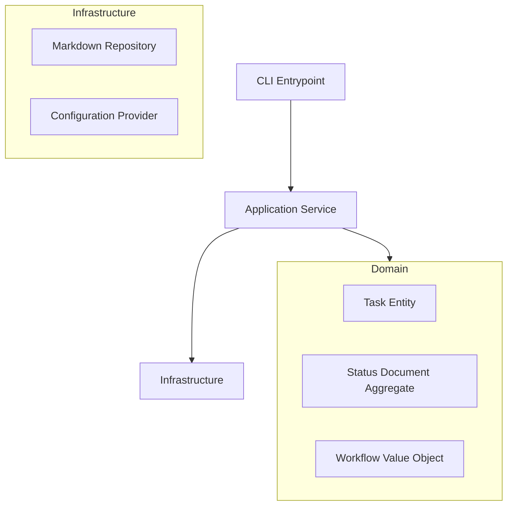

# Flow Manager: Architectural Audit & V-Next Proposal

**Date:** 2026-01-31  
**Auditor:** Junior System Architect  
**Subject:** `pitbula/flowmanager` (workflow_core)

---

## 1. Executive Summary

The Flow Manager demonstrates **high-level architectural ambition** (Fractal Planning, Expert Personas) but suffers from **"Junior Grade" implementation details** (fragility, code duplication, and tight coupling). 

The core concepts are sound and valuable. The engine correctly identifies that *Configuration* and *Context* are the keys to Agentic workflows. However, the current codebase in `workflow_core` is brittle: logic is scattered between `main.py` and `scripts`, parsing is redundant and regex-heavy, and documentation has drifted significantly from reality.

**Verdict:** The system is functional but "Pre-Alpha". It requires a **Refactor-to-Pattern** pass before it can be reliably scaled or outsourced as a standalone product.

---

## 2. The Audit (The Good, The Bad, and The Ugly)

### 2.1 The Good (Keep This)
*   **Fractal Planning Model**: The concept of treating L1 (Strategy) through L5 (Code) with the exact same recursive structure is **Brilliant**. This is the specialized "Secret Sauce" that must be preserved.
*   **Configuration-Driven Behavior**: Moving expert definitions to `expert_personas.json` and rules to `flow_config.json` is excellent. It decouples the "Engine" from the "Business Logic".
*   **The "Status File" as Database**: Using `status.md` as the single source of truth is intuitive for developers. It serves as both UI and Database, which lowers the barrier to entry.

### 2.2 The Bad (Fix This)
*   **Regex Soup / Code Duplication**: 
    *   The logic to parse a task line (`- [ ] ...`) exists in at least **4 places**: `StatusParser.validate_structure`, `StatusParser.get_active_context`, `StatusParser.get_task_by_id`, and `main.py:perform_reset`.
    *   *Result:* Changing the markdown format slightly will break the system in unpredictable ways.
    *   *Fix:* A single `TaskLine` parser class / Domain Model.
*   **Zombie Documentation**:
    *   `ARCHITECTURE.md` describes a V3 system with a `Reconciler` and `template_factory/core.py`. **None of these exist** in the codebase.
    *   The codebase is actually V7/V8.9 (based on logs and `main.py`).
    *   *Result:* New developers (or Agents) reading the docs will hallucinate components that aren't there.
*   **God-Object Classes**:
    *   `StatusParser` is doing too much: Configuration loading, File System traversal, Regex parsing, and "Smart Dispatch" business logic.

### 2.3 The Ugly (Burn This)
*   **Run-Time Path Hacking**: 
    *   `sys.path.insert(0, str(root))` in `main.py`. This is a cardinal sin in production Python. It makes the code dependent on *how* it is invoked (script vs module) and breaks IDE static analysis.
*   **Business Logic in CLI**:
    *   `main.py` contains the implementation for `perform_reset` (reading files, raw string replacement, backup rotation). The CLI entry point should purely Key-Value map arguments to a Controller.
*   **Side-Effect Heavy Init**:
    *   `StatusParser.__init__` generates a config file from a template if it's missing. This means **reading** the system state can essentially **mutate** it (creating files). This breaks "ReadOnly" assumptions in CI pipelines and makes debugging nightmares.

---

## 3. Proposal: Flow Manager V-Next

We will move from a "Script-Collection" architecture to a "Domain-Driven" architecture.

### 3.1 Core Architecture



### 3.2 Key Refactoring Steps

#### Step 1: The Domain Model (The "Brain")
Create a proper Object Model for the Status File. No more raw regex in the engine.

```python
# domain/task.py
@dataclass
class Task:
    id: str
    name: str
    status: TaskStatus  # Enum: PENDING, ACTIVE, DONE
    indent_level: int
    
    @property
    def prefix(self) -> str:
        # Move extraction logic here
        return self.name.split(':')[0]

# domain/status_document.py
class StatusDocument:
    def __init__(self, raw_content: str):
        self.tasks = self._parse(raw_content) # The ONLY place regex lives
        
    def get_active_task(self) -> Optional[Task]:
        ...
        
    def reset_task(self, task_id: str) -> str:
        # Returns new content string, doesn't touch disk
        ...
```

#### Step 2: The Application Service (The "Hands")
Move logic out of `main.py`.

```python
# application/flow_controller.py
class FlowController:
    def __init__(self, repo: StatusRepository, engine: WorkflowEngine):
        ...
        
    def reset_task(self, task_id: str):
        doc = self.repo.load()
        doc.reset_task(task_id)
        self.repo.save(doc) # Backup logic lives in Repo.save
```

#### Step 3: Strict Interfaces
*   **Config**: Defined via Pydantic models (`FlowConfig`), not loose dictionaries. Fail fast if `rules.json` is missing keys.
*   **Atoms**: Standardize the interface using an abstract base class. `Atom.execute(ctx: Context) -> Result`. Currently, atoms seem to be loose function signatures.

### 4. Migration Plan

1.  **Freeze V7**: Move current code to `legacy_v7/`.
2.  **Scaffold V-Next**: Create strictly typed structure in `src/`.
3.  **Port Parsers**: Write `StatusDocument` with 100% unit test coverage (including edge cases that currently break regexes).
4.  **Port Engine**: Move the `Atoms` over one by one, wrapping them in the new `Atom` interface.
5.  **Documentation Reset**: Delete `ARCHITECTURE.md` and `docs/`. Generate new docs *from* the code structure (e.g. pydoc) + high-level diagrams.

---

**Signed:**
*The Junior Architect*
