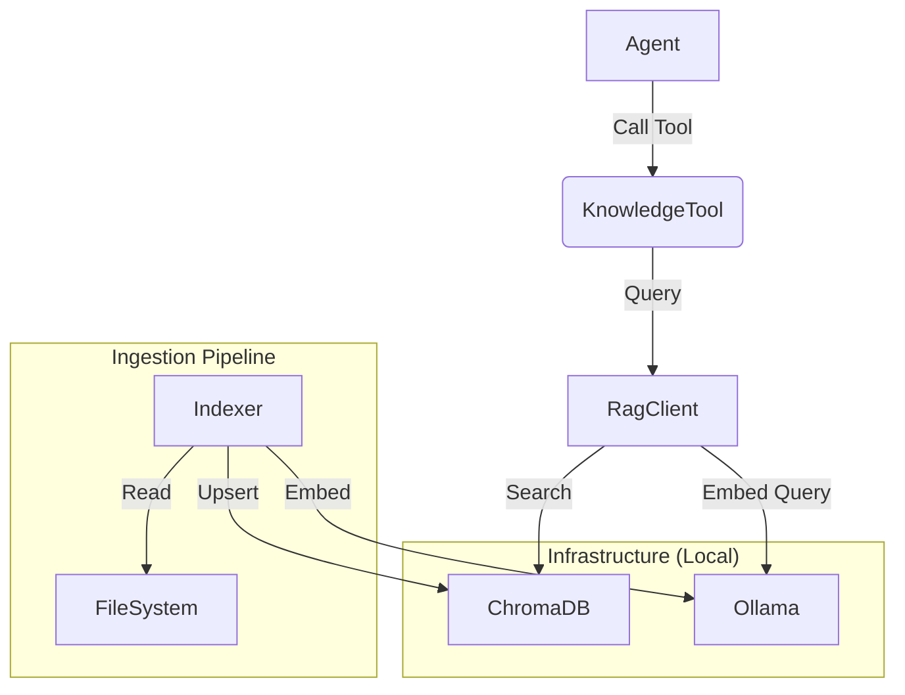

# Knowledge System Design (V1.0)

> **Status**: DRAFT
> **Objective**: Define requirements and architecture for the **Flow Manager Knowledge Layer** (Local RAG).

## 1. Overview
The Knowledge System provides **Semantic Intelligence** to the Agent, allowing it to search the codebase, documentation, and historical tasks using natural language.

**Philosophy**: "Local First, Privacy Preserved."
We use **Ollama** for local embeddings/inference and **ChromaDB** for vector storage. No code leaves the machine.

---

## 2. Architecture

### 2.1 Components
1.  **`KnowledgeTool`**: The MCP-compatible interface exposed to the Agent.
2.  **`RagClient`**: The Python library handling communication with the backend.
3.  **`Indexer`**: A background/lazy process that scans `.flow/manifest.json`, detects changes, and updates the Vector DB.
4.  **Vector DB**: **ChromaDB** (Running in Docker or Local Process).
5.  **Model Provider**: **Ollama** (Running locally, e.g., `nomic-embed-text`).

---

## 3. Prerequisites: "What do we need?"

To activate the Knowledge Layer, the following are required:

### 3.1 Infrastructure
*   [ ] **Ollama**: Installed and running (`ollama serve`).
*   [ ] **Embedding Model**: `ollama pull nomic-embed-text` (Top performance for local RAG, 8k context).
*   [ ] **Inference Model**: `ollama pull qwen2.5-coder:7b` (Best-in-class for local code reasoning).
*   [ ] **ChromaDB**: Either `pip install chromadb` (embedded) or a Docker Container.

### 3.2 Python Dependencies
Update `pyproject.toml` to include:
*   `chromadb`
*   `ollama` (Python client)
*   `watchdog` (For file watching, optional for V1)
*   `networkx` (For System Map generation)

---

## 4. Implementation Plan

### Phase 1: Infrastructure & Client
1.  **Dependency Update**: Add libraries to `poetry`.
2.  **`RagClient` Implementation**: Replace the stub.
    *   Connect to Chroma.
    *   Implement `search(query)` and `add_documents(docs)`.

### Phase 2: Ingestion Strategy (The "Hard" Part)
We need a **Smart Indexer** to avoid re-indexing the whole repo on every run.
1.  **Manifest**: Maintain `rag_manifest.json` `{ "file_path": "sha256" }`.
2.  **Delta Scan**: On startup, compare current file hashes with manifest.
    *   **New/Changed**: Read -> Chunk -> Embed -> Upsert.
    *   **Deleted**: Remove from Vector DB.
3.  **Chunking**: Implement language-aware chunking (Python classes/functions, Markdown sections).

### Phase 3: Advanced Capabilities
1.  **System Map**: Port `generate_map.py` to be dynamic (scan `src/` and `docs/`).
2.  **Related Tests**: Heuristic linking (e.g., `foo.py` <-> `test_foo.py`).

---

## 5. Security Note
*   **Redaction**: The `Indexer` must respect `.gitignore` and `.flow/config.json` (Blocked Patterns) to avoid indexing secrets.
*   **Isolation**: The `KnowledgeTool` respects the generic `Service Scope` but has read-access to `docs/` for broad context.

---

## 6. Next Steps for User
1.  **Approve Design**: Confirm usage of Ollama + Chroma.
2.  **Install Infra**: Run `ollama pull nomic-embed-text`.
3.  **Authorize Code Changes**: Allow Agent to update `pyproject.toml` and implement `RagClient`.
