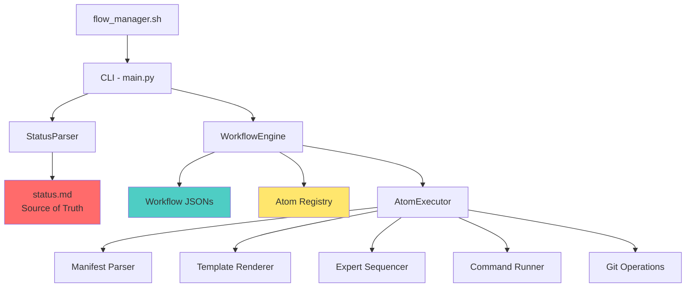

# Part 1: Current State Assessment

## Executive Summary

The Flow Manager (V7/V8.9) is a **configuration-driven workflow orchestration engine** that enforces strict development protocols across a multi-language monorepo (Python, Rust, Kotlin). It implements a **fractal planning hierarchy** (L1-L5) with **expert council oversight** and **document-driven state management**.

## 1. Architecture Overview

### 1.1 Core Components



### 1.2 Technology Stack

| Component | Technology | Purpose |
|-----------|-----------|---------|
| **Orchestrator** | Python 3.x | Engine + CLI |
| **State** | Markdown (status.md) | Single source of truth |
| **Configuration** | JSON (workflows, atoms, rules) | Declarative definitions |
| **Templates** | Jinja2 | Document generation |
| **Execution** | Subprocess (Poetry/Cargo/Maven) | Language-agnostic testing |

## 2. Workflow Orchestration Model

### 2.1 Dual-Phase System

**Planning Phase** (`Phase.Planning`):
- Task prefixes: `Plan.*`, `Design.*`, `Init.*`, `Review.*`
- Workflow: `planning.json` (V8.5)
- Steps:
  1. Parse manifest from status.md
  2. Initialize planning document header
  3. Run Expert Council sequential analysis
  4. Wait for draft completion
  5. Validate content (no placeholders)
  6. Execute standard review
  7. Wait for manual approval

**Execution Phase** (`Phase.Execution`):
- Task prefixes: `Impl.*`, `Valid.*`, `Git.*`, `Gate.*`, `Fix.*`
- Workflow: `execution.json`
- Delegates to feature-specific workflows (e.g., `Impl.Feature`)

### 2.2 Smart Dispatch

The `StatusParser` automatically determines workflow mode:
- **Regex**: `^([A-Za-z]+(?:\.[A-Za-z]+)?)(?::|\\s)` extracts prefix
- **Configuration**: Maps prefix to workflow via `flow_config.json`
- **Strict Mode**: Enforces prefix validation (unknown prefixes = HALT)

## 3. Fractal Planning Hierarchy

### 3.1 Five-Level Structure

| Level | Name | Scope | Example |
|-------|------|-------|---------|
| **L1** | Inception | Strategic Roadmap | Phase 5 Planning |
| **L2** | Architecture | System Design | Service Communication Map |
| **L3** | Detailed Design | Service Specification | API Contracts |
| **L4** | Feature Plan | Feature Specification | MACD Strategy Bundle |
| **L5** | Implementation | Code Changes | Specific file edits |

### 3.2 Recursive Mechanics

- **Depth Calculation**: Task ID segments = Level (e.g., `4.3.2` = L3)
- **Parent-Link**: Every plan references parent document
- **Service Cohesion**: All L2-L5 artifacts for task `4.x.y` go to folder `4_{ServiceName}`
- **Fractal Templates**: Same templates (`research.j2`, `synthesis.j2`, `review.j2`) used at ALL levels

## 4. Atom-Based Composition

### 4.1 Atom Registry

Atomic tasks are Python modules registered in `atoms.json`:

| Atom | Module | Purpose |
|------|--------|---------|
| `Manifest_Parse` | manifest.py | Extract context from status.md |
| `render_template` | render_template.py | Generate documents from Jinja2 |
| `Expert_Sequencer` | expert_sequencer.py | Orchestrate sequential expert analysis |
| `Wait_For_Manual_Approval` | wait_approval.py | Block until marker found |
| `Run_Command` | run_command.py | Execute shell commands |
| `Git_Command` | git_command.py | Git operations |

### 4.2 Workflow Composition

Workflows are JSON files defining step sequences:
```json
{
  "steps": [
    {
      "id": "parse",
      "type": "atom",
      "ref": "Manifest_Parse",
      "args": {"target_file": "${status_file}"},
      "export": {"phase": "phase", "service_name": "service_name"}
    },
    {
      "id": "review",
      "type": "workflow",
      "ref": "Review.Standard"
    }
  ]
}
```

- **Atoms** = Leaf operations
- **Workflows** = Compositions (can nest workflows)
- **Variable Resolution**: `${var}` placeholders resolved from context

## 5. Expert Council System

### 5.1 Sequential Scribing (V8.9.1)

1. **Initialize**: Create document with metadata header only
2. **Iterate Experts**: For each council member:
   - Write `## [Expert Role] Analysis` header
   - Inject prompt with full document context
   - Append AI-generated analysis
   - Persist immediately (crash-safe)
3. **Synthesis**: Consolidate findings into unified plan
4. **Review**: Council re-examines for completeness

### 5.2 Expert Sets

Defined in `core_teams.json` and `expert_personas.json`:
- **ProductCouncil**: PO, Principal Architect, Compliance
- **PlatformGrid**: Backend Dev, DBA, SRE, Security
- **AlphaSquad**: Quant Dev, ML Engineer, Performance Eng
- **ExecutionCore**: Backend Dev, QA, Test Automation
- **QualityAssurance**: QA, Test Automation, Performance

## 6. Document-Driven State

### 6.1 Source of Truth

`status.md` is the **program counter**:
- Tasks: `- [ ] 4.3.2 Impl.Feature: MACD Strategy`
- Active: `- [/]` (one task only)
- Complete: `- [x]`

### 6.2 Task Selection Algorithm

**Deepest First Pending (DFP)**:
1. Scan for first non-complete parent
2. Recursively drill to first non-complete leaf
3. If siblings are `[/]`, prioritize by document order

### 6.3 Context Extraction

`Manifest_Parse` atom reconstructs hierarchy:
- **Phase**: Top-level `# Phase X` header
- **Service**: Root bold task in hierarchy
- **Feature**: Current active task name
- **Level**: Count of Task ID segments
- **Artifact Dir**: Resolve folder `{Root_ID}_{ServiceName}`

## 7. Verification Pipeline

### 7.1 Quality Gates

Defined in `workflow_registry.json`:
```json
{
  "WorkflowBindings": {
    "Impl": {
      "Feature": {
        "Pipeline": [
          {"action": "generate_report"},
          {"action": "execute_cmd", "cmd": "{lint_cmd}"},
          {"action": "execute_cmd", "cmd": "{unit_test_cmd}"},
          {"action": "execute_cmd", "cmd": "{e2e_test_cmd}"},
          {"action": "require_review"}
        ]
      }
    }
  }
}
```

### 7.2 Language Contexts

Toolchain commands mapped by language:
- **Python**: `poetry run pytest`, `pylint`, `black`
- **Rust**: `cargo test`, `cargo clippy`
- **Kotlin**: `mvn test`, `ktlint`

Service-specific `validate.sh` acts as unified entry point.

## 8. Current Strengths

✅ **Configuration-Driven**: No hardcoded workflows in engine  
✅ **Fractal Scalability**: Same patterns L1-L5  
✅ **Strict Validation**: Prefix enforcement prevents untracked work  
✅ **Expert Oversight**: Multi-perspective risk analysis  
✅ **Crash Recovery**: State persistence + atomic operations  
✅ **Language Agnostic**: Subprocess model for any tech stack  

## 9. Current Limitations

### 9.1 Agent Context Leakage

**Problem**: Single agent sees all contexts (planning + implementation + testing)

**Impact**:
- Confirmation bias (implementation follows research too closely)
- Testing not truly independent
- Review rubber-stamping

### 9.2 Workflow Duplication

**Observation**:
- Same workflow patterns repeated across levels
- No workflow inheritance/composition beyond step nesting
- `planning.json` vs `planning_standard.json` vs `planning_expert_council.json`

### 9.3 Document Format Rigidity

**Current**: Markdown with manual structure validation  
**Issue**: Hard for machines to parse complex nested plans

### 9.4 Agent Communication

**Missing**:
- No formal protocol for agent handoffs
- Context passed through shared document access
- No isolation boundaries

## 10. Key Files Reference

| Path | Purpose |
|------|---------|
| `flow_manager.sh` | Entry point wrapper (session token) |
| `workflow_core/entrypoints/cli.py` | Main CLI (redirects to flow_manager/main.py) |
| `workflow_core/flow_manager/main.py` | Command processor (start, resume, status, reset) |
| `workflow_core/flow_manager/status_parser.py` | Status.md parser + smart dispatch |
| `workflow_core/engine/core/engine.py` | Workflow execution loop |
| `workflow_core/engine/core/executor.py` | Atom execution |
| `workflow_core/config/flow_config.json` | Root markers, prefixes, strict mode |
| `workflow_core/config/workflow_registry.json` | Prefix → TaskSet → ExpertSet bindings |
| `workflow_core/config/workflows/*.json` | Workflow definitions |
| `workflow_core/config/atoms.json` | Atom registry |

## 11. Conclusion

The current Flow Manager is a **robust, configuration-driven orchestrator** with strong foundations for fractal planning and expert oversight. However, it lacks:

1. **Agent isolation boundaries**
2. **Workflow composition primitives** (inheritance, mixins)
3. **Machine-readable intermediate formats**
4. **Formal agent communication protocols**

These gaps form the basis for the refactoring strategy in subsequent parts.

---

**Status**: ✅ Current State Documented  
**Next**: Part 2 - Agent Isolation Architecture
