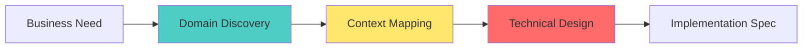
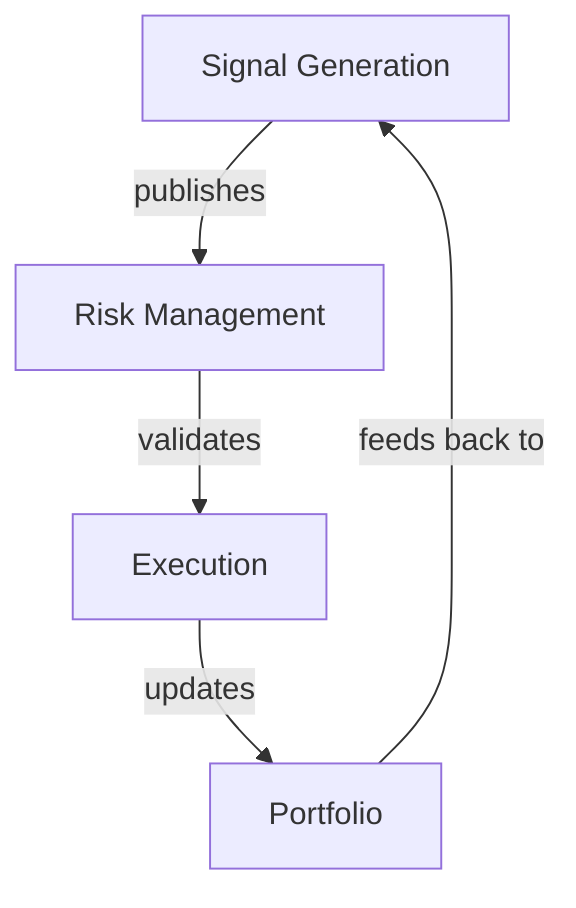
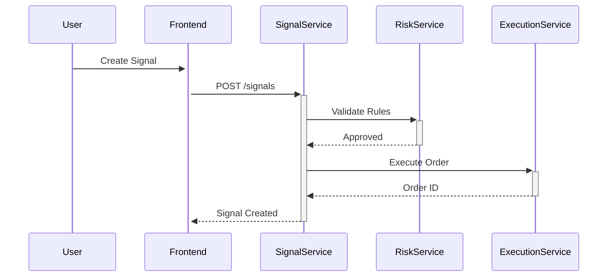

#Part 6: Analysis Process Framework (Business to Technical)

## Executive Summary

Proposes a **domain-agnostic analysis framework** that systematically transforms business requirements into technical specifications, applicable to Quantivista and any other project type.

## 1. Universal Analysis Phases



## 2. Phase 1: Domain Discovery

### 2.1 Structured Questionnaire

**Template** (`domain_discovery.yaml`):
```yaml
business_context:
  - question: "What problem are we solving?"
    examples: ["Automate trading decisions", "Track job applications"]
  - question: "Who are the users?"
    examples: ["Retail traders", "Job seekers"]
  - question: "What is the core value proposition?"
    examples: ["Algorithmic trading without coding", "Organize job hunt"]

domain_entities:
  - question: "What are the key entities?"
    examples: ["Signal, Order, Portfolio", "Application, Company, Interview"]
  - question: "What actions do users perform?"
    examples: ["Create strategy, Execute trade", "Apply to job, Schedule interview"]
```

### 2.2 Domain Model Template

```markdown
# Domain Model: ${ProjectName}

## Core Entities

### ${EntityName}
- **Definition**: ${Description}
- **Attributes**: ${Key Fields}
- **Lifecycle States**: ${State Machine}
- **Business Rules**: ${Constraints}

## Entity Relationships
[Mermaid ER diagram]

## User Workflows
[Sequence diagrams]
```

**Example (Quantivista)**:
```markdown
### Signal
- **Definition**: Trading recommendation with entry/exit criteria
- **Attributes**: symbol, direction (long/short), confidence, timestamp
- **Lifecycle**: Draft → Validated → Executed → Closed
- **Rules**: Must pass risk checks before execution
```

**Example (Job Tracker)**:
```markdown
### Application
- **Definition**: Record of job application submission
- **Attributes**: company, position, status, applied_date, salary_range
- **Lifecycle**: Draft → Submitted → Interview → Offer → Accepted/Rejected
- **Rules**: Cannot have multiple active offers without decision
```

## 3. Phase 2: Context Mapping

### 3.1 Bounded Contexts

**Template**:
```yaml
contexts:
  - name: ${ContextName}
    responsibility: ${What it owns}
    entities: ${List of entities}
    interfaces: ${External APIs}
    dependencies: ${Other contexts}
```

**Quantivista Example**:
```yaml
contexts:
  - name: Signal Generation
    responsibility: Create and validate trading signals
    entities: [Signal, Indicator, Strategy]
    interfaces: [POST /signals, GET /signals/{id}]
    dependencies: [Market Data Context]
  
  - name: Risk Management
    responsibility: Validate trades against risk rules
    entities: [RiskRule, PositionLimit, Exposure]
    interfaces: [POST /validate]
    dependencies: [Portfolio Context]
```

**Job Tracker Example**:
```yaml
contexts:
  - name: Application Management
    responsibility: Track job applications
    entities: [Application, Resume, CoverLetter]
    interfaces: [POST /applications, GET /applications]
    dependencies: [Company Database]
  
  - name: Interview Scheduling
    responsibility: Manage interview calendar
    entities: [Interview, InterviewRound, Feedback]
    interfaces: [POST /interviews]
    dependencies: [Calendar Service]
```

### 3.2 Context Map Visualization



## 4. Phase 3: Technical Design

### 4.1 Service Decomposition

**Decision Matrix**:
| Factor | Monolith | Microservices |
|--------|----------|---------------|
| Team size | < 5 | > 5 |
| Domain complexity | Low-Medium | High |
| Deployment frequency | Weekly | Daily |
| Scalability needs | Vertical | Horizontal |

**Service Blueprint** Template:
```yaml
service:
  name: ${ServiceName}
  responsibility: ${Single Responsibility}
  tech_stack:
    language: ${Python/Rust/Kotlin}
    framework: ${FastAPI/Axum/Spring}
    database: ${Postgres/Redis/None}
  interfaces:
    rest: [${Endpoints}]
    grpc: [${RPCs}]
    events: [${Topics}]
  dependencies:
    internal: [${Other Services}]
    external: [${Third-party APIs}]
```

### 4.2 Data Flow Diagrams



## 5. Phase 4: Implementation Specification

### 5.1 API Contract Template

**OpenAPI Spec**:
```yaml
paths:
  /signals:
    post:
      summary: Create new trading signal
      requestBody:
        required: true
        content:
          application/json:
            schema:
              $ref: '#/components/schemas/SignalRequest'
      responses:
        '201':
          description: Signal created
          content:
            application/json:
              schema:
                $ref: '#/components/schemas/Signal'
```

### 5.2 Database Schema Template

```sql
-- Entity: ${EntityName}
CREATE TABLE ${table_name} (
    id UUID PRIMARY KEY,
    ${attribute_1} ${TYPE} ${CONSTRAINTS},
    created_at TIMESTAMPTZ DEFAULT NOW(),
    updated_at TIMESTAMPTZ DEFAULT NOW()
);

-- Indexes
CREATE INDEX idx_${table}_${field} ON ${table}(${field});

-- Constraints
ALTER TABLE ${table} ADD CONSTRAINT ${name} CHECK (${condition});
```

## 6. Generalized Process (Any Project)

### 6.1 Step-by-Step Guide

**Step 1: Kick-off Interview**
```markdown
1. Schedule 60-min stakeholder meeting
2. Use domain_discovery.yaml questionnaire
3. Record answers in discovery_notes.md
4. Identify 3-5 core entities
```

**Step 2: Domain Modeling Workshop**
```markdown
1. Create entity diagrams (Mermaid/Lucidchart)
2. Map entity relationships
3. Define state machines for key entities
4. Document business rules
5. Output: domain_model.md
```

**Step 3: Context Mapping**
```markdown
1. Identify bounded contexts (DDD)
2. Map context dependencies
3. Define integration points
4. Output: context_map.md
```

**Step 4: Technical Design**
```markdown
1. Decompose into services/modules
2. Choose tech stack per service
3. Define API contracts (OpenAPI/gRPC)
4. Design database schemas
5. Output: technical_design.md
```

**Step 5: Implementation Planning**
```markdown
1. Break design into L4/L5 tasks
2. Estimate complexity
3. Sequence dependencies
4. Output: implementation_plan.md (Part 4 format)
```

### 6.2 Workflow Integration

```json
{
  "name": "Analysis.Business_To_Technical",
  "steps": [
    {
      "id": "discovery",
      "ref": "Interactive_Questionnaire",
      "args": {"template": "domain_discovery.yaml"},
      "output": "discovery_notes.md"
    },
    {
      "id": "domain_model",
      "ref": "Multi_Agent_Step",
      "agent_role": "Domain_Analyst",
      "context": ["discovery_notes"],
      "output": "domain_model.md"
    },
    {
      "id": "context_map",
      "ref": "Multi_Agent_Step",
      "agent_role": "Architect",
      "context": ["domain_model"],
      "output": "context_map.md"
    },
    {
      "id": "technical_design",
      "ref": "Multi_Agent_Step",
      "agent_role": "Technical_Designer",
      "context": ["context_map", "domain_model"],
      "output": "technical_design.md"
    }
  ]
}
```

## 7. Reusable Templates

### 7.1 Template Library

```
workflow_core/templates/analysis/
├── domain_discovery.yaml
├── domain_model.md.j2
├── context_map.md.j2
├── technical_design.md.j2
├── api_spec.yaml.j2
└── db_schema.sql.j2
```

### 7.2 Example: Job Tracker Analysis

**Domain Discovery Output**:
```yaml
entities:
  - Application
  - Company
  - Interview
  - Contact
  - Document (Resume, Cover Letter)

workflows:
  - Apply to Job: User → Research Company → Tailor Resume → Submit Application
  - Interview Prep: User → Schedule Interview → Research → Prepare Questions
  - Offer Negotiation: User → Receive Offer → Compare Offers → Negotiate → Accept/Decline
```

**Context Map**:
```yaml
contexts:
  - Application_Management
  - Company_Intelligence
  - Interview_Scheduling
  - Document_Management
  - Offer_Tracking
```

**Technical Design**:
```yaml
services:
  - name: ApplicationService
    language: Python
    framework: FastAPI
    database: PostgreSQL
    
  - name: DocumentService
    language: Python
    framework: FastAPI
    storage: S3/MinIO
```

## 8. Quality Checklist

After each phase, verify:

**Discovery**:
- [ ] All key entities identified
- [ ] User workflows documented
- [ ] Business rules captured

**Domain Model**:
- [ ] Entity relationships clear
- [ ] State machines defined
- [ ] Ubiquitous language established

**Context Map**:
- [ ] Bounded contexts identified
- [ ] Integration points defined
- [ ] Dependencies mapped

**Technical Design**:
- [ ] Service responsibilities single and clear
- [ ] Tech stack justified
- [ ] API contracts defined
- [ ] Data models normalized

## 9. Automation Support

### 9.1 Domain Discovery Agent

```python
class DomainDiscoveryAgent:
    def run_interview(self, questionnaire):
        """Interactive Q&A session"""
        answers = {}
        for question in questionnaire:
            answer = self.ask_user(question)
            answers[question.id] = answer
        return answers
    
    def generate_domain_model(self, answers):
        """Uses LLM to draft domain model from answers"""
        prompt = f"Based on these answers: {answers}, create a domain model"
        return llm.generate(prompt, template="domain_model.md.j2")
```

### 9.2 Code Generation

```python
def generate_service_skeleton(design):
    """Generates boilerplate from technical design"""
    for service in design.services:
        create_directory_structure(service)
        generate_api_endpoints(service.interfaces)
        generate_database_migrations(service.schema)
        generate_tests(service.entities)
```

## Conclusion

This framework provides:
✅ **Systematic approach** from business to technical  
✅ **Reusable templates** for any project type  
✅ **Agent integration** for automation  
✅ **Quality gates** at each phase  
✅ **Flow Manager compatible** workflows  

---

**Status**: ✅ Analysis Framework Defined  
**Next**: Part 7 - Flow Manager Implementation Language
