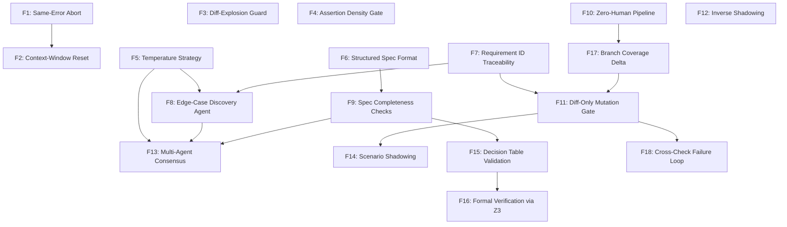

# Verification Gates — Feature Backlog

> Extracted from the "Verification & Specification" brainstorm (March 2026).
> All features include: description, integration point, implementation sketch, relevant formulas, effort, impact, and dependencies.

---

## Priority Legend

| Tag | Meaning |
|:---:|:---|
| **P0** | Do next — low effort, high impact, few/no dependencies |
| **P1** | Do soon — medium effort, high impact, may depend on P0 |
| **P2** | Do later — medium-high effort, medium impact |
| **P3** | Explore — high effort or uncertain ROI, research first |

---

## Dependency Map



> **Reading**: An arrow `A --> B` means "A should be built before B" (B depends on A).

---

## P0 — Do Next

---

### F1: Same-Error Abort (3-Strike Rule)

**What**: If an agent produces the *same* compiler error or the *same* JSON-diff mismatch 3 times in a row, abort the iteration loop. LLMs almost never self-correct after 3 identical failures — they oscillate in their own context window and burn API tokens producing the same broken output.

**Why this matters first**: This is the single most expensive failure mode in agentic systems. Without this, a stuck agent can consume unlimited retries. Every other iteration feature (F2, F10, F11) assumes this safety net exists.

**Where it hooks in**: [Engine._handle_retry_status](file:///c:/development/pitbula/flowManager/src/flow/engine/core.py#L430-L471) already has a 3-retry circuit breaker based on count. This feature adds **content-based deduplication** on top.

**Implementation sketch**:
- Store a hash of the last N error messages in the retry context (`__error_hash_{task_id}__`)
- Before bumping retry count, compare current error hash to the stored one
- If 3 consecutive identical hashes -> return `"error"` with a `SAME_ERROR_LOOP` reason
- This is distinct from the existing count-based breaker: an agent that produces 3 *different* errors might still be making progress

**Effort**: Low (< 1 day). Touches only `_handle_retry_status` and `_handle_crash`.

**Impact**: High. Prevents the most common and expensive failure mode in agentic loops.

**Depends on**: Nothing.

---

### F2: Context-Window Reset on Retry

**What**: When an iteration fails, the next retry prompt should contain **only** the current broken code + the current error message. The history of previous failures is deliberately discarded. Each retry feels like the agent's "first attempt."

**Why**: The attention mechanism in transformer models gives disproportionate weight to failure patterns when they accumulate in context. An agent that sees "you failed 3 times" will often fixate on the failure framing rather than the actual problem. By resetting context, each attempt is unbiased.

**Where it hooks in**: Atom execution context ([Engine._run_atom_isolated](file:///c:/development/pitbula/flowManager/src/flow/engine/core.py#L391-L428)). The `read_only_context` currently carries forward between retries. This feature adds a "context pruning" step.

**Implementation sketch**:
- Add a `retry_context_policy` field to the Atom or Flow definition: `CARRY_FORWARD` (default/current) or `FRESH_START`
- When `FRESH_START`: strip all `__error_*` and `__last_*` keys from context before the retry prompt. Only inject the current error + the original spec.
- The Atom/prompt template controls what goes in; the engine just prunes.

**Effort**: Low (< 1 day).

**Impact**: High. Directly improves retry success rates.

**Depends on**: F1 (same-error abort must exist first to prevent infinite fresh-start loops).

---

### F3: Diff-Explosion Guard

**What**: If an agent rewrites more than X% of a file (e.g., 40%) to fix a small error, reject the edit. A massive rewrite in response to a minor failure is a strong signal of context pollution — the agent has lost track of the localized problem and is "shotgun rewriting."

**Where it hooks in**: The Loom (file weaver) or the tool layer (`src/flow/tools/file/`). After the agent proposes a file edit, compute the edit ratio *before* applying it.

**Implementation sketch**:
- After receiving the agent's proposed edit, compute `ratio = len(diff_lines) / len(original_lines)`
- If ratio exceeds a configurable threshold -> reject the edit, mark as `error`, report "Diff explosion: agent rewrote X% of file to fix a single error"
- Threshold configurable per-task in `.flow/config.json` (default: 40%)
- Exception: if this is the initial file creation (no original), skip the check

**Effort**: Low (< half day). Pure math on strings.

**Impact**: Medium-High. Catches a specific but damaging failure mode.

**Depends on**: Nothing.

---

### F4: Assertion Density Gate

**What**: Use an AST parser to count the number of assertion calls (`assert`, `expect`, `assertEqual`, `assertRaises`) versus lines of code in test files. "Ghost tests" — tests that run code but verify nothing — are caught by this metric.

**Why a standalone feature**: Mutation testing (F11) catches this too, but it's 100x more expensive to run. Assertion density is a cheap, instant static check that filters out the worst offenders before mutation testing even starts.

**Formula**:
```
Density = AssertionCalls / TestLOC
```
- If Density < 0.05 (one assertion per 20 lines): likely a "ghost test" — lots of setup, no real verification
- If Density < 0.02: almost certainly fake — flag as `GHOST_TEST`

**Where it hooks in**: Post-test verification gate. Can be a standalone script or part of the quality test suite (`tests/quality/`).

**Implementation sketch**:
- Walk the AST of each test file using Python's `ast` module
- Count `ast.Assert` nodes, `ast.Call` nodes where the function name matches assertion patterns
- Divide by total LOC
- Report files below threshold with specific line counts

**Effort**: Low (< 1 day). Python's `ast` module does the heavy lifting.

**Impact**: Medium. Cheap early filter that catches lazy test generation.

**Depends on**: Nothing.

---

### F5: Temperature Strategy per Agent Role

**What**: Define a temperature map so different agents run at different temperatures based on their role. This isn't just a config tweak — it's a systematic approach to controlling the creativity-vs-precision tradeoff across the entire agent pipeline.

**Where it hooks in**: The LLM adapter layer (`src/flow/llm/`). Agent/Persona definitions in `.flow/` config already define roles; this adds a `temperature` field with role-based defaults.

**Temperature map**:

| Role Category | Default Temp | Why |
|:---|:---:|:---|
| `discovery` / `adversarial` | 0.8 | Maximum "paranoia" — you want creative, unusual edge cases |
| `architect` / `scenario` | 0.4-0.5 | Balanced: realistic integration flows need creativity but grounding |
| `implementer` | 0.2 | Faithful to spec, minimal hallucination |
| `validator` / `formatter` | 0.0 | Strictly deterministic. No "creative" logic when checking if A = B |

**Implementation sketch**:
- Add `temperature: float` to the Persona/Agent definition schema
- LLM adapter reads it before calling the provider API
- If not set, derive from role category using the map above
- Override via `.flow/config.json` for project-level tuning

**Effort**: Low (a config field + adapter plumbing).

**Impact**: Medium. Subtle but compounds over many agent runs. Prerequisite for F8 and F13.

**Depends on**: Nothing (but F8 and F13 both benefit from this).

---

## P1 — Do Soon

---

### F6: Structured Spec Format (Markdown Tunneling + Protobuf Contracts)

**What**: Standardize how specifications are written for agent consumption. Two layers:

**Layer 1 — Protobuf as Absolute Contract**: For any inter-process communication, feed the raw `.proto` file to the agent instead of prose descriptions. LLMs know exactly how to generate Rust structs or Python dataclasses from `.proto` — type safety is grammatically enforced. The model cannot hallucinate field types when the grammar is unambiguous.

**Layer 2 — Structured Markdown Tunneling**: For behavioral specs, force agents into a "mental tunnel" using strict markdown headers:

```markdown
# Objective
Calculate the dynamic threshold for portfolio rebalancing.

# Strict Constraints
- No external crates except ndarray and serde
- O(1) time complexity mandatory
- All state must be passed via function arguments

# Forbidden
- No database calls
- No print/debug logging
- No panic!() or unwrap()
```

**Why it works**: LLMs are massively trained on structured README files and GitHub Markdown. The `# Objective` / `# Strict Constraints` / `# Forbidden` headers create strong attention anchors. The `# Forbidden` section in particular produces a "do not cross" signal that models respect far more reliably than inline prohibitions buried in prose.

**Where it hooks in**: Spec templates in `.flow/templates/`. The Jinja2 template system already supports structured injection — this standardizes what those templates look like.

**Implementation sketch**:
- Define a spec template schema with mandatory sections: `Objective`, `Constraints`, `Forbidden`
- Create Jinja2 templates that enforce this structure
- For IPC specs: `.proto` file reference replaces prose
- Validation: reject specs missing mandatory sections before agent invocation

**Effort**: Medium (2-3 days). Template design + validation logic.

**Impact**: High. Every downstream feature (F7-F16) produces better results when the input spec is well-structured.

**Depends on**: Nothing, but all spec-consuming features benefit.

---

### F7: Requirement ID Traceability

**What**: Create a machine-readable "contract" file (`contract.json`) listing all edge cases and requirements with unique IDs. Agents must tag their test code with these IDs (e.g., `# covers: ERR-01`). FlowManager cross-references and reports gaps as a set operation.

**Why**: This catches the #1 "lazy agent" pattern — writing tests that touch the happy path but skip edge cases. It also provides the structured contract that F8 (Discovery Agent) and F11 (Mutation Gate) operate on.

**Where it hooks in**: New verification gate after "Tests Pass." Could be a `TraceabilityAuditAtom`.

**Implementation sketch**:
- JSON schema for the contract file:
  ```json
  {
    "cases": [
      {"id": "ERR-01", "category": "negative", "description": "Empty input list", "expected": "Return empty, no exception"},
      {"id": "PERF-01", "category": "performance", "description": "10k items", "expected": "< 50ms"}
    ]
  }
  ```
- Language-specific tagging conventions:
  - Python: `@pytest.mark.covers("ERR-01")`
  - Kotlin: `@Test @Requirement("ERR-01")`
  - Rust: `#[test] #[doc = "covers: ERR-01"]`
- **Phase 1 (Static Traceability)**: Scanner runs `grep -rn "covers:" tests/` -> extract IDs -> compute `Missing = Contract_IDs - Found_IDs`. If `len(Missing) > 0` -> gate fails.
- **Phase 2 (Behavioral Trace)**: The agent might tag a test `ERR-01` but only execute the "Happy Path". Run the test in isolation and map its execution trace via code coverage. If the trace doesn't hit the specific branch mapped to the requirement, it's flagged as a fake test.
- **Phase 3 (Negative Log Scan)**: Scan test execution logs for the absence of expected exceptions. If the edge case says "Should throw InvalidInputException", the test runner logs MUST contain that exception.

**Effort**: Medium (2-3 days). New atom, schema, scanner, reporting.

**Impact**: High. Directly prevents "fake green" test suites.

**Depends on**: Nothing, but F8 naturally feeds into this.

---

### F8: Adversarial Edge-Case Discovery Agent

**What**: Before coding starts, run a dedicated "QA Architect" agent whose only job is to find edge cases and output a formal `contract.json`. This agent never sees the implementation — only the spec, Protobufs, and function signatures. It "attacks" the specification.

**Why**: Separating "find edge cases" from "write code" creates adversarial tension. The coding agent cannot dodge requirements it didn't write. The discovery agent cannot write lazy tests because it never writes code.

**Where it hooks in**: New Atom type (`EdgeCaseDiscoveryAtom`). First step in the workflow, before implementation.

**System prompt strategy**: Temperature 0.8 (per F5). Force the agent through structured discovery frameworks:
- **Boundary Value Analysis (BVA)**: Numbers (`0, 1, -1, MaxInt, MinInt, NaN`), Collections (empty, 1 element, 10k elements), Strings (empty, very long, Unicode/Emojis, injection attempts)
- **State Transition Testing**: "What happens if `cancel()` is called while state is `FINISHED`?"
- **Negative Path Checklist**: Network timeouts, permission denied, disk full, invalid Protobuf tags

**Constraint Injection** (prevents hallucinated impossible cases):
- Rust: "null-pointers are impossible; focus on logic overflows and integer wrapping"
- Kotlin: "non-null types by default; focus on empty collections and concurrency"
- Python: "duck typing means type errors are runtime; focus on incorrect types at call sites"

**N+1 Discovery Rate (Stop Signal)**:
When running multiple discovery sessions, measure diminishing returns:
1. Agents A and B independently generate edge-case lists
2. flowManager deduplicates by hashing the "core intent" of each case
3. Agent C runs. If 90% of C's cases already exist -> **New Case Discovery Rate** has dropped below 10%
4. **Stop when**: rate < 5%. The problem space is exhausted.
5. **Over-engineering guard**: if total cases > 3x the number of branches in the code, trigger a pruning pass instead of more discovery

**Effort**: Medium (2-3 days).

**Impact**: High. Shifts quality left before any code is written.

**Depends on**: F7 (contract schema must exist). F5 (temperature strategy for high-temp discovery).

---

### F9: Spec Completeness Checks (Static Analysis)

**What**: Before implementation starts, run automated static checks on the specification artifacts to detect under-specification. No LLM needed — pure parsing and math.

**Check 1 — Entity-to-Action Density**:
Count defined data types (Protobuf messages, Rust structs, Python dataclasses) vs. defined operations (methods, API endpoints, functions).
```
Ratio = UniqueActions / UniqueEntities
```
If Ratio < 1.0: the spec describes *what data exists* but not *what to do with it*. Flag: "Spec is object-heavy but logic-poor."

**Check 2 — Type Specificity Score**:
Parse the spec's interfaces. Measure how many types are domain-specific vs. primitive.
```
S_t = DomainTypes / (DomainTypes + PrimitiveTypes)
```
- PrimitiveTypes: `String`, `Int`, `Boolean`, `Float`
- DomainTypes: `UserID`, `TransactionState`, `OrderStatus` (enums, value objects)
- If S_t < 0.3: the spec suffers from "Primitive Obsession." Agents will hallucinate the domain because it's undefined. Force the agent to define Enums/Structs before writing code.

**Check 3 — Negative Constraint Coverage**:
Cross-reference the contract file (F7) with defined features. Every feature must have at least one negative test case (an error path, a rejection, a boundary).
- If a feature has zero negative constraints -> flag: "No error-path specification for [Feature X]"

**Check 4 — Complexity-to-Coverage Ratio**:
```
K = EdgeCases / CyclomaticComplexity
```
- If K < 0.5: complex logic with almost no safety boundaries. Halt and demand more edge cases.
- If K > 3.0: possible over-engineering. Suggest pruning redundant cases.

**Where it hooks in**: New gate between "spec approved" and "implementation starts." Could be a `SpecValidationAtom`.

**Implementation sketch**:
- Parser for proto/interface files (use `tree-sitter` or simple regex for `.proto`)
- Counter logic for entities vs. actions
- AST-based type classification
- Cross-reference with `contract.json` for negative coverage

**Effort**: Medium (3-4 days for all four checks).

**Impact**: High. Catches under-specified prompts before any API tokens are spent on code generation.

**Depends on**: Benefits from F6 (structured spec format ensures parseable inputs) and F7 (for the negative-constraint check).

---

### F10: Three-Gate Zero-Human Pipeline

**What**: Define a rigid automated gate sequence that all agent-generated code must pass *before* any human sees it. The HITL only reviews code that is already syntactically correct, functionally verified, and performant. Their focus shifts from "does it work?" to "is it safe and semantically correct?"

**Gate 1 — Syntactic Contract** (compile + lint):
- Agent generates code. The compiler runs (`cargo check`, `python -m py_compile`, `kotlinc`).
- Linters run (Ruff, Clippy, etc.)
- If this fails -> iterate automatically. No human sees syntax errors.

**Gate 2 — Functional Scenarios** (JSON I/O test matrices):
- Deterministic input/output pairs (JSON blobs) are injected into the compiled binary/function via CLI or FFI.
- Output is compared byte-for-byte with `expected_output`.
- No prose, no interpretation — pure data in, data out.

**Gate 3 — Non-Functional** (performance benchmark):
- An isolated benchmark runs the core function in memory.
- Hard threshold: e.g., < 10 microseconds for a threshold calculation, < 50ms for a batch operation.
- If exceeded -> agent must optimize or the task is escalated.

**Strawman Proposal pattern for HITL interactions**:
When the HITL reviews code that passed all three gates, don't ask open-ended questions. Instead, generate concrete proposals:
> **Bad**: "How should refunds work?"
> **Good**: "I propose: Refunds are only allowed within 30 days and require a Manager approval role. Does this work? (Approve / Edit / Reject)"

This reduces HITL cognitive load: the user *edits* rather than *creates from scratch*.

**Where it hooks in**: Orchestration layer in `engine/core.py`. Each gate maps to an Atom type in the workflow definition.

**Implementation sketch**:
- Define a `GateSequence` schema that lists gates in order
- Each gate has: a command to run, a pass/fail parser, and a max-retry count
- The engine runs gates sequentially; failure at any gate triggers the retry loop (with F1/F2 safety)
- Only after all gates pass does the task reach `AWAITING_REVIEW` status

**Effort**: Medium (3-4 days). Mostly orchestration config and gate result parsing.

**Impact**: High. Eliminates the most common waste: humans reviewing code that doesn't compile.

**Depends on**: Nothing directly, but benefits greatly from F1 (retry safety) and F2 (context reset).

---

### F17: Branch Coverage Delta Gate

**What**: Agents are great at faking "Line Coverage" by executing code sequentially, but struggle with "Branch Coverage." If an `if/else` block has only one path tested, branch coverage is 50%. This gate stops the iteration loop when the *delta* (change) in branch coverage between two consecutive review sessions is `0%` (or an epsilon).

**Where it hooks in**: Evaluated after functional tests (Gate 2) and before the heavy Mutation Testing (F11). It serves as a rapid structural gate.

**Implementation sketch**:
- Extract Branch Coverage using existing tools (`Coverage.py`, `JaCoCo`, etc.)
- Keep `.flow/` state of the previous branch coverage for the component
- Compare current iteration coverage to the previous iteration
- If the agent ran and `Coverage_New - Coverage_Old <= 0`, they have hit their structural ceiling. Stop the loop.

**Effort**: Low-Medium. Leverages standard coverage reports.
**Impact**: High. Faster to compute than mutation testing, catches one-dimensional test strategies instantly.
**Depends on**: F10 (Pipeline framework).

---

## P2 — Do Later

---

### F11: Diff-Only Mutation Gate

**What**: After tests pass, run mutation testing *only* on the git diff (changed lines). If the mutation score falls below a threshold, the agent must improve its tests. This is the "gold standard" for test integrity — a test that passes despite injected bugs is a test that verifies nothing.

**Mutation Score formula**:
```
MS = Killed / (Total - Equivalent)
```
- **Killed**: test suite failed when a bug was injected (good)
- **Survived**: test suite passed despite the bug (bad — lazy test)
- **Equivalent**: mutation that doesn't change behavior (e.g., `i++` vs `++i`) — excluded
- **Target**: MS > 85%. A perfect 100% is usually impossible due to equivalent mutants.

**Language-specific mutation drivers**:

| Language | Tool | Diff-Only Flag | Output |
|:---|:---|:---|:---|
| Python | `mutmut` | `--paths-to-mutate {files}` | JUnit XML |
| Rust | `cargo-mutants` | `--in-diff` | JSON |
| Kotlin | Pitest | `pitest-git` plugin | XML |

**Driver registry** (`drivers.yaml`):
```yaml
languages:
  python:
    command: "mutmut run --paths-to-mutate {changed_files}"
    score_path: "summary.killed_percent"
    threshold: 80
  rust:
    command: "cargo mutants --in-diff"
    score_path: "metrics.success_ratio"
    threshold: 85
```

**Performance guards**:
- If `len(changed_files) > 5`: skip mutation, fall back to branch coverage only
- Hard timeout: 5-minute cap per mutation run
- **Diminishing returns exit**: if the mutation score has not improved by more than 2% over the last two agent iterations, stop even if threshold isn't met. The agent has hit its ceiling.

**Where it hooks in**: New verification gate after Gate 2 (functional tests). Implemented as a `MutationTestAtom` that shells out to the driver.

**Effort**: Medium (3-4 days including Python driver, extensible for other languages).

**Impact**: Medium. Mathematically proves test quality, but depends on external tooling.

**Depends on**: F7 (traceability gives mutation context). F10 (pipeline architecture defines where this gate runs).

---

### F18: The "Cross-Check" Failure Rate (Reviewer Agent Loop)

**What**: If using a dedicated "Reviewer Agent," Flow Manager tracks its success rate in finding flaws. The iteration stops *only* when the Reviewer Agent returns a "No Changes Required" status AND the Mutation Score (F11) has not decreased.

**Why**: An agent Reviewer can become an agreeable "yes-man" after long contexts. The Mutation score provides objective physical grounding. If the Reviewer says "Approved" but mutants survive, the codebase is decaying and the Reviewer failed.

**Where it hooks in**: The HITL/Reviewer orchestration step, combined with Mutation Test output.

**Effort**: Low. Simple boolean comparison of two existing signals.
**Impact**: Medium. Prevents agent-reviewer drift and "green checkmark" syndrome.
**Depends on**: F11 (Mutation Testing is the grounding reality).

---

### F12: Inverse Shadowing (Spec Verification)

**What**: After an agent generates a spec artifact (Decision Table, API schema, function contract), give that artifact — and *only* that artifact — to a second agent who has never seen the original user prompt. Ask Agent B to predict the system's behavior from the artifact alone. Compare the prediction to the original requirements.

**Why**: This detects a critical class of errors — specs that are internally consistent but don't match the user's intent. A Decision Table might be perfectly formatted but encode the wrong business logic. Traditional validation (syntax checks, range overlap) won't catch this; you need a "fresh eyes" semantic check.

**The Protocol**:
1. Agent A generates the spec artifact (e.g., a Decision Table)
2. Agent B receives *only* the artifact, with no context about the project
3. Agent B is asked: "Based on this table, what happens when Market Volatility hits 25%?"
4. flowManager compares Agent B's answer to the original User Requirement
5. **If they diverge**: the artifact has a mapping logic error — it failed to capture the intent

**Where it hooks in**: Post-spec validation gate, after F9 (completeness checks). New Atom type: `InverseShadowAtom`.

**Implementation sketch**:
- Strip all context from Agent B's prompt — give it only the raw artifact
- Ask specific behavior-prediction questions derived from the requirements
- Use structured output (JSON) so comparison is deterministic rather than prose-based
- Temperature: 0.2 for Agent B (precision matters more than creativity here)

**Effort**: Medium (2-3 days). Prompt design + structured comparison logic.

**Impact**: Medium-High. Catches the "spec is technically correct but semantically wrong" failure class.

**Depends on**: Nothing directly, but most effective when specs follow the structured format from F6.

---

### F13: Multi-Agent Semantic Consensus

**What**: Run N independent agents (typically 3) at Temperature 0.5 with the same spec. Compare their structured outputs. If outputs diverge significantly, the spec is ambiguous. This goes beyond F9's static checks — it tests whether *different agents interpret the same spec the same way*.

**Core formula — Cosine Similarity**:
```
Similarity = (A . B) / (||A|| * ||B||)
```
- A, B = embedding vectors of two agent summaries
- If average similarity across N agents < 0.8 -> spec is ambiguous
- Embedding model: `text-embedding-3-small` (API) or `sentence-transformers` (local)

**Advanced: Chunked Consensus** (localize the ambiguity):
- Break agent outputs into sections (Architecture, Data Flow, Error Handling)
- Compute per-section variance independently
- Pinpoint *where* the spec breaks down rather than just flagging the whole thing

**Weighted Variance** (avoid noise from cosmetic disagreements):
```
V_total = SUM(V_i * w_i)
```
- w = 1.0: data types, API endpoints, error codes (critical)
- w = 0.2: logging levels, variable naming, comments (cosmetic)

**HITL Engagement Trigger** (prevent question fatigue):
```
Engage = (V_local > 0.2) AND (Impact_local > Threshold)
```
Only interrupt the human when divergence is high AND the section is high-impact.

**Automated HITL question generation**:
When a high-variance section is found, use a Temp 0.0 analysis agent to extract the specific contradiction and formulate a binary question:
> "Agent A assumes a synchronous API; Agent B assumes an async message queue. Should the Payment service return immediately (sync) or emit a PaymentPending event (async)?"

**Temperature Sweep** (debugging persistent disagreement):
1. Reduce all analysis agents to Temp 0.2
2. Add a constraint: "Focus only on the data flow defined in the Protobuf"
3. Re-run consensus
4. **If still divergent at low temp**: the problem is the user prompt, not the agents. Escalate to HITL.

**Abstraction Layer Matrix** (use different artifacts per layer for best signal):

| Layer | Artifact | Comparison Method |
|:---|:---|:---|
| L1: System Architecture | Mermaid / C4 diagrams | Graph adjacency matrix diff |
| L2: Data Contracts | Protobuf / OpenAPI | Schema field diff |
| L3: Algorithms / Logic | Decision Tables | Row/value diff, range overlap |
| L4: Implementation | Unit Test Assertions | Assertion logic parity |

> **Rule**: Never ask for L3 (algorithm) and L1 (architecture) in the same prompt. The agent will lose focus and the consensus signal becomes noisy.

**Why P2 and not P1**: 3x API cost per spec check. F9 (static checks) catches most under-specification at near-zero cost. Reserve consensus for high-stakes specs (multi-service architectures, trading algorithms).

**Effort**: Medium-High (4-5 days). Embedding pipeline + structured-diff logic + HITL question generation.

**Impact**: Medium. Powerful for complex multi-service specs; overkill for single-function tasks.

**Depends on**: F9 (static checks first), F5 (temperature control), F8 (discovery agent feeds structured output).

---

### F14: Scenario Test Shadowing (Path Delta)

**What**: Compare the code coverage of scenario/integration tests vs. unit tests. If a scenario test doesn't cover any *unique* code paths beyond what unit tests already cover, it's redundant and should be deleted. This prevents over-engineering of the test suite.

**Formula**:
```
P_delta = Paths_scenario - Paths_unit
```
Stop adding scenarios when `P_delta` stops growing.

**Where it hooks in**: Post-test verification gate. Needs coverage tooling (`coverage.py` for Python, `JaCoCo` for Kotlin).

**Implementation sketch**:
- Run unit tests with coverage -> `coverage_unit.json`
- Run scenario tests with coverage -> `coverage_scenario.json`
- Compute delta: lines/branches covered by scenarios but not by units
- If delta is approximately 0 -> flag scenario as redundant
- Report which specific scenario tests add no unique coverage

**Effort**: Medium (2-3 days).

**Impact**: Medium. Prevents test suite bloat and reduces CI time.

**Depends on**: F11 (mutation gate provides the test infrastructure this builds on).

---

## P3 — Explore (Research First)

---

### F15: Decision Table Range-Overlap Validation

**What**: If the spec includes decision tables (structured if/then rules), automatically check for overlapping ranges, dead rules, and incomplete coverage. Pure interval math — no LLM needed.

**Example**: Rule 1 says "if volatility is 0-50, BUY." Rule 2 says "if volatility is 40-100, SELL." The range 40-50 triggers both rules -> logical conflict.

**Checks**:
- **Range overlap**: two rules trigger on the same input -> conflict
- **Dead rules**: a rule that can never fire because another rule's range fully contains it
- **Incomplete coverage**: input ranges that trigger no rule at all -> undefined behavior

**Structural Antagonism** (complementary technique):
Use the adversarial agent (F8) at Temp 0.8 to attack the decision table itself — not the code. Prompt: "Find a combination of inputs that leads to an undefined state or a circular dependency in this table."

**Why P3**: Requires specs to be written as formal decision tables — a format not yet standardized. High effort to get the format right; the validation itself is simple interval math.

**Effort**: Medium (2 days for the validator, blocked on standardizing decision table format).

**Impact**: High *when applicable* (trading logic, risk calculations), low for general features.

**Depends on**: F9 (spec completeness checks are the parent gate).

---

### F16: Formal Verification via SMT Solver (Z3)

**What**: Translate decision tables or business rules into Z3 constraints. Let the solver *mathematically prove* whether any two rules contradict each other.

**Formula** (contradiction check):
```
Verify(Rule_1 AND Rule_2 => False)
```
If Z3 finds the conjunction "satisfiable," both rules can fire simultaneously -> proven conflict.

**Why explore**: Z3 is the nuclear option. It provides mathematical proof of consistency, but:
- Translating natural-language or semi-structured specs into Z3 constraints is a hard problem
- The toolchain is heavy (`z3-solver` pip package is ~50MB)
- ROI is only justifiable for safety-critical logic (trading algorithms, risk calculations)

**Recommendation**: Park this. If F15 (simple range-overlap checks) catches most contradictions, Z3 is unnecessary. Revisit only if you find real-world cases where interval math is insufficient.

**Effort**: High (1-2 weeks including the spec-to-Z3 translation layer).

**Impact**: Very high for specific domains; very low for general use.

**Depends on**: F15 (prove the simpler approach is insufficient before investing).

---

## Summary: Recommended Implementation Order

| Wave | Features | Theme | Total Effort |
|:---:|:---|:---|:---:|
| **Wave 1** | F1, F2, F3, F4, F5 | Iteration Safety & Foundations | ~4 days |
| **Wave 2** | F6, F7 | Spec Standards & Contracts | ~5 days |
| **Wave 3** | F8, F9, F10, F17 | Discovery, Validation & Pipeline | ~9 days |
| **Wave 4** | F11, F12, F14, F18 | Mutation, Shadowing & Coverage | ~9 days |
| **Wave 5** | F13, F15 | Consensus & Decision Logic | ~7 days |
| **Future** | F16 | Formal Verification | ~2 weeks |

> [!TIP]
> **Wave 1 alone** (F1-F5) gives you ~60% of the total value for ~10% of the total effort. Ship that first, then reassess priorities based on real-world agent behavior.
