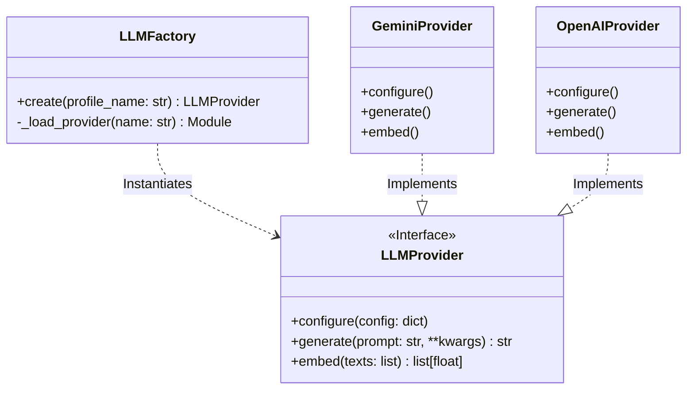

# 01_05 LLM Binding & Selection Specification

> **Status**: DRAFT
> **Owner**: Architecture Team
> **Context**: Unified Interface for all LLM interactions (RAG & Agents).

## 1. Overview
The **LLM Binding System** serves as the abstraction layer between the Flow Manager core and the various underlying LLM providers (Google Gemini, OpenAI, Anthropic, Ollama, etc.).

**Key Objectives:**
1.  **Uniformity**: All providers must adhere to a strict, identical interface.
2.  **Modularity**: Providers are installed as optional plugins; the core system does not depend on them physically.
3.  **Dynamic Selection**: Users can switch providers/models at runtime via configuration profiles.
4.  **Zero Leakage**: Provider-specific logic (e.g., `google-genai` types) must not leak into the core system.

---

## 2. Architecture



---

## 3. The Protocol (`LLMProvider`)
Located at: `workflow_core.core.llm.provider.LLMProvider`

All adapters **MUST** inherit from this ABC and implement all methods.

```python
from abc import ABC, abstractmethod
from typing import List, Dict, Any

class LLMProvider(ABC):
    @property
    @abstractmethod
    def provider_name(self) -> str:
        """The canonical unique identifier (e.g. 'gemini', 'openai')."""
        pass

    @abstractmethod
    def configure(self, config: Dict[str, Any]) -> None:
        """
        Initialize the provider with standardized config.
        Raises: ProviderConfigError if validation fails.
        """
        pass

    @abstractmethod
    def generate(self, prompt: str, **kwargs) -> str:
        """
        Synchronous text generation.
        Args:
            prompt: The input prompt.
            **kwargs: Standardized overrides (temperature, max_tokens, stop_sequences).
        """
        pass

    @abstractmethod
    def embed(self, texts: List[str]) -> List[List[float]]:
        """
        Batch embedding generation.
        """
        pass
```

---

## 4. Configuration Schema (`flow_config.json`)

The configuration uses a **Profile** system. A "Profile" maps a semantic intent (e.g. "default", "coding") to a specific technical implementation.

```json
{
  "llm_bindings": {
    "profiles": {
      "default": {
        "provider": "gemini",
        "description": "General purpose chat",
        "config": {
          "model": "gemini-1.5-flash",
          "temperature": 0.7
        }
      },
      "coding_expert": {
        "provider": "anthropic",
        "description": "Used for code generation tasks",
        "config": {
          "model": "claude-3-5-sonnet",
          "temperature": 0.1,
          "max_tokens": 4096
        }
      },
      "local_reasoning": {
        "provider": "ollama",
        "description": "Offline reasoning tasks",
        "config": {
          "model": "deepseek-r1:7b",
          "base_url": "http://localhost:11434"
        }
      }
    }
  }
}
```

### 4.1 Field Definitions
*   **provider**: Must match a registered provider key.
*   **config**: Passed directly to the provider's `configure()` method.
    *   **Common keys**: `model`, `api_key_env` (optional override), `temperature`.
    *   **Provider-specific**: `project_id` (Google Vertex), `base_url` (Ollama/OpenAI compatible).

---

## 5. The Factory (`LLMFactory`)
Located at: `workflow_core.core.llm.factory.LLMFactory`

The Factory is the **only** way to obtain an LLM instance.

1.  **Lazy Loading**: It imports the specific adapter module ONLY when requested.
2.  **Error Handling**: If the underlying SDK (e.g. `google-genai`) is missing, it raises a clear `MissingDependencyError` with installation instructions (e.g. "Run `poetry install -E google`").
3.  **Caching**: It manages the lifecycle of provider instances (Singletons per profile).

---

## 6. Implementation Guidelines

### 6.1 Dependency Isolation
*   Core logic (`workflow_core.core`) MUST NOT import `google`, `openai`, etc.
*   Adapters (`workflow_core.core.llm.adapters.*`) are the ONLY place where SDK imports occur.
*   Adapters MUST use `try/except ImportError` blocks at the top level to allow the file to be parsed even if dependencies are missing.

### 6.2 Error Standardization
Providers must catch SDK-specific errors and raise standard System exceptions:
*   `LLMConnectionError`: Network/API reachability issues.
*   `LLMAuthError`: Invalid API keys or credentials.
*   `LLMRateLimitError`: Quota exhaustion.
*   `LLMGenerationError`: Internal model errors.

This allows the retry logic (Tenacity) to work uniformly across all providers.
