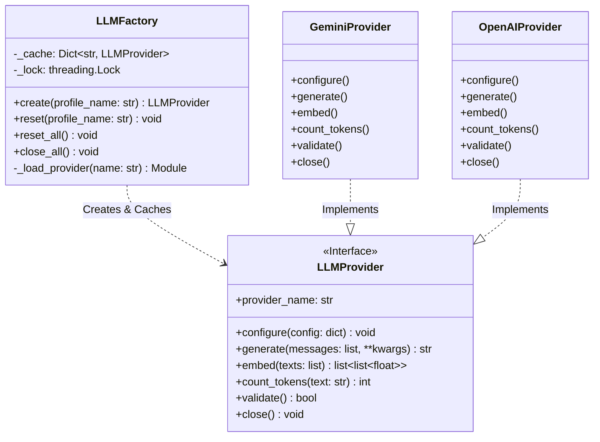

# 01_06 LLM Binding & Selection Specification

> **Status**: DRAFT
> **Owner**: Architecture Team
> **Context**: Unified Interface for all LLM interactions (RAG & Agents).

## 1. Overview
The **LLM Binding System** serves as the abstraction layer between the Flow Manager core and the various underlying LLM providers (Google Gemini, OpenAI, Anthropic, Ollama, etc.).

**Key Objectives:**
1.  **Uniformity**: All providers must adhere to a strict, identical interface.
2.  **Modularity**: Providers are installed as optional plugins; the core system does not depend on them physically.
3.  **Dynamic Selection**: Users can switch providers/models at runtime via configuration profiles.
4.  **Zero Leakage**: Provider-specific logic (e.g., `google-genai` types) must not leak into the core system.
5.  **Secure Credentials**: Each provider uses distinct authentication mechanisms. Secrets are resolved from environment variables at runtime — never stored in config files.

**Primary Consumers:**
*   **`AgentAtom`** (01_05 §3): Uses `generate()` for the ReAct reasoning loop and `count_tokens()` for context budget management.
*   **`KnowledgeService`** (01_09): Uses `embed()` for RAG vector generation and `count_tokens()` for retrieval budget enforcement. The `KnowledgeTool` (01_04 §5) accesses embedding capabilities via the `KnowledgeService`, NOT by directly calling `LLMProvider`.

---

## 2. Architecture



---

## 3. The Protocol (`LLMProvider`)
Located at: `src/flow/llm/provider.py`

All adapters **MUST** inherit from this ABC and implement all methods.

```python
from abc import ABC, abstractmethod
from typing import List, Dict, Any, Optional

class LLMProvider(ABC):
    """
    Abstract Base Class for all LLM Provider implementations.
    
    Lifecycle Contract:
      1. Factory instantiates the adapter via __init__() (no args).
      2. Factory calls configure(config) exactly ONCE.
      3. After configure() succeeds, generate()/embed()/count_tokens() are callable.
      4. Calling generate()/embed()/count_tokens() BEFORE configure() MUST raise 
         ProviderNotConfiguredError. Even local tokenizers (e.g. tiktoken) require
         configure() to resolve which model's tokenizer to load.
      5. Calling configure() a SECOND time MUST raise ProviderAlreadyConfiguredError.
         This includes cases where the first configure() FAILED (e.g., LLMAuthError).
         A failed configure() poisons the adapter. The caller MUST discard it and
         obtain a fresh instance via Factory.reset() + Factory.create().
      5a. Resource Cleanup on configure() Failure: If configure() raises an exception
          after partially initializing SDK resources (e.g., HTTP pool created but
          credential validation failed), the adapter MUST clean up those resources
          in its exception handler before re-raising. The adapter MUST also tolerate
          close() being called on a partially-configured (poisoned) instance —
          close() MUST release any partially-initialized SDK resources rather than
          silently no-opping.
      6. close() MAY be called to release SDK resources (HTTP pools, background threads).
         After close(), calling generate()/embed()/count_tokens() MUST raise 
         ProviderNotConfiguredError.
      7. close() is PERMANENT. After close(), the adapter is dead. Calling configure()
         again MUST raise ProviderAlreadyConfiguredError. To obtain a new instance,
         use Factory.reset(profile_name) followed by Factory.create(profile_name).
      8. close() MUST be idempotent. Calling it multiple times MUST NOT raise.
    
    Thread Safety:
      All implementations MUST be thread-safe. Concurrent calls to generate()
      and embed() from different Engine threads (e.g., parallel Fan-Out 
      branches — see 01_03 §3.4.3) MUST NOT cause data corruption or 
      shared state leaks.
      
      Implementation Guidance: Adapter implementations SHOULD hold no mutable 
      instance state other than the SDK client handle. If mutable state is 
      needed (e.g., request counters), it MUST be protected with a 
      threading.Lock. The SDK client handles themselves are typically 
      thread-safe (httpx, requests, google-genai).
    """

    @property
    @abstractmethod
    def provider_name(self) -> str:
        """The canonical unique identifier (e.g. 'gemini', 'openai').
        MUST match the registry key used by LLMFactory."""
        pass

    @abstractmethod
    def configure(self, config: Dict[str, Any]) -> None:
        """
        Initialize the provider with a profile's config dict.
        
        The adapter MUST:
          - Resolve credentials from environment variables (see §4).
          - Initialize the underlying SDK client.
          - Validate that the credentials are well-formed (format check).
        
        Error Classification:
          - ProviderConfigError:           Structural config issues — missing 
                                           'model', invalid 'base_url', missing 
                                           'deployment_name' for Azure. Anything 
                                           unrelated to authentication.
          - LLMAuthError:                  Credential resolution failures — 
                                           missing API key, expired token, 
                                           revoked SSO. Specifically for auth.
          - ProviderAlreadyConfiguredError: If called more than once.
        
        If in doubt between ProviderConfigError and LLMAuthError, prefer 
        LLMAuthError for any issue related to credential resolution.
        """
        pass

    @abstractmethod
    def generate(
        self,
        messages: List[Dict[str, str]],
        *,
        timeout_seconds: int = 120,
        **kwargs
    ) -> str:
        """
        Synchronous text generation using the chat/messages paradigm.
        
        Args:
            messages: Ordered list of role/content dicts.
                      All text MUST be valid UTF-8 strings.
                      
                      Input Validation (adapters MUST enforce):
                        - messages list MUST NOT be empty (raise ValueError).
                        - Each dict MUST contain 'role' and 'content' string keys 
                          (raise ValueError if missing or wrong type).
                        - role MUST be one of: "system", "user", "assistant"
                          (raise ValueError for unknown roles).
                        - content SHOULD NOT be an empty string. Adapters SHOULD
                          raise ValueError for empty-string content as a defensive
                          measure, since most providers reject it. This is a
                          RECOMMENDED validation, not a hard requirement.
                        - content SHOULD NOT contain null bytes (\x00). Adapters
                          SHOULD strip or reject null bytes as a defensive measure.
                          This is a RECOMMENDED validation, not a hard requirement.
                      
                      V1 roles: "system", "user", "assistant".
                      [FUTURE V2]: When function-calling is added, "tool" and 
                      "function" roles will be introduced. The role validation
                      must be extensible (not hardcoded list).
                      
                      Supported roles: "system", "user", "assistant".
                      Example: [
                          {"role": "system", "content": "You are a code reviewer."},
                          {"role": "user", "content": "Review this function: ..."}
                      ]
                      A single-shot prompt is: [{"role": "user", "content": prompt}].
            timeout_seconds: Max wait time before aborting. Adapters MUST 
                             respect this (via SDK timeout or async wrapper).
            **kwargs: Standardized overrides:
                      - temperature (float)
                      - max_tokens (int)
                      - stop_sequences (List[str])
                      - top_p (float)
                      - top_k (int)
        
        Returns:
            The generated text string. NEVER returns None, empty string, or 
            whitespace-only string. If the raw SDK response object is None,
            the response text attribute is None, or the response text is empty /
            whitespace-only, raise LLMGenerationError. Adapters MUST guard
            against None from the SDK (common with safety-filtered responses
            where e.g. Gemini's response.text is None rather than "").
        
        Kwargs Pass-Through:
            Unknown **kwargs (not in the standardized list above) SHOULD be
            silently passed through to the underlying provider SDK. This allows
            callers to use provider-specific features without adapter changes.
            Adapters MUST NOT raise on unknown kwargs.
        
        Raises:
            ProviderNotConfiguredError: If configure() has not been called.
            ValueError:                If messages input fails validation.
            LLMConnectionError:        Network/API reachability (retryable).
            LLMAuthError:              Invalid/expired credentials (NOT retryable).
            LLMRateLimitError:         Quota exhaustion (retryable with backoff).
            LLMGenerationError:        Model error, safety filter, empty response,
                                       None SDK response, or context window
                                       overflow. Context overflow is non-retryable
                                       (see §6.3).
            ProviderConfigError:       Model not found / deprecated at provider 
                                       (discovered at runtime, NOT retryable).
            TimeoutError:              If timeout_seconds is exceeded.
        """
        pass

    @abstractmethod
    def embed(
        self,
        texts: List[str],
        *,
        timeout_seconds: int = 60
    ) -> List[List[float]]:
        """
        Batch embedding generation.
        
        Args:
            texts: List of strings to embed. All text MUST be valid UTF-8.
                   If texts is an empty list, MUST return an empty list 
                   without making an API call.
            timeout_seconds: Max wait time before aborting.
        
        Returns:
            List of embedding vectors. len(result) == len(texts).
            Each vector is a list of floats (dimension depends on model).
        
        Batch Size:
            Adapters SHOULD accept batches up to the provider's native limit.
            Oversized batches MUST raise ValueError with the provider's limit 
            in the message. Auto-chunking of large batches is NOT required 
            for V1 — callers (the RAG system) are responsible for batch sizing.
        
        Raises:
            Same as generate(), plus:
            NotImplementedError: If the provider does not support embeddings
                                 (e.g., Anthropic as of 2026). Callers MUST
                                 handle this gracefully.
        """
        pass

    @abstractmethod
    def count_tokens(self, text: str) -> int:
        """
        Returns the token count for the given text using the provider's 
        native tokenizer.
        
        Required by:
          - AgentAtom context budget management (01_05 §3.3)
          - RAG retrieval budget enforcement (01_09 §7)
          - Context window pre-check before generate() (see §6.6)
        
        Args:
            text: A string to tokenize. MUST be a valid string.
                  Raises TypeError if text is not a string.
                  Returns 0 for empty strings.
                  No maximum input size is enforced — callers are responsible 
                  for pre-validating input size.
        
        If no native tokenizer is available, the adapter SHOULD use
        a reasonable approximation (e.g., tiktoken for OpenAI-compatible,
        chars/4 as absolute fallback) and log a warning.
        """
        pass

    def validate(self) -> bool:
        """
        Quick health check. Returns True if the provider is reachable 
        and authenticated.
        
        Default implementation: Attempts a minimal generate() call with 
        a trivial prompt and 5s timeout. Adapters SHOULD override with 
        a cheaper provider-specific check (e.g., models.list() endpoint)
        to avoid token consumption.
        
        IMPORTANT: The default implementation costs tokens. Adapter authors
        are strongly encouraged to override with a non-generative check.
        
        Note: Calling validate() before configure() will raise 
        ProviderNotConfiguredError (since it calls generate() internally).
        This is expected — the Factory calls validate() only after 
        configure().
        """
        try:
            self.generate(
                [{"role": "user", "content": "ping"}],
                timeout_seconds=5,
                max_tokens=1
            )
            return True
        except Exception:
            return False

    def close(self) -> None:
        """
        Release SDK resources (HTTP connection pools, background threads).
        
        Called by the Factory during reset() before evicting the cached 
        instance, and during Engine shutdown for graceful cleanup.
        
        After close(), any subsequent generate()/embed() calls MUST raise 
        ProviderNotConfiguredError.
        
        Default implementation: No-op. Adapters SHOULD override if the SDK 
        client maintains persistent connections or background threads 
        (e.g., httpx.Client, grpc channels).
        """
        pass
```

---

## 4. Authentication & Credential Management

> [!IMPORTANT]
> **Golden Rule**: Credentials are NEVER stored in `flow_config.json` or any file in `.flow/`.
> They are resolved at runtime through a **layered credential chain** (see §4.4).
> The config file only declares the **auth method** and, if applicable, the *name* of
> the environment variable — never the secret itself.

### 4.1 Auth Method Enum

The `auth.method` field in a profile selects the credential resolution strategy.

> [!NOTE]
> If a profile has **no `auth` block**, the adapter MUST log a `WARNING` with `"No auth method specified, defaulting to 'api_key'"` and default to `method: api_key` using the provider's conventional environment variable (e.g., `OPENAI_API_KEY` for OpenAI). This default behavior is a convenience for simple setups — production configurations SHOULD always declare `auth` explicitly.

| Method | Scope | Provider(s) | Description | V1? |
|:---|:---|:---|:---|:---|
| `api_key` | Any key-based provider | OpenAI, Anthropic, Gemini, Azure | API key resolved from env var or OS keyring. | ✅ |
| `adc` | Google only | Gemini (standard API) | Google Application Default Credentials. User runs `gcloud auth application-default login` once — SDK auto-discovers the cached OAuth2 token. Zero config. | ✅ |
| `vertex_adc` | Google Vertex AI only | Gemini (Vertex) | ADC + explicit `project_id` and `location`. For enterprise Vertex AI deployments with service accounts or user SSO. | ✅ |
| `keyring` | Any key-based provider | OpenAI, Anthropic, Gemini, Azure | OS-native encrypted credential store (Windows Credential Manager, macOS Keychain, Linux Secret Service). Managed via `flow secret set`. | ✅ |
| `none` | Ollama | Ollama | No authentication. Network-level security only. | ✅ |
| `azure_ad` | Azure only | Azure OpenAI | [FUTURE] Azure Active Directory / Entra ID via `DefaultAzureCredential`. Supports `az login`, Managed Identity, service principals. | ❌ V2 |
| `vault` | Any | Any | [FUTURE] Pluggable external vault (HashiCorp Vault, AWS Secrets Manager, GCP Secret Manager). | ❌ V2 |

### 4.2 Provider Authentication Matrix

| Provider | Supported Auth Methods | Required Credentials | Env Var Convention |
|:---|:---|:---|:---|
| **Gemini (API Key)** | `api_key`, `keyring` | API Key | `GOOGLE_API_KEY` |
| **Gemini (SSO)** | `adc` | None (user's Google login via `gcloud auth`) | Auto-discovered by SDK |
| **Gemini (Vertex AI)** | `vertex_adc` | Project ID + Location (in config) + ADC or SA | `GOOGLE_APPLICATION_CREDENTIALS` (SA key file path) |
| **OpenAI** | `api_key`, `keyring` | API Key + Org ID (optional) | `OPENAI_API_KEY`, `OPENAI_ORG_ID` |
| **Anthropic** | `api_key`, `keyring` | API Key | `ANTHROPIC_API_KEY` |
| **Ollama** | `none` | Base URL only | `OLLAMA_HOST` (optional) |
| **Azure OpenAI** | `api_key`, `keyring`, `azure_ad` (V2) | API Key + Endpoint + Deployment | `AZURE_OPENAI_API_KEY`, `AZURE_OPENAI_ENDPOINT` |

### 4.3 Auth Configuration Examples

The `auth` block within each profile defines **how** to resolve credentials. It does NOT contain the credentials themselves.

```json
{
  "knowledge": {
    "profiles": {
      "default": {
        "provider": "gemini",
        "description": "Developer workstation — Google SSO, zero config",
        "auth": {
          "method": "adc"
        },
        "config": {
          "model": "gemini-2.0-flash",
          "temperature": 0.7
        }
      },
      "gemini_api_key": {
        "provider": "gemini",
        "description": "CI/CD — API key from env var",
        "auth": {
          "method": "api_key",
          "api_key_env": "GOOGLE_API_KEY"
        },
        "config": {
          "model": "gemini-2.0-flash",
          "temperature": 0.7
        }
      },
      "vertex_enterprise": {
        "provider": "gemini",
        "description": "Enterprise — Vertex AI with Service Account or user SSO",
        "auth": {
          "method": "vertex_adc",
          "project_id": "my-gcp-project",
          "location": "us-central1"
        },
        "config": {
          "model": "gemini-2.0-pro",
          "temperature": 0.2
        }
      },
      "coding_expert": {
        "provider": "anthropic",
        "description": "Code gen — key from OS keyring",
        "auth": {
          "method": "keyring",
          "keyring_service": "flowmanager",
          "keyring_key": "ANTHROPIC_API_KEY"
        },
        "config": {
          "model": "claude-3-5-sonnet",
          "temperature": 0.1,
          "max_tokens": 4096
        }
      },
      "fast_reasoning": {
        "provider": "openai",
        "description": "Quick analysis — key from env var",
        "auth": {
          "method": "api_key",
          "api_key_env": "OPENAI_API_KEY",
          "org_id_env": "OPENAI_ORG_ID"
        },
        "config": {
          "model": "gpt-4o-mini",
          "temperature": 0.1
        }
      },
      "local_reasoning": {
        "provider": "ollama",
        "description": "Offline — no auth required",
        "auth": {
          "method": "none"
        },
        "config": {
          "model": "deepseek-r1:7b",
          "base_url": "http://localhost:11434"
        }
      },
      "azure_enterprise": {
        "provider": "azure_openai",
        "description": "Corporate Azure deployment",
        "auth": {
          "method": "api_key",
          "api_key_env": "AZURE_OPENAI_API_KEY"
        },
        "config": {
          "endpoint": "https://mycompany.openai.azure.com/",
          "deployment_name": "gpt-4o-company",
          "api_version": "2024-02-15-preview"
        }
      }
    }
  }
}
```

### 4.4 Credential Resolution Chain

During `configure()`, adapters resolve credentials using a **layered chain**. The first layer that returns a valid credential wins.

```
┌─────────────────────────────────────────────────────────────┐
│  1. Explicit Environment Variable                           │
│     (auth.api_key_env or provider convention)                │
│     Best for: CI/CD, Docker, automation                      │
├─────────────────────────────────────────────────────────────┤
│  2. OS Keyring (if method=keyring OR as fallback)            │
│     Python `keyring` → OS-native encrypted store             │
│     Best for: Developer workstations                         │
├─────────────────────────────────────────────────────────────┤
│  3. Application Default Credentials (if method=adc|vertex_adc)│
│     Google: `gcloud auth application-default login`          │
│     Azure (V2): `az login`                                   │
│     Best for: SSO / interactive developer auth               │
├─────────────────────────────────────────────────────────────┤
│  4. Fail Fast                                                │
│     Raise LLMAuthError with actionable message               │
│     Example: "Anthropic API key not found.                   │
│      Set ANTHROPIC_API_KEY env var, run                      │
│      'flow secret set ANTHROPIC_API_KEY', or configure       │
│      auth.method=keyring in the profile."                    │
└─────────────────────────────────────────────────────────────┘

> [!CAUTION]
> **Credential Sanitization**: The extracted API key MUST be aggressively sanitized. Adapters MUST strip the following characters before passing to the SDK:
> - Leading/trailing whitespace (spaces, tabs `\t`)
> - Newlines (`\n`, `\r`, `\r\n`)
> - Byte Order Marks (`\xEF\xBB\xBF`, `\uFEFF`)
> - Zero-Width Spaces (`\u200B`)
> - Non-Breaking Spaces (`\u00A0`)
> - Em Spaces (`\u2003`)
>
> DAUs frequently copy unprintable characters from Outlook, Slack, Teams, and web browsers into config fields or environment variables. Windows Notepad in particular adds BOM and CRLF.
```

**Important**: For `method=adc`, layers 1 and 2 are skipped entirely — the Google SDK handles credential discovery internally via its own chain (env var → `gcloud` CLI tokens → compute metadata). The adapter simply calls `genai.Client()` with no arguments.

### 4.5 SSO / Application Default Credentials (ADC)

**Purpose**: Allow developers to use their existing Google (or Azure) login instead of managing API keys manually.

#### 4.5.1 Google ADC (`method: adc`)

**One-time setup** (developer runs once, token cached for weeks):
```bash
gcloud auth application-default login
```
This opens a browser, the user logs in with their Google account, and a refresh token is stored at `~/.config/gcloud/application_default_credentials.json`. The `google-genai` SDK picks this up **automatically**.

**Adapter behavior**: When `method=adc`, the adapter calls `genai.Client()` with NO API key argument. The SDK resolves credentials internally. No env vars, no config, no secrets management.

**Token Refresh**: The SDK handles refresh token renewal transparently. If the token expires and cannot be refreshed (e.g., user revoked access), the adapter catches the SDK error and raises `LLMAuthError` with: `"Google ADC token expired or revoked. Run 'gcloud auth application-default login' to re-authenticate."`

#### 4.5.2 Vertex AI ADC (`method: vertex_adc`)

Same as `adc`, but the adapter additionally passes `project_id` and `location` from the auth config:
```python
client = genai.Client(vertexai=True, project=project_id, location=location)
```
Auth can come from:
-   `gcloud auth application-default login` (developer SSO)
-   Service Account key file via `GOOGLE_APPLICATION_CREDENTIALS` env var (CI/CD)
-   Compute Engine metadata (GCP VMs)

#### 4.5.3 [FUTURE] Azure AD (`method: azure_ad`)

Uses `DefaultAzureCredential` from the `azure-identity` SDK. Chains through:
1.  Managed Identity (Azure VMs)
2.  `az login` (developer CLI)
3.  Browser interactive login
4.  Environment variables (fallback)

**Why V2**: Requires the `azure-identity` SDK as an additional dependency. The `api_key` method already covers Azure OpenAI for V1.

### 4.6 OS Keyring (`method: keyring`)

**Purpose**: Encrypted credential storage on developer workstations without managing environment variables.

#### 4.6.1 Backend

Uses Python's [`keyring`](https://pypi.org/project/keyring/) library, which delegates to the **OS-native credential store**:

| OS | Backend | Encryption |
|:---|:---|:---|
| Windows | **Credential Manager** | DPAPI (tied to user login session) |
| macOS | **Keychain** | AES-256 (tied to user login session) |
| Linux | **Secret Service** (GNOME Keyring / KWallet) | AES-256 (tied to user login session) |

**Key properties**: Zero infrastructure, works fully offline, encrypted by the OS (not by us — we do NOT roll our own crypto), credentials tied to the user's login session.

#### 4.6.2 CLI Workflow

```bash
# Store a secret (interactive prompt, never visible in shell history)
flow secret set OPENAI_API_KEY
> Enter value: ****

# List stored secret keys (values never shown)
flow secret list
> OPENAI_API_KEY    (set)
> ANTHROPIC_API_KEY (set)

# Remove a secret
flow secret remove OPENAI_API_KEY

# Verify a specific provider profile can authenticate
flow secret verify --profile coding_expert
> ✅ Profile 'coding_expert' (anthropic): credentials valid.
```

#### 4.6.3 Keyring Config

```json
"auth": {
  "method": "keyring",
  "keyring_service": "flowmanager",
  "keyring_key": "ANTHROPIC_API_KEY"
}
```

*   `keyring_service`: The service namespace in the OS keyring (default: `"flowmanager"`).
*   `keyring_key`: The key name to look up. If omitted, falls back to provider convention (e.g., `OPENAI_API_KEY` for OpenAI).

#### 4.6.4 Fallback Behavior

When `method=keyring`, the resolution chain is:
1.  **Environment variable** (always checked first — env var overrides keyring).
2.  **OS keyring** lookup.
3.  **Fail fast** with message: `"API key not found in keyring. Run 'flow secret set <KEY_NAME>' to store it."`

> [!WARNING]
> **Headless Timeout**: The `keyring.get_password()` call MUST be wrapped in a strict 3-second timeout (e.g., via background thread or async wrapper). In headless Linux/macOS environments, locked keyrings wait indefinitely for GUI user prompts. If it times out, raise `LLMAuthError("OS Keyring locked or unresponsive in headless environment")`.

This means CI/CD environments (where env vars are set by the pipeline) work seamlessly without touching the keyring, while developer workstations use the keyring for convenience.

### 4.7 Credential Security Constraints

*   **No Disk Persistence**: Resolved API keys MUST be held in memory only. They MUST NOT be written to `.flow/`, logs, `audit.jsonl`, or `AtomResult.exports`.
*   **No Logging**: API keys MUST NOT appear in any log output. The `SmartRedactor` (01_04 §7) provides a safety net, but adapters MUST NOT emit keys in the first place.
*   **No Exception Leakage**: API keys MUST NOT appear in exception messages, `str(exception)`, or `exception.args`. When `configure()` or credential resolution fails, the error message MUST describe the *problem* (e.g., "API key not found") without including the *credential value*. This is **explicitly forbidden** — violations are treated as security bugs.
*   **Key Rotation**: Singleton cache invalidation (§5.2) provides the mechanism. If a key is rotated, the operator runs `flow secret set <KEY>` (keyring) or updates the env var, then calls `flow reset-llm` (or restarts the engine) to force re-resolution.
*   **Keyring Dependency**: The `keyring` package is an **optional** dependency. If it is not installed and `method=keyring` is configured, `configure()` MUST raise `MissingDependencyError` with: `"Run 'pip install keyring' to use OS keyring authentication."` If not installed and method is `api_key`, the keyring fallback is silently skipped — env var is the only source.

### 4.8 Capability Matrix (Not All Providers Support Everything)

| Provider | `generate()` | `embed()` | `embed_dims` | `count_tokens()` | Function-Calling (V2) |
|:---|:---|:---|:---|:---|:---|
| Gemini | ✅ | ✅ | 768 | ✅ (native) | ✅ (V2) |
| OpenAI | ✅ | ✅ | 1536 / 3072 | ✅ (tiktoken) | ✅ (V2) |
| Anthropic | ✅ | ❌ `NotImplementedError` | N/A | ⚠️ approximation | ✅ (V2) |
| Ollama | ✅ | ✅ | model-dependent | ⚠️ approximation | ❌ |
| Azure OpenAI | ✅ | ✅ | 1536 / 3072 | ✅ (tiktoken) | ✅ (V2) |

Callers MUST handle `NotImplementedError` from `embed()` gracefully. The RAG system (01_09) MUST use a profile with embedding support and SHOULD validate this at startup.

**Embedding Dimensions**: Adapters that support `embed()` SHOULD expose their embedding dimensions via a `embedding_dimensions` property (returning `Optional[int]`). This allows the RAG system to validate dimension compatibility at startup rather than discovering mismatches at vector insertion time. If the adapter cannot determine dimensions statically, it SHOULD return `None` and let the caller infer from the first result.

---

## 5. The Factory (`LLMFactory`)
Located at: `src/flow/llm/factory.py`

The Factory is the **only** way to obtain an LLM instance.

### 5.1 Core Responsibilities

1.  **Lazy Loading**: It imports the specific adapter module ONLY when first requested for that provider. This prevents `ImportError` cascades when optional SDKs are missing.
2.  **Error Handling**: If the underlying SDK (e.g., `google-genai`) is not installed, it raises a clear `MissingDependencyError` with installation instructions (e.g., "Run `poetry install -E google`").
3.  **Provider Name Validation**: After instantiation, the Factory MUST verify that `adapter.provider_name` matches the registered key. Mismatches raise `ProviderRegistrationError`.
4.  **Lazy Initialization (No Eager Validation)**: The Factory does NOT call `validate()` during `create()`. Initialization is lazy — the adapter is configured and cached, but health is verified only on the first real `generate()` or `embed()` call. This avoids wasting tokens on health checks at engine startup and prevents issues with local providers (e.g., Ollama) that may not be running at boot time.
    *   **Risk**: Bad credentials are discovered late (at first use, not at startup). This is an acceptable trade-off for V1. Operators can run `flow secret verify --profile <name>` explicitly to pre-validate.
5.  **Thread-Safe Singleton Creation**: The Factory MUST use a `threading.Lock` to guard `create()`. If two Engine threads call `create("coding_expert")` simultaneously on first use, only one thread performs instantiation + `configure()`. The second thread waits and receives the cached instance.

### 5.2 Instance Lifecycle (Singleton Cache)

*   **Caching**: Provider instances are **Singletons per profile name**. `create("coding_expert")` always returns the same adapter instance for the lifetime of the Engine process.
*   **Invalidation**:
    *   `reset(profile_name: str)`: Calls `adapter.close()` on the evicted instance, then evicts it from the cache. Next `create()` will re-instantiate and re-configure. If `profile_name` has never been created (not in cache), `reset()` is a **silent no-op** — it MUST NOT raise.
    *   `reset_all()`: Calls `close()` on all cached instances, then clears the cache.
*   **When to use `reset()`**: Credential rotation (API key changed), configuration changes (switching models), or recovering from a provider that is persistently failing. It is NOT for cancelling in-flight API calls — those are governed by `timeout_seconds`.

> [!CAUTION]
> `reset()` and `reset_all()` are NOT safe during active workflow execution. They are intended for operator-initiated reconfiguration **between** workflow runs (e.g., via `flow reset-llm` CLI or before Engine restart). Calling `reset()` while parallel fan-out branches are using the adapter results in undefined behavior.
>
> **Distinction from `close_all()`**: `close_all()` IS safe during active execution because it is a **shutdown** path — the entire Engine is going down, so in-flight requests are abandoned. `reset()` is **unsafe** because it is a **reconfiguration** path during the Engine's life — callers may still hold references to the evicted adapter and attempt to use it. If `reset()` is called during active calls, the recommended behavior is that the evicted adapter's `close()` sets an internal `_closed` flag, causing in-flight operations to raise `ProviderNotConfiguredError`.

*   **Graceful Shutdown**: `close_all()` calls `adapter.close()` on every cached instance and marks the Factory as **shut down**. Called by the Engine during `SIGTERM` / `SIGINT` teardown to release network resources. **CRITICAL: The teardown loop MUST wrap `close()` in an absolute hard-timeout (e.g., 5 seconds) to prevent frozen TCP sockets from creating infinite zombie processes blocking `SIGTERM`.** After `close_all()`, calling `create()` MUST raise `FactoryClosedError` to prevent returning dead (closed) adapter instances. To resume operations, the Engine must instantiate a new Factory.
*   **Config Changes**: Changes to `flow_config.json` at runtime are NOT automatically detected. A `reset()` or engine restart is required. This is acceptable for V1.

### 5.3 Provider Registry

The Factory maintains a static mapping of provider keys to adapter module paths:

```python
PROVIDER_REGISTRY = {
    "gemini":       "src.flow.llm.adapters.gemini_adapter.GeminiProvider",
    "openai":       "src.flow.llm.adapters.openai_adapter.OpenAIProvider",
    "anthropic":    "src.flow.llm.adapters.anthropic_adapter.AnthropicProvider",
    "ollama":       "src.flow.llm.adapters.ollama_adapter.OllamaProvider",
    "azure_openai": "src.flow.llm.adapters.azure_openai_adapter.AzureOpenAIProvider",
}
```

Each provider MUST be installable as an independent Poetry extras group:
*   `poetry install -E google` → installs `google-genai`
*   `poetry install -E openai` → installs `openai`
*   `poetry install -E anthropic` → installs `anthropic`
*   `poetry install -E ollama` → installs `ollama`

> [!WARNING]
> Installing multiple provider extras simultaneously may cause transitive dependency conflicts (e.g., conflicting `httpx` version pins between `google-genai` and `anthropic`). For V1, using a **single provider extra per project** is the recommended configuration. Multi-provider setups should be tested with `poetry lock --check`. V2 may introduce stricter dependency isolation.

---

## 6. Implementation Guidelines

### 6.1 Dependency Isolation
*   Core logic (`src/flow/`) MUST NOT import `google`, `openai`, `anthropic`, `ollama`, etc.
*   Adapters (`src/flow/llm/adapters/*`) are the ONLY place where SDK imports occur.
*   Adapters MUST use `try/except ImportError` blocks at the top level to allow the file to be parsed even if dependencies are missing:
    ```python
    try:
        from google import genai
    except ImportError:
        genai = None  # Deferred: MissingDependencyError raised in configure()
    ```

### 6.2 Error Standardization
Providers must catch SDK-specific errors and raise standard system exceptions:
*   `LLMConnectionError`: Network/API reachability issues. **Adapters MUST explicitly catch and map `[SSL: CERTIFICATE_VERIFY_FAILED]` (Corporate Proxy Mitigations) and HTTP 502/504 `json.decoder.JSONDecodeError` (Cloudflare generic HTML pages) to `LLMConnectionError`. Do NOT leak standard library tracebacks.**
*   `LLMAuthError`: Invalid API keys, expired credentials, permission denied.
*   `LLMRateLimitError`: Quota exhaustion (HTTP 429).
*   `LLMGenerationError`: Internal model errors, safety filter blocks, empty responses, context window overflow.
*   `ProviderConfigError`: Model not found / deprecated at provider (runtime discovery).

**Content Filtering / Safety Blocks**: If the provider's safety filter blocks a response (e.g., Gemini `HARM_CATEGORY_*` triggers), the adapter MUST raise `LLMGenerationError` with a descriptive message. Adapters MUST NEVER return `None` or an empty string silently.

**Model Not Found / Deprecated**: If the provider returns a 404 or similar "model not found" error at `generate()` time, the adapter MUST raise `ProviderConfigError` (not `LLMConnectionError`, since the network is fine). The message MUST include the model name and a suggestion to update the profile config.

### 6.3 Retry Semantics

Retry logic is implemented as **Tenacity decorators on the adapter's `generate()` and `embed()` methods**, NOT in the Factory (which is a routing concern, not a resilience concern).

| Error Type | Retryable? | Strategy | Max Retries (additional attempts after first failure) | Total Calls |
|:---|:---|:---|:---|:---|
| `LLMConnectionError` | ✅ Yes | Exponential backoff (1s, 2s, 4s) | 3 | 4 |
| `LLMRateLimitError` | ✅ Yes | Provider-specific retry header if available (see §6.3.1), else exponential backoff (5s, 15s, 30s) | 3 | 4 |
| `LLMAuthError` | ❌ No | Fail immediately | 0 | 1 |
| `LLMGenerationError` | ⚠️ Conditional | Single retry for model hiccups. Context window overflow errors are **non-retryable** — adapters SHOULD detect this from provider error messages and skip retry. | 1 (0 for overflow) | 2 (1 for overflow) |
| `ProviderConfigError` | ❌ No | Fail immediately (model not found) | 0 | 1 |
| `TimeoutError` | ✅ Yes | Retry with same timeout | 1 | 2 |

**Retry Budget**: Adapters MUST log every retry attempt at `WARNING` level. After final failure, the original exception is re-raised.

> [!NOTE]
> **Total Wall-Clock Bound**: When retries are enabled, the total wall-clock time for a single `generate()` call is approximately `(Total Calls × timeout_seconds) + cumulative backoff`. For example, a `LLMConnectionError` with `timeout_seconds=120` and 3 retries results in: `4 × 120s + (1+2+4)s backoff = ~487s` (~8 minutes). Callers must account for this when setting Engine-level step timeouts. There is no circuit-breaker at the adapter level — the Engine's `SIGTERM` handler and atom-level timeout are the ultimate safeguards.

#### 6.3.1 Rate Limit Header Parsing

Adapters SHOULD parse provider-specific retry-after headers where available:
*   **Standard**: `Retry-After` (seconds or HTTP date)
*   **OpenAI**: `x-ratelimit-reset-requests`, `x-ratelimit-reset-tokens`
*   **Anthropic**: `retry-after` (seconds)

If no retry hint is available from the provider, fall back to exponential backoff with jitter. Specific header parsing logic is adapter-specific and NOT standardized in the protocol.

### 6.4 Timeout Contract

*   Both `generate()` and `embed()` accept a `timeout_seconds` keyword argument.
*   Default: `120s` for `generate()`, `60s` for `embed()`.
*   Adapters MUST enforce the timeout. If the SDK supports a native `timeout` parameter, use it. Otherwise, wrap the blocking call using `concurrent.futures.ThreadPoolExecutor` with a strict `max_workers` cap (e.g., matching the Engine's global concurrent limits). **Do NOT use unbounded ThreadPools, as large parallel fan-outs will trigger OS-level `RuntimeError: can't start new thread` or exhaust file descriptors.**
*   On timeout, raise `TimeoutError` — which is retryable per §6.3.

### 6.5 Observability & Logging

Adapters SHOULD emit structured log entries (via Python `logging`) for each `generate()` and `embed()` call. This provides basic observability without requiring a full metrics stack.

**Recommended log fields** (structured via `extra` dict or `structlog`):
*   `profile_name`: Which profile was used.
*   `model`: Which model was called.
*   `latency_ms`: Wall-clock time for the API call.
*   `prompt_tokens`: Token count of the input (if available from provider response).
*   `completion_tokens`: Token count of the output (if available).
*   `status`: `success`, `retry`, `error`.

**Log levels**:
*   `INFO`: Successful calls (latency + token counts).
*   `WARNING`: Retry attempts.
*   `ERROR`: Final failures after retries exhausted.

Structured log format is NOT mandated for V1. This is a recommendation for adapter authors. V2 may introduce a formal `LLMMetrics` interface for Prometheus/Grafana integration.

### 6.6 Context Window Pre-Check

To avoid burning API calls (and retry quota) on requests that are guaranteed to fail due to context window overflow:

*   Callers (primarily `AgentAtom`) SHOULD use `count_tokens()` to estimate the total token count of the `messages` payload before calling `generate()`.
*   If the estimated token count exceeds the model's known context window, the caller SHOULD raise a non-retryable `LLMGenerationError` with a descriptive message **without** making the API call.
*   The model's context window size is NOT exposed by the `LLMProvider` interface in V1. Callers must obtain this from profile configuration or hardcoded model metadata.
*   Adapters SHOULD additionally detect context window overflow errors from provider responses and classify them as non-retryable `LLMGenerationError` (see §6.3 retry table).

> [!NOTE]
> Pre-checking is a **caller responsibility**, not an adapter responsibility. The adapter simply reports the error if the provider rejects the request. This keeps the adapter interface simple and avoids requiring adapters to know about every model's context window.

---

## 7. Known Limitations & Future Work

> [!NOTE]
> The following capabilities are explicitly **out of scope for V1**. They are documented here to prevent ad-hoc workarounds and to guide future revisions.

### 7.1 [FUTURE] Streaming Interface
V1 is batch-only (`generate() -> str`). For the AgentAtom ReAct loop (01_05 §3.2), this means the user sees no output until the full response is ready.

**V2 Proposal**: 
```python
def generate_stream(self, messages: List[Dict], **kwargs) -> Iterator[str]:
    """Yields tokens as they arrive."""
```

**Why not V1**: Streaming requires fundamental changes to the Engine's event model (01_03 §3.5) and the Atom result contract. Batch mode is sufficient for initial workflows.

### 7.2 [FUTURE] Function-Calling / Tool-Use
V1 is text-in/text-out. The AgentAtom (01_05 §3.1) and Skills system (01_07 §5) will eventually require:
*   Declaring available tools/functions to the LLM.
*   Parsing structured tool-call responses.
*   Translating between provider-specific function-calling formats.

**V2 Proposal**: Introduce a `ToolCallableProvider(LLMProvider)` subclass with:
```python
def generate_with_tools(
    self, messages, tools: List[ToolDeclaration], **kwargs
) -> Union[str, ToolCallResult]:
```

**Why not V1**: Function-calling formats differ significantly across providers (Gemini uses `google.genai.types.FunctionDeclaration`, OpenAI uses JSON Schema `tools`, Anthropic uses `tools` with different structure). Getting the abstraction right requires dedicated design effort. V1 callers can work around this by parsing JSON from text output manually.

**Note (Role Extensibility)**: When function-calling is introduced, the `messages` role validation (§3) must be extended to support `"tool"` and `"function"` roles. The validation logic SHOULD use an extensible mechanism (e.g., a set of allowed roles) rather than a hardcoded if/else chain to facilitate this transition.

### 7.3 [FUTURE] Structured Output (JSON Mode)
Modern LLMs support forced JSON output via response schemas. V1 callers parse JSON from free-text. V2 may add a `response_format` parameter.

### 7.4 [FUTURE] Cross-Branch Rate Coordination
In parallel fan-out (01_03 §3.4.3), multiple branches sharing a provider may exhaust rate limits faster than a single branch. V1 handles rate limits per-adapter with no cross-branch awareness. V2 may introduce a centralized rate limiter.

### 7.5 [FUTURE] External Vault Backends (`method: vault`)
For enterprise/team deployments where secrets must be centrally managed:
*   **HashiCorp Vault** — Self-hosted, industry standard.
*   **AWS Secrets Manager** — Cloud-native, IAM-integrated.
*   **GCP Secret Manager** — Cloud-native, IAM-integrated.
*   **Azure Key Vault** — Cloud-native, Entra ID-integrated.

**Why V2**: Requires infrastructure setup and additional SDK dependencies. The `keyring` + `api_key` + `adc` methods cover all developer and CI/CD use cases in V1. Vault backends add value only for team-wide secret rotation and audit trails.

### 7.6 [FUTURE] Azure AD Authentication (`method: azure_ad`)
Uses `DefaultAzureCredential` from the `azure-identity` SDK for Azure OpenAI. Supports Managed Identity, `az login`, service principals, and browser-based SSO.

**Why V2**: Requires `azure-identity` as an additional optional dependency. The `api_key` method covers Azure OpenAI for V1.

### 7.7 [FUTURE] Fallback Profiles
If a profile's `generate()` fails with `LLMConnectionError` after retries are exhausted, the Factory could automatically attempt a configured fallback profile. This requires the profile config to include an optional `fallback` key:
```json
"coding_expert": {
  "provider": "anthropic",
  "fallback": "fast_reasoning",
  ...
}
```
**Why V2**: Requires careful design around error semantics (which errors trigger fallback?), context compatibility (different models have different context windows), and observability (logging which profile actually served the request). V1 callers handle provider failures via the Engine's retry/error escalation path.

---

## 8. Adapter Implementation Checklist

Every new adapter MUST satisfy:

- [ ] Inherits from `LLMProvider` ABC.
- [ ] `provider_name` matches the Factory registry key.
- [ ] `configure()` resolves credentials per §4.4 resolution chain.
- [ ] `configure()` raises `LLMAuthError` if credentials are missing.
- [ ] `configure()` raises `ProviderAlreadyConfiguredError` on double-call.
- [ ] `generate()` / `embed()` raise `ProviderNotConfiguredError` before `configure()`.
- [ ] `generate()` validates messages input (non-empty, valid roles, string content) per §3.
- [ ] `generate()` never returns None, empty string, or whitespace-only string.
- [ ] `embed([])` returns `[]` without making an API call.
- [ ] SDK import uses `try/except ImportError` at module level.
- [ ] SDK-specific exceptions are caught and re-raised as §6.2 standard types.
- [ ] Model-not-found errors mapped to `ProviderConfigError`.
- [ ] Tenacity retry decorator applied per §6.3.
- [ ] `timeout_seconds` parameter is respected.
- [ ] Thread-safe for concurrent calls (no unprotected mutable state).
- [ ] `count_tokens()` implemented (native or approximation). Raises `TypeError` for non-string input.
- [ ] `validate()` overridden with a lightweight check (avoid token consumption).
- [ ] `close()` implemented if SDK client holds persistent connections or background threads.
- [ ] No API keys in logs, exports, or disk writes.
- [ ] Installable via independent Poetry extras group.

### 8.1 Adapter Contract Testing

All adapters MUST be testable against a shared **Contract Test Base Class** (`AbstractProviderContractTest`). This base class pre-defines ~15 mechanical test cases that exercise the ABC contract without provider-specific logic:

*   `test_generate_before_configure_raises`: Verifies `ProviderNotConfiguredError`.
*   `test_double_configure_raises`: Verifies `ProviderAlreadyConfiguredError`.
*   `test_generate_empty_messages_raises`: Verifies `ValueError` for `[]`.
*   `test_generate_invalid_role_raises`: Verifies `ValueError` for unknown roles.
*   `test_generate_missing_content_key_raises`: Verifies `ValueError`.
*   `test_embed_empty_list_returns_empty`: Verifies `[]` return for `embed([])`.
*   `test_count_tokens_non_string_raises`: Verifies `TypeError`.
*   `test_count_tokens_empty_string_returns_zero`: Verifies `0` return.
*   `test_provider_name_matches_registry`: Verifies name consistency.
*   `test_close_then_generate_raises`: Verifies `ProviderNotConfiguredError` after `close()`.
*   `test_concurrent_generate_no_crash`: 5-thread concurrent `generate()` smoke test.

The adapter author provides a fixture that returns a configured adapter instance. The contract tests validate the protocol; provider-specific behavior tests are separate.

The contract test base class will be defined in `tests/unit/llm/contract_test_base.py` and documented in the test spec.
