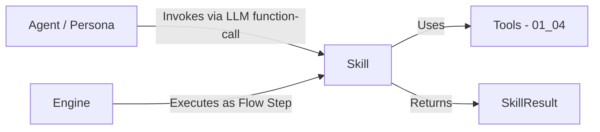

# 01_07 Skills and Personas Specification

> **Status**: DRAFT
> **Owner**: Architecture Team
> **Context**: Defining the "Who" (Personas) and the "What" (Skills) of the Agentic System.
> **Dependencies**: 01_04 (Tooling), 01_06 (LLM Binding), 01_08 (Flows)

## 1. Overview
This specification decouples the **Identity** of an agent from its **Capabilities**.

*   **Persona**: Defines *who* the agent is (Role, Tone, Priorities, Ethics). It is the "Soft Configuration" of the LLM.
*   **Skill**: Defines *what* the agent can do. It is a portable, versioned, single-responsibility unit of capability.

**LLM Agnosticism**:
Both Personas and Skills are defined in standard JSON/YAML. They are **projected** onto the specific LLM (Gemini, OpenAI, etc.) at runtime via the `LLMGateway` (01_06). The Core Engine handles the translation of a Skill's JSON Schema parameters into the specific function-calling format of the provider.

**Design Principles** (aligned with Anthropic, Google ADK, OpenAI convergent patterns):
1.  **JSON Schema for parameters** — All Skill inputs use strict JSON Schema.
2.  **Strict schema validation** — Input conformance is enforced before execution.
3.  **Agent-as-a-Tool** — Skills can expose themselves as LLM-callable tools.
4.  **Versioned definitions** — Every Skill and Persona carries a version identifier.
5.  **Consistent result type** — All Skills return a `SkillResult` with `status`, `exports`, `error`.
6.  **Single responsibility** — One Skill = one capability. Composition belongs in Flows (01_08).
7.  **Explicit registry** — Skills and Personas are whitelisted; unregistered items do not exist.

---

## 2. Personas ("The Who")

A Persona is a named, **versioned** configuration that applies a specific **Lens** to the LLM's reasoning.

### 2.1 Schema (`expert_personas.json`)

Located at: `src/flow/config/expert_personas.json`

```json
{
  "schema_version": "1",
  "personas": {
    "Senior Backend Developer": {
      "version": "1",
      "Description": "Expert in Python/clean code.",
      "SystemPrompt": "You are a Senior Backend Developer. Prioritize SOLID principles, error handling, and performance.",
      "Focus": ["Code Quality", "Maintainability"],
      "AllowedSkills": [
        {"name": "refactor_code", "version": "1"},
        {"name": "write_unit_tests", "version": "1"},
        {"name": "debug_error", "version": "1"}
      ],
      "AllowedTools": ["read_file", "search_file", "run_test", "git_commit"],
      "model_params": {
        "temperature": 0.2,
        "top_p": 0.9,
        "top_k": 40
      }
    }
  }
}
```

### 2.2 Schema Fields

| Field | Type | Required | Description |
|:---|:---|:---|:---|
| `version` | `string` | ✅ | Persona definition version. Incremented on breaking changes. |
| `Description` | `string` | ✅ | Human-readable role summary. |
| `SystemPrompt` | `string` | ✅ | Injected as the LLM's system message. **Maximum 8192 characters** (see §2.3 validation). |
| `Focus` | `List[str]` | ✅ | Expertise areas for context (advisory, not enforced). |
| `AllowedSkills` | `List[object]` | ✅ | **Whitelist** of Skill references this Persona can invoke. Each entry is `{"name": "skill_name", "version": "1"}`. The `version` pins the Persona to a specific Skill version for schema compatibility. Empty list `[]` is valid — means no Skills, tools-only agent. |
| `AllowedTools` | `List[str]` | ✅ | **Whitelist** of low-level Tool names (01_04). Empty list `[]` is valid. |
| `Checklist` | `List[str]` | ❌ | **[REMOVED IN V2]** Post-execution validation prompts. See §2.5 Anti-Pattern. |
| `model_params` | `object` | ❌ | LLM parameter overrides. See §2.4. |

### 2.3 Startup Validation

When the Engine loads `expert_personas.json` at startup, it MUST:

0.  **Parse file as JSON**: Before any schema checks, attempt `json.loads()`. On `json.JSONDecodeError`, raise `ConfigParseError` with the filename and line number: `"Failed to parse expert_personas.json at line 42: Expecting ',' delimiter."` Engine startup is aborted. (For hot-reload, a parse failure is treated as a no-op — see §5.3.)
1.  **Validate `schema_version`**: If the file's `schema_version` does not match the Engine's expected version, raise `SchemaVersionError` with: `"Persona file version '2' is not supported by this Engine (expected '1'). Update the file or downgrade the Engine."`
2.  **Validate `AllowedSkills`**: Every skill entry in `AllowedSkills` MUST reference a Skill name AND version that exist in the Skill Registry (§5). If a referenced skill is not registered, raise `RegistryError` at startup with: `"Persona 'Senior Backend Developer' references unknown skill 'security_audit'. Register it in skills.registry.json or remove it from AllowedSkills."` If the version does not match the registered Skill's version, the Engine MUST NOT fail on the first mismatch. Instead, it MUST scan ALL Personas, collect ALL version mismatches, and report them in a single `RegistryError`: `"Persona→Skill version mismatches detected: Persona 'Senior Backend Developer' references skill 'refactor_code' version '1' (registry has '2'); Persona 'QA Lead' references skill 'refactor_code' version '1' (registry has '2'). Update these Personas in expert_personas.json."` This prevents the frustrating cycle of fixing one Persona, restarting, hitting the next mismatch, and repeating.
3.  **Validate `AllowedTools`**: Every tool name in `AllowedTools` MUST exist in the Tool Registry (01_04). Same fail-fast rule. Each entry in `AllowedTools` MUST be a non-empty, non-whitespace string. Duplicate entries within a single Persona's `AllowedTools` list raise `RegistryError`: `"Persona 'X' has duplicate AllowedTools entry 'read_file'. Remove the duplicate."`
4.  **Tool count warning and hard cap**: If `len(AllowedSkills) + len(AllowedTools) > 20`, log a `WARNING`: `"Persona 'X' exposes 25 tools to the LLM. Provider accuracy degrades above 20 tools. Consider using dynamic tool filtering."` (Based on OpenAI's recommendation.) If the count exceeds the `max_tools_per_persona` value configured in `.flow/config.json` (default: `30`), raise `RegistryError`: `"Persona 'X' exposes 35 tools, exceeding the hard cap of 30. Reduce AllowedSkills/AllowedTools or raise max_tools_per_persona in config."` This cap prevents silent accuracy degradation in unmonitored long-running daemons.
5.  **Empty capability warning**: If both `AllowedSkills` and `AllowedTools` are empty, log a `WARNING`: `"Persona 'X' has no AllowedSkills and no AllowedTools. This agent has no capabilities."` This is valid (e.g., a "Thinking Only" persona) but deserves visibility.
6.  **Validate `model_params` keys**: If `model_params` is present, every key MUST be from the recognized set: `temperature`, `top_p`, `top_k`, `max_tokens`, `stop_sequences`. Unrecognized keys trigger a `WARNING` at startup: `"Persona 'X' has unrecognized model_params key 'temprature'. Check for typos."`
7.  **Validate `SystemPrompt` length**: If `len(SystemPrompt) > 8192`, raise `RegistryError`: `"Persona 'X' SystemPrompt exceeds 8192 characters (actual: N). A prompt this large consumes the provider context window before the agent starts work. Shorten the system prompt."` The 8192-character limit is aligned with the Engine's `MAX_INLINE_SIZE` (01_03 §3.5).

### 2.4 Model Parameter Override Chain

The `model_params` field allows per-persona LLM parameter overrides. The full override chain (last wins):

```
Provider Default → Profile Config (01_06 §4.3) → Persona model_params → Expert Set → Flow Step args → AgentAtom kwargs
```

**Merge strategy**: Shallow merge (key-level replace, not deep merge). If Persona sets `temperature: 0.2` and Expert Set sets `temperature: 0.0`, the Expert Set value wins.

**Provider-Unsupported Parameters**: After the override chain is resolved, the `LLMGateway` (01_06) MUST silently strip any parameters not supported by the active provider before constructing the API request. For example, `top_k` is valid for Gemini but not for OpenAI; the Gateway removes it rather than failing the call. Stripping is logged at `DEBUG` level: `"Stripped unsupported param 'top_k' for provider 'openai'."` No error is raised because the param was already validated as a recognized key in §2.3 step 6.

Analytical roles (QA, SRE, Quant) should use low temperature (0.0–0.2) for precision; creative roles (UI/UX, Product) can use higher (0.4–0.7). See [Agent Isolation Analysis §10](../analysis/agent_isolation.md) for full guidelines.

### 2.5 Anti-Pattern: Persona Self-Evaluation (Checklists)

Previous iterations allowed a Persona to hold a `Checklist` for self-evaluation. This is functionally flawed as it triggers on every ReAct loop or forces awkward conversational endings where the LLM must write an arbitrary confirmation message.
**Rule**: A Persona MUST NOT self-evaluate using a Checklist. Checklists MUST be evaluated by a separate `Reviewer` Persona in a downstream Flow step (01_08) or natively by the Engine via Assertions. The `Checklist` field has been removed from the Persona schema.

3.  [FUTURE V2]: Machine-verifiable checklists using rubric-based scoring evaluated structurally, never via injected prompt text (see `agent_isolation.md` §9).

### 2.6 Usage

When a Flow Step requires an "Expert", the Engine:
1.  Loads the Persona definition from the registry.
2.  Injects the `SystemPrompt` into the LLM context.
3.  **Tool Projection**: Combines `AllowedSkills` (projected as high-level tools) + `AllowedTools` (low-level tools) into the LLM's toolset via the `LLMGateway`.

---

## 3. Toolset Primitives (from `01_04_tooling_spec.md`)

Skills compose these fundamental Tool primitives via their `execute()` method. A Persona can also access them directly. Skills interact with the environment **exclusively through Tools** — never through Atoms (which are Engine-internal primitives for Flow orchestration).

### 3.1 The Standard Library
*   **FileTool**: `read_file`, `write_file`, `edit_file` (Loom), `search_file`, `list_files`, `count_matches`, `create_directory`, `delete_file`.
*   **ShellTool**: `run_test`, `run_lint`, `git_status`, `git_diff`, `git_add`, `git_commit`, `git_push` (RelEng only), `git_checkout`, `install_dependencies`.
*   **ShellTool [V2]**: `git_log`, `git_stash`, `git_merge`, `git_rebase`, `git_tag`, `git_reset`.
*   **KnowledgeTool**: `search_knowledge` (RAG), `find_usage`, `get_task_context`.
*   **SystemTool** (SRE Only): `install_package`, `system_ctl`.

---

## 4. Skills ("The What")

A Skill is a **portable, versioned, single-responsibility** unit of capability. It bridges the gap between high-level intent and low-level **Tools** (01_04).

> [!IMPORTANT]
> **Architectural Boundary**: Atoms (01_05) are internal to the Engine and used only within Flows (01_08). Skills interact with the external environment **exclusively through Tools** (01_04). Skills MUST NOT invoke Atoms directly.

### 4.1 Architecture



**Calling Model** (resolves the ambiguity):
*   **Path 1 — Engine Step**: The Flow Engine executes a Skill directly as a step (`"type": "skill"` in 01_08 §2.1). The Engine instantiates the Skill, calls `execute()`, and processes the `SkillResult`.
*   **Path 2 — LLM Function-Call**: The `AgentAtom` (01_05 §3) exposes Skills as callable tools to the LLM via `Skill.as_tool()`. When the LLM decides to invoke a Skill, the AgentAtom intercepts the function call, executes `Skill.execute()`, and returns the result to the LLM as a tool response.
*   Both paths use the **same `execute()` method** and return the **same `SkillResult` type**.

### 4.2 The `SkillResult` Type

All Skills MUST return a `SkillResult`. This is the standard contract between Skills and their callers (Engine or AgentAtom).

```python
from dataclasses import dataclass, field
from enum import Enum
from typing import Any, Dict, Optional

class SkillStatus(str, Enum):
    SUCCESS = "SUCCESS"
    FAILED = "FAILED"
    RETRY   = "RETRY"
    PAUSED_FOR_EXPANSION = "PAUSED_FOR_EXPANSION"
    # NOTE: DELEGATE is explicitly NOT a V1 status. Sub-flow delegation
    # requires the ACID state DB (Phase 1.5) and is deferred to V2.
    # PAUSED_FOR_EXPANSION is the V1 equivalent manual trigger. See §8.5.

@dataclass
class SkillResult:
    """
    Standard return type for all Skill executions.
    
    Mirrors AtomResult (01_05 §2.2) for consistency. The Engine
    processes SkillResult and AtomResult identically in the 
    Flow execution loop.
    """
    status: SkillStatus
    message: str = ""                                    # Human-readable summary for logs
    exports: Dict[str, Any] = field(default_factory=dict)
    error: Optional[Dict[str, Any]] = None               # Structured: {"code": "...", "message": "...", "suggestion": "..."}
    
    # Metadata for observability
    skill_name: str = ""
    skill_version: str = ""
    duration_ms: int = 0
```

**Contracts**:
*   `status=SUCCESS`: Execution completed. `exports` contains output data for downstream steps. `error` MUST be `None`.
*   `status=FAILED`: Execution failed. `error` contains a structured error dict (see below). `exports` MAY contain partial results.
*   `status=RETRY`: Transient failure. The Engine MAY re-execute based on the `error.code` field (see Retry Convention below) and the Flow-level retry policy (01_08).
*   `status=PAUSED_FOR_EXPANSION`: Task exceeds Skill scope. See §8.5 for usage.
*   `error` MUST be `None` when `status=SUCCESS`. **Engine Enforcement**: If the Engine receives a `SkillResult` with `status=SUCCESS` and `error is not None`, it MUST log a `WARNING`: `"Skill 'X' returned SUCCESS with a non-null error field. This violates the SkillResult contract. The error field will be discarded."` The Engine then strips the `error` field before processing the result. If both `exports` and `error` are populated on non-SUCCESS statuses, `status` takes precedence for Engine behavior.
*   A Skill MUST NOT raise unhandled exceptions. All exceptions MUST be caught and returned as `SkillResult(status=FAILED, error={"code": "INTERNAL_ERROR", "message": str(e)})`. The Engine wraps `execute()` in a safety net identical to Atom execution (01_05 §6.1).

**Structured Error Schema** (aligns with `AtomResult` and `ToolResult`):
```json
{
  "code": "FILE_NOT_FOUND",
  "message": "File src/main.py does not exist.",
  "suggestion": "Check the path or use list_files to see available files."
}
```

**Retry Convention** (via `error.code`):
When `status=RETRY`, the Engine uses `error.code` to determine retry behavior:
*   `error.code = "RATE_LIMITED"` → Engine uses exponential backoff.
*   `error.code = "TRANSIENT_ERROR"` → Engine retries immediately.
*   `error.code = "TIMEOUT"` → Engine retries with same timeout.
*   Any other code → Engine uses default retry policy from the Flow step's `on_failure` config.

### 4.3 The Standard Skill Protocol

Located at: `src/flow/skills/base.py`

Each Skill must implement a standard definition that allows any LLM to understand and use it.

```python
from abc import ABC, abstractmethod
from typing import Any, Dict, List, Optional
from flow.skills.result import SkillResult

class Skill(ABC):
    """
    Abstract Base Class for all Skills.
    
    Design Rules (Industry Convergent):
      - Single Responsibility: One Skill = one capability.
      - Stateless: No mutable instance state between invocations.
      - Verb-Noun naming: e.g., refactor_code, not code_refactorer.
      - Input validation: Validate inside execute(), not outside.
    
    Thread Safety:
      Skills MUST be stateless and therefore inherently thread-safe.
      The same Skill instance MAY be called from parallel Fan-Out 
      branches (01_03 §3.4.3). If a Skill needs scratch state during
      execution, it MUST use local variables, not instance attributes.
      
    Network Safety (The Synchronous I/O Timeout Trap):
      Direct use of blocking network libraries (e.g., requests.get() without
      a timeout) is strictly forbidden. The Engine injects a globally configured
      requests.Session factory via the ToolContext, which enforces hard socket
      timeouts. Skills doing HTTP/TCP I/O MUST use the Engine-provided network
      factories to guarantee cooperative interruption.
    """

    @property
    @abstractmethod
    def name(self) -> str:
        """Unique identifier. Verb-noun format: 'refactor_code', 'run_security_audit'.
        MUST match the key in skills.registry.json."""
        pass

    @property
    @abstractmethod
    def version(self) -> str:
        """Semantic version string: '1', '2', etc.
        Incremented when parameters schema or behavior changes."""
        pass

    @property
    @abstractmethod
    def description(self) -> str:
        """Human-readable description shown to the LLM.
        Should explain WHAT the skill does, not HOW."""
        pass

    @property
    def required_tools(self) -> List[str]:
        """Tool names (01_04) this Skill depends on.
        The Engine validates these against the Tool Registry at startup.
        Default: empty (Skill uses no tools)."""
        return []

    @property
    @abstractmethod
    def parameters_schema(self) -> Dict[str, Any]:
        """JSON Schema defining the Skill's input parameters.
        
        MUST be a valid JSON Schema object with `type: "object"` at the 
        top level. The Engine validates this schema at startup using
        `jsonschema.Draft7Validator.check_schema()` AND verifies the
        top-level `type` is `"object"`. At runtime, the Engine validates 
        incoming arguments against this schema BEFORE calling execute().
        
        The LLMGateway projects this schema to provider-specific formats:
          - Gemini:    genai.types.FunctionDeclaration
          - OpenAI:    tools[].function.parameters  
          - Anthropic: tools[].input_schema
          - Ollama:    Modelfile/Template format
        
        Example:
            {
                "type": "object",
                "properties": {
                    "target_file": {
                        "type": "string",
                        "description": "Path to the file to refactor"
                    },
                    "refactoring_type": {
                        "type": "string",
                        "enum": ["extract_method", "rename", "inline"]
                    }
                },
                "required": ["target_file", "refactoring_type"],
                "additionalProperties": false
            }
        """
        pass

    @property
    def expected_duration_ms(self) -> Optional[int]:
        """Optional hint for the Engine's timeout scheduler.
        
        If provided, the Engine MAY use this value to set a per-step 
        timeout instead of the global default. The Flow step's explicit
        timeout config (01_08) always takes precedence.
        
        Default: None (Engine uses Flow step config or global default).
        Example: 30000 (30 seconds for a RAG search Skill).
        
        Validation: MUST be None or a positive integer > 0. Values of 0
        or negative integers are rejected at startup with RegistryError:
        "Skill 'X' has expected_duration_ms=0. Must be None or > 0."
        """
        return None

    @property
    def strict_schema(self) -> bool:
        """If True, the LLMGateway requests strict schema conformance
        from providers that support it (e.g., Anthropic's strict: true,
        OpenAI's strict mode). This guarantees the LLM's function call
        arguments exactly match the schema — no missing fields, no 
        wrong types.
        
        Default: True. Set to False only for Skills with dynamic or
        provider-specific parameter variations."""
        return True

    @abstractmethod
    def execute(
        self,
        context: Dict[str, Any],
        tool_context: "ToolContext",  # from flow.tools.base — injected by Engine
        **kwargs,
    ) -> SkillResult:
        """
        Execute the Skill's logic.
        
        Args:
            context:      The Flow execution context (read-only snapshot).
                          The Engine passes this as types.MappingProxyType(context)
                          to enforce immutability. Skills MUST NOT attempt to
                          mutate this dict — it will raise TypeError.
                          Contains step outputs, config values, input data, and
                          the reserved key "idempotency_token" (see §8.2).
                          Same context type as Atoms (01_05 §2.1).
            tool_context: The ToolContext (01_04 §2.3) injected by the Engine.
                          Contains service_root, isolation_level, allowed_commands,
                          access_token, and volume_id. Skills MUST pass this
                          object to every Tool call they make. This ensures RBAC
                          and service-scope enforcement applies to all Skill I/O,
                          regardless of whether the Skill runs via Path 1 (Engine
                          Step) or Path 2 (LLM Function-Call via AgentAtom).
                          Under Path 2, the AgentAtom's ToolContext is forwarded
                          unchanged to the Skill.
            **kwargs:     The validated parameters matching parameters_schema.
                          By the time execute() is called, kwargs have already
                          been validated against the JSON Schema.
        
        Returns:
            SkillResult with status, message, exports, and optional error.
        
        Error Contract:
            - Skills SHOULD catch their own exceptions and return
              SkillResult(status=FAILED, error={"code": "...", "message": str(e)}).
            - If an unhandled exception escapes execute(), the Engine
              catches it and wraps it as SkillResult(status=FAILED).
            - Skills MUST NOT raise SystemExit or KeyboardInterrupt.
            - For tasks exceeding single-responsibility scope, return
              SkillResult(status=PAUSED_FOR_EXPANSION). See §8.5.
        
        Schema Validation Failure (Path 1 — Engine Step):
            If **kwargs fail JSON Schema validation before execute() is called,
            the Engine raises ValueError and processes the failure per the
            Flow step's on_failure policy (halt/retry/ignore — see 01_08 §2.1).
        
        Schema Validation Failure (Path 2 — LLM Function-Call):
            If the LLM's function-call arguments fail validation, the Engine
            MUST NOT call execute(). Instead, it wraps the error as a
            ToolResult(status="error", error={"code": "SCHEMA_VALIDATION_FAILED",
            "message": "<validation detail>", "suggestion": "<hint>"}) and
            returns it to the AgentAtom, which forwards it to the LLM as a
            function-call error response. The LLM then self-corrects. This
            prevents an invalid Python call while still keeping the ReAct loop
            alive. See §4.5 failure table.
        
        Idempotency — Check-Then-Act:
            Action Skills (category="action") MUST follow the Check-Then-Act
            pattern before performing any side-effecting operation:
              1. Check if the desired end-state already exists.
              2. If yes: return SkillResult(status=SUCCESS) immediately.
              3. If no:  perform the action using atomic primitives (see below).
            This ensures the Skill is idempotent across Engine restarts.
        
        Atomicity of File Mutations (Partial-Write Safety):
            Action Skills performing file I/O MUST use the Loom (FileTool.edit_file
            or FileTool.write_file — 01_04 §3.2) rather than raw Python I/O.
            The Loom's Write-Replace pattern (write to .tmp → fsync → atomic
            rename) guarantees that a crash mid-write leaves either the old file
            intact OR the new file intact — never a corrupt half-written state.

            WARNING — Non-Atomic Partial Writes:
            If a Skill writes a file using raw Python I/O (e.g., open(path, 'w'))
            and the Engine crashes mid-write, the file may contain a partial
            replacement. On restart, the Check-Then-Act pre-check may not match
            the expected original content (because the file now holds a partial
            state), leaving the Skill unable to complete the operation safely.
            This is the "partial-write trap" — the Skill cannot find the old
            string to finish, and cannot confirm the new string is complete.
            DIRECT RAW FILE I/O IS FORBIDDEN FOR ACTION SKILLS. Violations are
            caught by the Engine's startup schema validator.
        
        Parallel Safety:
            Skills performing file I/O MUST use the Run ID (from context["run_id"])
            or a UUID in temp-file paths to prevent collisions in parallel
            Fan-Out scenarios (01_03 §3.4.3). The Loom's advisory file locking
            (01_04 §3.2.1) handles concurrent access to shared files.
        
        Exports Key Namespacing:
            To prevent collisions in WorkflowState.context_cache (01_03 §3.4.1),
            Skills MUST namespace their export keys:
              exports={"skill:<skill_name>:<key>": value}
            Example: exports={"skill:refactor_code:diff_path": "/tmp/..."}.
            Un-namespaced exports that shadow reserved Engine keys (e.g.,
            "status", "run_id") will be rejected at startup validation.
        
        Idempotency Token:
            context["idempotency_token"] is a deterministic string derived from
            the Engine's RunID (see §8.2). Action Skills SHOULD use this token
            as a deduplication key in external API calls to prevent ghost writes
            on retry. Reasoning and RAG Skills MAY ignore it. The Engine does
            not enforce usage — but an Action Skill that ignores it is explicitly
            accepting at-least-once execution semantics.
        
        Timeout:
            The Engine enforces a per-step timeout (01_03 §3.2),
            optionally informed by the Skill's `expected_duration_ms` hint.
            If SIGTERM is received during execute(), the Engine calls
            cleanup() if defined (see below). Skills SHOULD NOT catch
            SIGTERM themselves.
        """
        pass

    def cleanup(self) -> None:
        """Optional graceful teardown hook.
        
        Called by the Engine when:
          - SIGTERM/SIGINT is received during execute()
          - The Flow is cancelled while this Skill is running
        
        Engine Exception Contract:
          The Engine MUST wrap every cleanup() call in an independent
          try/except block (identical to Atom.cleanup() — 01_05 §2):
            try:
                skill.cleanup()
            except Exception as e:
                log.error("cleanup() raised: %s", e)  # never re-raise
          A failure inside cleanup() MUST NOT abort the broader Flow teardown
          chain. Other Atoms and Skills in the stack still need their cleanup
          called. Silently logging the error is the correct behaviour.
        
        Cleanup Chain for Path 2 (LLM Function-Call):
          When a Skill is invoked via the AgentAtom's ReAct loop (Path 2),
          the Engine does NOT directly know a Skill is running. The chain is:
            1. Engine receives SIGTERM → calls AgentAtom.cleanup()
            2. AgentAtom.cleanup() MUST propagate to any in-flight Skill
               by calling skill.cleanup() on the currently-executing Skill.
          This is the AgentAtom's responsibility, not the Engine's.
          
        V1 GIL/Synchronous Limitation Mitigation (Global Timeout Concept):
          Because Python's execution logic here is synchronous, hard blocking I/O
          cannot be interrupted cleanly by a SIGTERM or threading.Event without
          terminating the OS process. If a Skill hangs indefinitely, the outer
          watchdog SIGKILLs the whole Orchestrator.
          To mitigate this:
            - The Engine MUST inject globally timeout-bound HTTP/TCP context utilities
              into ToolContext.
            - Skills MUST only use these Engine-provided network functions rather than
              raw `requests` loops to ensure they naturally yield and surface timeouts.
        
        Network I/O Restriction (mirrors 01_05 §6.2):
          cleanup() MUST NOT perform blocking network I/O (e.g., trying
          to POST a webhook notification, gracefully closing a remote
          session over a dropped VPN). It MUST only perform local
          OS-level teardowns: terminating PIDs, closing file handles,
          deleting temp files. Blocking network I/O in cleanup() will
          exceed the 5-second budget and trigger SIGKILL.
        
        Default: no-op. Override to release local resources (temp files,
        file handles, partial state).
        
        MUST complete within 5 seconds. After that, the Engine
        force-terminates the step via SIGKILL (01_05 §6.2).
        """
        pass

    def as_tool(self) -> Dict[str, Any]:
        """Project this Skill as an LLM-callable tool definition.
        
        Returns a provider-agnostic tool descriptor that the 
        LLMGateway can translate to any provider's format.
        
        The AgentAtom (01_05 §3) uses this method to expose
        Persona-allowed Skills to the LLM during the ReAct loop.
        
        Returns:
            {
                "type": "skill_reference",
                "skill_name": self.name,
                "skill_version": self.version,
                "description": self.description,
                "parameters": self.parameters_schema,
                "strict": self.strict_schema
            }
        """
        return {
            "type": "skill_reference",
            "skill_name": self.name,
            "skill_version": self.version,
            "description": self.description,
            "parameters": self.parameters_schema,
            "strict": self.strict_schema,
        }
```

### 4.4 Skill Categories

Each Skill belongs to exactly one category. The category determines its security profile:

| Category | Side-Effects | Tool Scope | Example Skills |
|:---|:---|:---|:---|
| **Reasoning** | None (read-only) | Read-only tools | `ArchitecturalReview`, `SecurityAudit` |
| **Action** | Yes (file/git/shell) | Read + Write tools | `RefactorCode`, `GitCommit`, `FileEdit` |
| **RAG** | None (read-only) | KnowledgeTool only | `ConsultDocumentation`, `SearchCodebase` |

> [!IMPORTANT]
> **Single Responsibility Rule**: A Skill MUST do one thing. "Full Code Review" is NOT a valid Skill — it is a **Flow** (01_08) that composes `StaticAnalysis` + `SecurityAudit` + `PerformanceCheck` as sequential steps. Composition belongs in Flows, not Skills.

### 4.5 Skill Error Handling & Failure Modes

| Failure Scenario | Calling Path | Behavior |
|:---|:---|:---|
| Required tool unavailable at runtime | Both | Engine raises `RegistryError` **before** calling `execute()`. The Skill is never invoked. For Path 1 this check runs before dispatch. For Path 2, the AgentAtom uses a **two-layer defense**: (a) the `as_tool()` projection uses the *frozen snapshot* captured at `AgentAtom.__init__()` — so the LLM never sees a degraded skill in its toolset; (b) the *dispatch check* before `execute()` uses the *live registry* — so a mid-loop degradation (between when the LLM was shown the tool and when it tries to call it) still prevents execution. A DEGRADED skill triggers a `RegistryError` just as a missing skill would. |
| Skill fails mid-execution (partial side-effects) | Both | Skill returns `SkillResult(status=FAILED)`. Engine processes the failure per the Flow's `on_failure` policy (`halt`, `retry`, `ignore` — see 01_08 §2.1). |
| Skill times out | Both | Engine sends SIGTERM, calls `cleanup()` (wrapped in try/except), then returns `SkillResult(status=FAILED, error={"code": "TIMEOUT", "message": "Skill execution exceeded timeout"})`. **Path 2 timeout contract**: within a ReAct loop the AgentAtom is responsible for enforcing a per-Skill call timeout using `expected_duration_ms` (if provided) or the global default from `.flow/config.json` (`default_skill_timeout_ms`). The AgentAtom wraps each `skill.execute()` call with this timeout budget. The Engine's outer Atom-level timeout governs the entire AgentAtom lifetime, not individual Skill calls. |
| Input args fail JSON Schema validation | Path 1 (Engine Step) | Engine raises `ValueError`; processed per the Flow step's `on_failure` policy. `execute()` is never called. |
| Input args fail JSON Schema validation | Path 2 (LLM Function-Call) | Engine wraps as `ToolResult(status="error", error={"code": "SCHEMA_VALIDATION_FAILED", ...})` and returns it to the LLM as a function-call error. The ReAct loop remains alive; LLM self-corrects. **LLM schema correction retry limit**: The AgentAtom tracks consecutive schema validation failures per Skill invocation. After `max_schema_retries` failures (default: `3`, configurable in `.flow/config.json`), the AgentAtom MUST stop the self-correction loop and return `SkillResult(status=FAILED, error={"code": "LLM_SCHEMA_CORRECTION_EXHAUSTED", "message": "LLM failed to produce valid arguments for skill 'X' after 3 attempts."})`. This aligns with the Engine's circuit breaker pattern (01_03 §3.1). |
| LLM hallucinates a Skill name that doesn't exist | Path 2 | AgentAtom checks the Persona's `AllowedSkills` whitelist. Unknown names return a tool error to the LLM: `"Unknown skill 'X'. Available skills: [...]"`. |
| LLM passes valid-schema but semantically invalid args (e.g. `target_file: "/etc/passwd"`) | Path 2 | Schema validation passes. The Skill's `execute()` is responsible for business-rule validation. Action Skills MUST validate argument semantics and return `SkillResult(status=FAILED, error={"code": "INVALID_ARGUMENT", ...})` rather than propagating a security-sensitive operation. |
| Skill instance state leak across ReAct iterations | Both | Skills are **stateless** (§4.3). The same instance is reused, but no mutable state persists. All data flows through `context` and `kwargs`. |
| Engine crashes while Skill is `IN_PROGRESS` (restart) | Path 1 | Engine re-executes the Skill from scratch upon resume. **Action Skills MUST be idempotent** (Check-Then-Act). The Engine does NOT call `check_completion()` on Skills — idempotency is the Skill's own responsibility. Reasoning and RAG Skills are naturally safe to re-run. |
| Engine crashes while Skill is `IN_PROGRESS` (restart) | Path 2 | On AgentAtom resume, the Engine rehydrates the thought history. If no tool response exists for the last tool call in history, the AgentAtom re-invokes the Skill. The Skill's idempotency guarantee (Check-Then-Act, §4.3) and the idempotency token (§8.1) ensure safe re-execution. |
| Engine crashes while Skill is writing a file mid-write (restart) | Path 1 | If the Skill used the Loom (mandatory for Action Skills), the Write-Replace pattern guarantees the old file is intact on restart. If raw I/O was used (forbidden), the file may be half-written and irrecoverable — see Partial-Write Safety in §4.3 `execute()`. |

---

## 5. Skill Registry

Located at: `src/flow/config/skills.registry.json`

### 5.1 Registry Schema

The Skill Registry is the **explicit whitelist** of all known Skills. It follows the same Explicit Registry principle as Atoms (01_03 §H3): **anything NOT in the registry does not exist.**

```json
{
  "schema_version": "1",
  "skills": {
    "refactor_code": {
      "version": "1",
      "module": "flow.skills.code.refactor.RefactorCodeSkill",
      "category": "action",
      "description": "Safely refactors a file using AST-aware methods.",
      "required_tools": ["read_file", "edit_file", "run_test"]
    },
    "search_codebase": {
      "version": "1",
      "module": "flow.skills.rag.search.SearchCodebaseSkill",
      "category": "rag",
      "description": "Searches the codebase using RAG and returns relevant snippets.",
      "required_tools": ["search_knowledge"]
    },
    "architectural_review": {
      "version": "2",
      "module": "flow.skills.reasoning.arch_review.ArchReviewSkill",
      "category": "reasoning",
      "description": "Reviews code architecture for SOLID violations and design smells.",
      "required_tools": ["read_file", "search_file"]
    }
  }
}
```

### 5.2 Registry Startup Validation

When the Engine starts, it MUST:

1.  **Load and parse** `skills.registry.json` as JSON. On `json.JSONDecodeError`, raise `ConfigParseError` with filename and line number. On schema_version mismatch, raise `SchemaVersionError`.
2.  **Import each module**: Verify the Python class exists and is a subclass of `Skill`.
3.  **Cross-validate metadata**: The class's `name`, `version`, `description`, and `required_tools` MUST match the registry entry. Mismatches raise `RegistryError`.
4.  **Validate `parameters_schema`**: Each Skill's `parameters_schema` MUST be a valid JSON Schema. The Engine validates using `jsonschema.Draft7Validator.check_schema()`. Additionally, the top-level `type` MUST be `"object"` — degenerate schemas (empty `{}`, `{"type": "string"}`, etc.) are rejected. All major LLM providers require object-type schemas for function parameters.
5.  **Check for name collisions**: The registry JSON MUST be parsed with a duplicate-key-detecting decoder (e.g., `json.loads(text, object_pairs_hook=...)` that raises on repeated keys). If two registry entries share the same key, raise `RegistryError`: `"Duplicate skill name 'refactor_code' in registry."` Standard `json.loads()` silently takes the last value on duplicate keys — this would allow a second definition to silently shadow the first.
6.  **Validate tool dependencies**: Every tool in `required_tools` MUST exist in the Tool Registry (01_04). Tool dependency validation SHOULD verify import success (not just registry key existence) at Engine startup. Missing or non-importable tools raise `RegistryError` at startup — not at runtime.

### 5.3 Skill Discovery & Hot-Reloading

Skills are **NOT auto-discovered** via directory scanning or plugin loading. Security mandates the Explicit Registry (01_03 §H3):
*   Auto-discovery would allow arbitrary code execution by dropping a `.py` file.
*   The Explicit Registry is the only entry point.
*   New Skills are added by: (1) writing the Skill class, (2) adding an entry to `skills.registry.json`.

**Hot-Reloading (V1 Supported)**:
To enable rapid iterative development and prompt-tuning, `skills.registry.json` and `expert_personas.json` support **Hot-Reloading**. The following rules govern its behaviour fully:

1.  **File Watching with Debouncing (Preventing Transactional Tears)**: The Engine monitors these JSON files. To prevent "Transactional Tearing" (e.g., executing validation while a DevOps engineer is mid-save on multiple inter-dependent files), the watcher MUST implement a **debounce window/batching mechanism** (default: 2000ms delay after the last modification event) before triggering validation.
2.  **Background Re-validation**: Upon detecting a change, the Engine re-runs the full startup validation (§5.2) **in a background thread, not the main execution loop**. The existing registry remains active during validation.
3.  **Safe Atomic Swap**: Only if validation completes successfully does the Engine atomically replace the in-memory registry reference. Any validation failure is logged as `ERROR` and the reload is treated as a no-op. The old registry remains active.
4.  **Schema Version Bump at Hot-Reload**: A `schema_version` bump (e.g., `"1"` → `"2"`) in either JSON file is treated as a **breaking change** and is **rejected at hot-reload**. The Engine logs: `"Hot-reload rejected: schema_version bump from '1' to '2' requires Engine restart."` Schema version upgrades MUST be applied via a full Engine restart, which runs the normal startup validation path.
5.  **In-Flight Execution Protection**: Any ReAct loop or Flow step already executing at the moment of the swap continues using the registry snapshot it started with. The new registry applies only to the next top-level invocation. This prevents mid-execution parameter schema crashes. **Snapshot Timing**: The registry snapshot is captured atomically at `AgentAtom.__init__()` time, before any LLM interaction begins. Once captured, it is frozen for the lifetime of the ReAct loop. The snapshot includes all `as_tool()` descriptors and Persona configuration active at instantiation time.
6.  **`as_tool()` Cache Invalidation**: The Engine caches each Skill's `as_tool()` descriptor to avoid repeated computation. On a successful hot-reload swap, the Engine MUST invalidate the entire `as_tool()` cache. The next ReAct loop that begins after the swap will rebuild the cache from the new registry. Loops already in-flight continue to use their pre-swap cached descriptors (see point 5).
7.  **Tool Dependency Drift**: If a hot-reload removes a tool from the Tool Registry that an existing registered Skill declares as `required_tools`, the affected Skill is marked `DEGRADED` and a `WARNING` is logged. **A DEGRADED Skill is immediately excluded from the `as_tool()` projection** — it becomes invisible to the LLM and cannot be invoked (Path 2) until the dependency is restored. The Skill remains in the internal registry for diagnostic purposes only. This prevents the LLM from attempting to invoke a Skill that will fail deterministically, producing cleaner failure modes than a runtime `RegistryError`.
    *   **Capability Collapse Guard**: If a Persona's declared `AllowedSkills` drop to **zero** active skills strictly due to degradation (i.e., it was configured to have skills, but all are now degraded), the Engine MUST refuse to instantiate the AgentAtom and fail the Flow step immediately with `PreconditionFailed`. Allowing the LLM to run with its primary tools silently removed guarantees hallucination.
8.  **Module Import Strategy**: The Engine loads new Skill modules using `importlib.import_module()`. Python's module cache (`sys.modules`) is NOT cleared during a hot-reload. **If a Skill's Python source file has changed on disk, hot-reloading the registry JSON will NOT pick up the new source code.** Source code changes require a full Engine restart. Hot-reload is designed for configuration changes (new Skills registered, new Personas, changed `model_params`) not Python source changes.
9.  **JSON Parse Failure at Hot-Reload**: If `skills.registry.json` or `expert_personas.json` is malformed JSON at the time of a hot-reload (e.g., file was truncated mid-write during a concurrent save), the parse error is treated as a validation failure — the reload is a no-op. The Engine logs: `"Hot-reload skipped: JSON parse error in skills.registry.json: Expecting ',' delimiter at line 17."` The existing in-memory registry remains active.

---

## 6. Agnostic Binding Strategy (LLM Projection)

The Flow Manager uses the `LLMGateway` (01_06) to translate Skill definitions into the provider's native format.

### 6.1 Projection Pipeline

**Scenario**: A "Backend Developer" Persona invokes the `refactor_code` Skill.

1.  **Gemini**: Gateway converts `Skill.parameters_schema` → `genai.types.FunctionDeclaration`. Maps `strict_schema=True` to declaration-level validation. **Note**: Gemini's strict mode validation occurs on the provider side before the response reaches Python. If Gemini rejects the function call due to strict schema enforcement, the Gateway receives an API error and wraps it as `SkillResult(status=FAILED, error={"code": "PROVIDER_SCHEMA_REJECTION", "message": "...", "suggestion": "Disable strict_schema or simplify the parameters_schema for Gemini."})`.
2.  **OpenAI**: Gateway converts `Skill.parameters_schema` → JSON Schema `tools[].function.parameters` format. Maps `strict_schema=True` to `strict: true`.
3.  **Anthropic**: Gateway converts `Skill.parameters_schema` → Claude `tools[].input_schema` format. Maps `strict_schema=True` to `strict: true`.
4.  **Ollama**: Gateway converts `Skill.parameters_schema` → Modelfile/Template format. `strict_schema` is ignored (Ollama does not support strict mode).

**Result**: The Skill code is written ONCE (in Python). The LLM interaction is handled dynamically by the Gateway.

### 6.2 Projection Failure Handling

If the `parameters_schema` uses a JSON Schema feature not supported by the target provider (e.g., `oneOf`, `anyOf` on Ollama):

*   The Gateway MUST raise `ProviderProjectionError` with: `"Skill 'refactor_code' uses 'oneOf' in its schema, which is not supported by provider 'ollama'. Simplify the schema or use a different provider."`
*   This error is **non-retryable** and propagates as `SkillResult(status=FAILED)`.

### 6.3 Tool Budget & "Tool Packages"

When constructing the LLM's toolset from a Persona's `AllowedSkills` + `AllowedTools`:

*   The Engine SHOULD limit the total tool count to **20 or fewer** for optimal LLM accuracy (OpenAI recommendation).
*   If the combined count exceeds 20, the Engine SHOULD log a warning (§2.3 point 4).

**Solving the Micro-Tool Problem (Tool Packages):**
If the system has 80 low-level micro-tools (e.g., `read_lines`, `count_chars`, `replace_block`), they MUST NOT be exposed directly to the LLM. Instead, use context-specific **Tool Packages**:

A Tool Package groups a focused set of micro-tools into a single LLM-facing Skill that is well-described and highly reusable.
1.  **CodeReviewerPackage**: Exposes an overarching Skill. Its JSON Schema defines parameters that map to underlying read-only micro-tools. The LLM understands it has a unified interface for code extraction.
2.  **DeveloperPackage**: Exposes an overarching Skill mapped to read/write micro-tools.
3.  **Flexibility**: Different packages can overlap, containing the same micro-tool if conceptually relevant.
4.  **Result**: The LLM prioritizes attention on well-described macro capabilities, while the Python execution elegantly delegates to the modular micro-tools underneath.

### 6.4 Deferred Loading (Tool Search)
For Personas genuinely needing massive toolsets (e.g., a "Systems Administrator" with hundreds of CLI commands), implement **Deferred Loading**.
1.  Provide the Persona with only one Skill: `search_available_skills`.
2.  The LLM queries it (e.g., "I need a tool to manage systemd").
3.  The Skill returns the exact JSON Schema for `system_ctl`.
4.  The LLM then natively invokes the discovered tool.

---

## 7. Implementation Roadmap

1.  **Registry**: Create `src/flow/skills/` to house the `Skill` ABC, `SkillResult`, and standard skill classes. Create `src/flow/config/skills.registry.json`.
2.  **Validation**: Implement startup validation for both `skills.registry.json` and `expert_personas.json` (§2.3, §5.2).
3.  **Projection**: Update `LLMGateway` to accept `Skill.as_tool()` descriptors and generate provider-specific tool definitions.
4.  **Integration**: Wire the AgentAtom (01_05 §3) to project Persona-allowed Skills via `as_tool()` during the ReAct loop.
5.  **Migration**: Move legacy "Checklists" from old `expert_personas.json` into the new versioned Persona Schema.

---

## 8. V1 Requirements & Constraints

> [!IMPORTANT]
> The following items are **non-optional for V1**. They are design decisions that have been deferred from the core spec sections but MUST be implemented before the first production deployment.

### 8.1 Engine-Level Idempotency Tokens
**Problem**: If an Action Skill successfully performs an action (e.g., `Webhook Trigger`), but crashes *before* yielding its state DB checkpoint, the Engine will duplicate the action on restart.
**Solution**: The Engine MUST inject a deterministic `context["idempotency_token"]` into every Skill's execution context.

**Token Derivation Formula**:
```
base64url(sha256(run_id + ":" + skill_name + ":" + step_index + ":" + tool_call_index))
```

Where:
*   `run_id` — the Flow's top-level Run ID (deterministic per flow execution).
*   `skill_name` — the Skill's registered name.
*   `step_index` — the index of the Engine Step for Path 1, or the AgentAtom's step index for Path 2.
*   `tool_call_index` — **the sequential invocation counter for this specific Skill within the current AgentAtom run** (Path 2 only). This is critical: in a single ReAct loop, the same Skill may be invoked multiple times.
    *   **CRITICAL (Idempotency Token Resumption Bug Fix)**: If the Engine crashes mid-ReAct loop and restarts, the Engine rehydrates the LLM thought history. The `tool_call_index` MUST be initialized based on `len(rehydrated_history_for_specific_skill)` upon restart. If it resumes at `0`, newly executed tools will hash to the same prior tokens, breaking idempotency. For Path 1, `tool_call_index` is always `0`.
    *   **Path 1 Retry Stability (By Design)**: For Path 1 retries, the idempotency token is intentionally stable across retry attempts. The `run_id` does not incorporate the retry count (per 01_05 §1.2 "RetryCount MUST NOT be included in the Base Hash"). This is correct: an external service receiving the same token on retry SHOULD deduplicate the request. The stable token is the mechanism that makes retries safe for at-least-once delivery.

The token is a URL-safe string. Action Skills SHOULD use it as a deduplication key in external API calls and as the `Idempotency-Key` HTTP header for webhook calls. Reasoning and RAG Skills MAY ignore it. The Engine does not enforce usage — but an Action Skill that ignores the token is explicitly accepting at-least-once execution semantics, which MUST be documented in the Skill's docstring.

### 8.2 State Leakage via Python Module Caching
**Problem**: While `Skill` instances are "stateless", Python module-level caching (e.g. `@lru_cache` or static dicts) can bleed state between agent invocations or parallel execution threads.
**Constraint**: Skills and their underlying helper modules MUST NOT use static or module-level caching. All transient state must be scoped to local variables within `execute()`. The Engine's startup validator MAY perform a static analysis pass to detect `@lru_cache` or `global` variable declarations in Skill modules and raise a `RegistryError` if found.

### 8.3 Graceful Teardown of Parallel Fan-Outs
**Problem**: If the Engine fans out to multiple parallel Skills and one branch fatally fails, the other executing branches should be aborted to preserve resources.
**Solution**: The Engine MUST create **exactly one** `abort_event: threading.Event` per top-level Fan-Out operation and inject the **same event object** (not copies) by reference into all branch contexts before Fan-Out. Skills executing long-running loops MUST periodically poll `context.get("abort_event")` and exit early if signalled.

**Ownership Rules**:
*   **Only the Engine MAY call `.set()`** on the abort_event, upon fatal branch failure or SIGTERM propagation.
*   Skills MUST only call `.is_set()` — never `.set()`, `.clear()`, or `.wait()`.
*   The `abort_event` is reference-shared into all branches' immutable `context` (`MappingProxyType`). The reference is immutable (callers cannot replace it), but the event object itself is mutable. This is intentional: the Engine uses mutability to propagate the abort signal to all branches without message passing.

**Cleanup Budget for Nested Teardown**: When the Engine calls `AgentAtom.cleanup()`, and the AgentAtom propagates to `Skill.cleanup()` per the contract in 01_05 §3.3.1, each invocation in the chain gets its own 5-second budget. The outer Engine watchdog (01_05 §6.2, SIGKILL timer) must account for the accumulated depth: a single AgentAtom containing a single active Skill has a theoretical cleanup window of 10 seconds before the outer SIGKILL fires. Engine operators MUST configure the SIGKILL watchdog with this in mind when nesting is expected.

### 8.4 Context Window Exhaustion via `exports`
If a Skill returns massive bulk string payloads in `exports`, the LLM ReAct loop will instantly hit OOM/token limits.
**Constraint**: Skills MUST use the **Blob Pointer** pattern from 01_05: write the large payload to `.flow/artifacts/blob_{run_id}_{key}.txt` and return a lightweight `{"ref": "blob_...", "type": "blob_ref"}` in `exports`. The 128KB aggregate limit on `exports` (01_05 §2) applies equally to SkillResult exports.

**Blob Pointer Path Traversal Guard**: When the Engine resolves a `blob_ref` in `exports`, it MUST validate that the `ref` path resolves within `.flow/artifacts/` using `SafePath` (01_04 §3.3) before reading. A `ref` value pointing outside `.flow/artifacts/` (e.g., `{"ref": "/etc/passwd"}`) is a path traversal vulnerability. The Engine MUST reject the result with `SkillResult(status=FAILED, error={"code": "INVALID_BLOB_REF", "message": "Blob ref resolves outside .flow/artifacts/. Rejected."})`.

### 8.5 Sub-Flow Delegation — V1 Interim Behaviour
Skills that encounter tasks exceeding their single-responsibility scope MUST return:
```python
SkillResult(status=SkillStatus.PAUSED_FOR_EXPANSION, error={"code": "COMPLEXITY_EXCEEDED",
    "suggestion": "Decompose into a Flow using: SecurityAudit + StaticAnalysis."})
```
This halts the Flow in a safe `PAUSED` state, signalling the human operator that a DAG redesign/expansion is needed, without overloading the `FAILED` status and polluting failure telemetry. Automated programmatic sub-flow delegation (`status=DELEGATE`) requires the ACID state DB and is deferred to V2 — see §10.4.

**Engine Policy for `PAUSED_FOR_EXPANSION`**: This status is NOT processed by the Flow step's `on_failure` policy (`halt`/`retry`/`ignore`) because it is not a failure. Instead, the Engine treats it equivalently to the `WAITING` orchestration state:
1.  The Flow transitions to a named `PAUSED_FOR_EXPANSION` state (not `FAILED`, not `WAITING`).
2.  The Engine emits a structured event to the operator dashboard: `{"event": "flow_paused_for_expansion", "flow_id": "...", "skill": "...", "suggestion": "..."}`. 
3.  The Flow's TTL timer (01_05 §5, `WAITING` state TTL) applies: if no human action is taken within the configured TTL, the Flow transitions to `TIMED_OUT`.
4.  Human resolution: the operator redesigns the DAG, updates the Flow definition, and resumes or restarts the Flow.

---

## 9. Known Edge Cases

> [!NOTE]
> The following are known non-obvious failure modes. Each one MUST be addressed during implementation or documented as an explicit accepted risk.

### 9.1 Skill's `required_tools` Tool Removed at Hot-Reload
If a tool is removed from the Tool Registry during a hot-reload while a Skill that depends on it is registered, the Skill is marked `DEGRADED` (§5.3 point 7). However, a ReAct loop already in-flight at the moment of the swap will not see the degradation until the next invocation. If the LLM attempts to invoke the degraded Skill mid-loop, it will receive a `RegistryError` at runtime. **Mitigation**: Action Skills MUST handle `RegistryError` from Tool calls and return `SkillResult(status=FAILED, error={"code": "TOOL_UNAVAILABLE", ...})` rather than propagating the exception.

### 9.2 LLM Passes Valid-Schema but Semantically Invalid Arguments
Schema validation (§4.5) catches type errors. A valid `target_file: "/etc/passwd"` passes the schema but would be a security violation. Action Skills MUST perform secondary business-rule validation of all arguments inside `execute()` before invoking any Tool, and MUST return `SkillResult(status=FAILED, error={"code": "INVALID_ARGUMENT", ...})` on any semantic violation. The `ToolContext.service_root` scope check (01_04 §3.3) is the final backstop, but the Skill should fail fast before reaching the Tool.

### 9.3 `cleanup()` Itself Throws an Exception
The Engine wraps `cleanup()` in a `try/except` (§4.3). However, if `cleanup()` raises a non-catchable `BaseException` (e.g., `SystemExit`, `KeyboardInterrupt`), the teardown chain is aborted and remaining Atoms/Skills in the stack do not get their `cleanup()` called. **Constraint**: `cleanup()` implementations MUST catch all `Exception` subtypes internally. They MUST NOT raise `SystemExit` or `KeyboardInterrupt`. The outer `try/except Exception` in the Engine is the last resort, not the primary guard.

### 9.4 Fan-Out Abort Signal — Live `threading.Event` in Immutable Context
The `abort_event` injected into `context` (§8.5) is a live `threading.Event` reference. Since `context` is a `MappingProxyType`, the *reference* is immutable (callers cannot replace it) but the *event object itself* is mutable. Skills MUST only call `abort_event.is_set()` — never `.set()`, `.clear()`, or `.wait()`. Calling `.wait()` would block the Skill's thread indefinitely, defeating the abort mechanism.

### 9.5 `as_tool()` Properties Must Be Pure Computed Values
All properties consumed by `as_tool()` (`name`, `version`, `description`, `parameters_schema`, `strict_schema`) MUST be pure computed values with no side effects, no `@lru_cache`, and no mutable default arguments. If any property decorated with `@lru_cache` returns stale data after a hot-reload (because `sys.modules` retains the old class), the cached `as_tool()` descriptor will be silently incorrect. The Engine's startup validator MUST detect `@lru_cache` on Skill properties and raise `RegistryError`. **Determinism Invariant**: All properties consumed by `as_tool()` MUST be deterministic and pure. If any property depends on runtime state (e.g., feature flags, environment variables read at call time), the Engine's `as_tool()` cache will serve stale values between hot-reloads. Runtime-dependent schemas are explicitly not supported in V1.

### 9.6 Versioning Convention — Integer Strings
Skill and Persona versions are integer strings (`"1"`, `"2"`). Version matching is **exact string equality**. There is no semver support in V1. Implications:
- `"1"` does NOT match `"1.0"` — use only bare integers.
- A Persona pinned to version `"1"` will fail if the Skill bumps to `"2"` — this is intentional (explicit compatibility contract).
- Floating-point strings (e.g., `"1.1"`) are rejected at startup validation with `RegistryError: "Version '1.1' is not a valid integer string."`

**Version Update Procedure**: When upgrading a Skill from version `"1"` to `"2"`:
1. Update the Skill class's `version` property to `"2"`.
2. Update the Skill's entry in `skills.registry.json` to `"version": "2"`.
3. **Update every Persona** in `expert_personas.json` that references the Skill to change `"version": "1"` → `"version": "2"`.
4. Restart the Engine (version bumps require a full restart, not a hot-reload).

If step 3 is incomplete, the Engine will fail at startup with `RegistryError`. The Engine's startup validator scans ALL Personas and reports ALL version mismatches in a single error message (see §2.3 step 2), so the operator can fix all references in one pass rather than restarting repeatedly. A [FUTURE V2] `compatibility_aliases` registry field will eventually provide a deprecation window, but that is out of scope for V1.

### 9.7 `additionalProperties: false` is Mandatory
All `parameters_schema` definitions MUST include `"additionalProperties": false` at the top level. If a provider's LLM returns extra fields not in the schema and `additionalProperties` is not false, they silently pass through to `execute()` as unexpected `**kwargs`. This is a potential schema injection vector. The Engine's startup validator (§5.2 point 4) MUST enforce this rule and reject any schema missing it with `RegistryError: "parameters_schema for 'X' must set additionalProperties: false."`

### 9.8 Two Concurrent AgentAtoms with the Same Persona During Hot-Reload
If two fan-out branches each use the same Persona, and a hot-reload fires mid-execution, one branch may receive the old cached descriptors and the other the new ones (depending on which started first). The in-flight protection (§5.3 point 5) ensures each AgentAtom keeps its snapshot for the duration of its loop, so this scenario resolves correctly. However, if the branches communicate via shared context keys, the different tool schemas could produce incompatible exports. **Mitigation**: Fan-Out branches should be designed to be fully orthogonal (01_03 §3.4.3) and must not depend on the other branch's tool schema.

### 9.9 Persona with Zero Skills Invoking Tools Directly via AgentAtom
A Persona with `AllowedSkills: []` and a non-empty `AllowedTools` is valid (§2.2). In Path 2, the AgentAtom exposes low-level Tools directly to the LLM (bypassing the Skill layer entirely). The `ToolContext` injection contract (§4.3 `execute()`) does not apply here — the AgentAtom injects `ToolContext` directly when calling the Tool. The ReAct loop must function identically with zero Skills. The AgentAtom implementation MUST handle this case explicitly (empty `allowed_skills` list does not cause a crash or an empty toolset error).

### 9.10 `SkillResult.exports` Key Collision with Engine Context Keys
When a Skill runs as Path 1, its `exports` are merged into `WorkflowState.context_cache` (01_03 §3.4.1, collision policy: last write wins). Exports that shadow reserved Engine keys (`run_id`, `status`, `current_step`, `idempotency_token`, `abort_event`) can corrupt Engine state silently. The namespacing rule in §4.3 (`skill:<name>:<key>`) is mandatory. The Engine MUST maintain an explicit list of reserved top-level context keys and reject at startup any Skill whose `exports` documentation declares a key that collides with a reserved name.

### 9.11 `cleanup()` MUST Be Idempotent
The Engine may call `cleanup()` from multiple concurrent sources: the SIGTERM handler and an AgentAtom timeout watchdog could both fire simultaneously. If `cleanup()` deletes a temporary file, the second concurrent call will hit `FileNotFoundError`. **Constraint**: Every `cleanup()` implementation MUST be idempotent. Resource teardown operations must be guarded: delete only if file exists, close only if socket is open, etc. A concise Python idiom for files:
```python
def cleanup(self) -> None:
    if self._tmp and self._tmp.exists():
        self._tmp.unlink(missing_ok=True)
        self._tmp = None
```

### 9.12 Empty `exports` + Downstream Step Key Reference
A Skill that returns `SkillResult(status=SUCCESS)` with no `exports` (or an empty `exports` dict) will cause a `KeyError` in any downstream Flow step that templates a reference to one of its expected export keys (e.g., `{{ steps.refactor_code.exports.patched_files }}`). The Skill produces a SUCCESS result; the Flow crashes at the next step's context resolution, not at the Skill boundary, making the root cause obscure.

**Constraint**: Skill authors MUST document all `exports` keys that can be absent on success (e.g., when no files were changed). **Flow authors** MUST use the `on_failure` policy or a default filter on downstream template references. The Engine SHOULD emit a `WARNING` at startup if a Flow step references an exports key from a Skill whose `exports` documentation marks that key as optional.

> [!NOTE]
> All items below are explicitly **[FUTURE V2+]** and out of scope for V1. Each entry documents *why* it is deferred, to prevent premature implementation.

### 10.1 Skill Dry-Run Mode
**Proposal**: Add `execute(context, tool_context, dry_run: bool = False, **kwargs)`. When `dry_run=True`, the Skill runs all checks but does not apply side effects. The Engine uses this for Flow dry-runs and validation rehearsals.
**Why not V1**: Requires every Action Skill author to implement the dry-run branch correctly. A missed branch silently defeats the feature. Enforcement requires the Capability Declaration (10.2) to be in place first.

### 10.2 Skill Capability Declaration
**Proposal**: Each Skill declares `capabilities: List[str]` (e.g., `["reads_files", "writes_files", "calls_network", "calls_git"]`). The Engine uses this for automated security policy enforcement and to enable dry-run enforcement (10.1).
**Why not V1**: Requires a complete capability taxonomy. A partial list is worse than no list.

### 10.3 Skill Execution Telemetry Hooks
**Proposal**: Optional `on_start(context, tool_context)` and `on_complete(result: SkillResult)` hooks called by the Engine around `execute()`. Allows Skill authors to emit structured telemetry without polluting `execute()`.
**Why not V1**: Not required for correctness. `SkillResult.duration_ms` covers basic observability. Full tracing is a Phase 4 concern.

### 10.4 Sub-Flow Delegation (`DELEGATE` status)
**Proposal**: Add `status=DELEGATE` to `SkillStatus`. A Skill yields `SkillResult(status=DELEGATE, exports={"subflow_id": "SecurityAudit"})`. The Engine snapshots the AgentAtom state, runs the sub-workflow via the Reconciliation Principle (01_08 §3.3), and injects the result back.
**Why not V1**: Requires the ACID state DB (Phase 1.5 — SQLite WAL) for crash-safe Two-Phase Commit on sub-flow genesis. Also requires the AgentAtom mid-loop pause contract to be fully specified in 01_05 and 01_08 first. See §8.5 for the V1 interim behaviour.

### 10.5 Expert Set Integration
Unify the simpler Persona model (§2) with the richer Expert Set concept from `agent_isolation.md` (§3.3–3.4), which adds stage-specific success criteria, complexity tiers, synthesis strategies, and adversarial review phases.

### 10.6 Skill Composition
A Skill that coordinates other Skills creates a mini-orchestration layer that duplicates the Flow Engine's purpose. Composition belongs in Flows (01_08). If needed: model it as a Flow, not a Skill.

### 10.7 Machine-Verifiable Checklists
V1 checklists are advisory (§2.5). V2 could implement rubric-based scoring (see `agent_isolation.md` §9) where each item maps to a machine-verifiable assertion with a numeric score.

### 10.8 Dynamic Tool Filtering
When a Persona has > 20 tools, automatically select a contextually relevant subset per step. Requires semantic matching infrastructure (Phase 2 RAG).

### 10.9 Module Path Convention
Standardize and externalize the module path convention for Skill and LLM Provider registries. Should be language-agnostic (supporting a potential Rust migration) and configurable via `.flow/config.json`.

### 10.10 Base Execution Result (Common Core)
**Proposal**: Introduce a `BaseExecutionResult` in a shared utility module that `AtomResult` (01_05), `ToolResult` (01_04), and `SkillResult` all inherit from, eliminating mapping boilerplate across boundary transitions.
**Why not V1**: The three result types are currently small and map cleanly. Premature unification risks coupling the three architectural layers before they stabilise.
