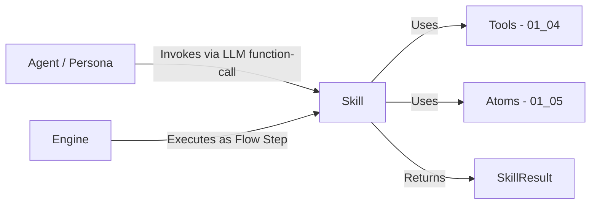

# 01_07 Skills and Personas Specification

> **Status**: DRAFT (v2 — Revised per Industry Audit)
> **Owner**: Architecture Team
> **Context**: Defining the "Who" (Personas) and the "What" (Skills) of the Agentic System.
> **Dependencies**: 01_04 (Tooling), 01_05 (Atoms), 01_06 (LLM Binding), 01_08 (Flows)

## 1. Overview
This specification decouples the **Identity** of an agent from its **Capabilities**.

*   **Persona**: Defines *who* the agent is (Role, Tone, Priorities, Ethics). It is the "Soft Configuration" of the LLM.
*   **Skill**: Defines *what* the agent can do. It is a portable, versioned, single-responsibility unit of capability.

**LLM Agnosticism**:
Both Personas and Skills are defined in standard JSON/YAML. They are **projected** onto the specific LLM (Gemini, OpenAI, etc.) at runtime via the `LLMGateway` (01_06). The Core Engine handles the translation of a Skill's JSON Schema parameters into the specific function-calling format of the provider.

**Design Principles** (aligned with Anthropic, Google ADK, OpenAI convergent patterns):
1.  **JSON Schema for parameters** — All Skill inputs use strict JSON Schema.
2.  **Strict schema validation** — Input conformance is enforced before execution.
3.  **Agent-as-a-Tool** — Skills can expose themselves as LLM-callable tools.
4.  **Versioned definitions** — Every Skill and Persona carries a version identifier.
5.  **Consistent result type** — All Skills return a `SkillResult` with `status`, `exports`, `error`.
6.  **Single responsibility** — One Skill = one capability. Composition belongs in Flows (01_08).
7.  **Explicit registry** — Skills and Personas are whitelisted; unregistered items do not exist.

---

## 2. Personas ("The Who")

A Persona is a named, **versioned** configuration that applies a specific **Lens** to the LLM's reasoning.

### 2.1 Schema (`expert_personas.json`)

Located at: `src/flow/config/expert_personas.json`

```json
{
  "schema_version": "1",
  "personas": {
    "Senior Backend Developer": {
      "version": "1",
      "Description": "Expert in Python/clean code.",
      "SystemPrompt": "You are a Senior Backend Developer. Prioritize SOLID principles, error handling, and performance.",
      "Focus": ["Code Quality", "Maintainability"],
      "AllowedSkills": ["refactor_code", "write_unit_tests", "debug_error"],
      "AllowedTools": ["read_file", "search_file", "run_test", "git_commits"],
      "Checklist": [
        "Are all inputs validated?",
        "Is the cyclomatic complexity under control?"
      ],
      "model_params": {
        "temperature": 0.2,
        "top_p": 0.9,
        "top_k": 40
      }
    }
  }
}
```

### 2.2 Schema Fields

| Field | Type | Required | Description |
|:---|:---|:---|:---|
| `version` | `string` | ✅ | Persona definition version. Incremented on breaking changes. |
| `Description` | `string` | ✅ | Human-readable role summary. |
| `SystemPrompt` | `string` | ✅ | Injected as the LLM's system message. |
| `Focus` | `List[str]` | ✅ | Expertise areas for context (advisory, not enforced). |
| `AllowedSkills` | `List[str]` | ✅ | **Whitelist** of Skill names this Persona can invoke. Empty list `[]` is valid — means no Skills, tools-only agent. |
| `AllowedTools` | `List[str]` | ✅ | **Whitelist** of low-level Tool names (01_04). Empty list `[]` is valid. |
| `Checklist` | `List[str]` | ❌ | Post-execution validation prompts. Empty list or omitted = no checklist. |
| `model_params` | `object` | ❌ | LLM parameter overrides. See §2.4. |

### 2.3 Startup Validation

When the Engine loads `expert_personas.json` at startup, it MUST:

1.  **Validate `schema_version`**: If the file's `schema_version` does not match the Engine's expected version, raise `SchemaVersionError` with: `"Persona file version '2' is not supported by this Engine (expected '1'). Update the file or downgrade the Engine."`
2.  **Validate `AllowedSkills`**: Every skill name in `AllowedSkills` MUST exist in the Skill Registry (§5). If a referenced skill is not registered, raise `RegistryError` at startup with: `"Persona 'Senior Backend Developer' references unknown skill 'security_audit'. Register it in skills.registry.json or remove it from AllowedSkills."`
3.  **Validate `AllowedTools`**: Every tool name in `AllowedTools` MUST exist in the Tool Registry (01_04). Same fail-fast rule.
4.  **Tool count warning**: If `len(AllowedSkills) + len(AllowedTools) > 20`, log a `WARNING`: `"Persona 'X' exposes 25 tools to the LLM. Provider accuracy degrades above 20 tools. Consider using dynamic tool filtering."` (Based on OpenAI's recommendation.)

### 2.4 Model Parameter Override Chain

The `model_params` field allows per-persona LLM parameter overrides. The full override chain (last wins):

```
Provider Default → Profile Config (01_06 §4.3) → Persona model_params → Expert Set → Flow Step args → AgentAtom kwargs
```

**Merge strategy**: Shallow merge (key-level replace, not deep merge). If Persona sets `temperature: 0.2` and Expert Set sets `temperature: 0.0`, the Expert Set value wins.

Analytical roles (QA, SRE, Quant) should use low temperature (0.0–0.2) for precision; creative roles (UI/UX, Product) can use higher (0.4–0.7). See [Agent Isolation Analysis §10](../analysis/agent_isolation.md) for full guidelines.

### 2.5 Checklist Lifecycle

When a Persona has a non-empty `Checklist`:

1.  The Engine injects the checklist items into the LLM's **system prompt** as mandatory self-validation steps.
2.  The checklist is **advisory** in V1 — the LLM is instructed to evaluate each item, but the Engine does not enforce pass/fail programmatically.
3.  [FUTURE V2]: Machine-verifiable checklists using rubric-based scoring (see `agent_isolation.md` §9).

### 2.6 Usage

When a Flow Step requires an "Expert", the Engine:
1.  Loads the Persona definition from the registry.
2.  Injects the `SystemPrompt` into the LLM context.
3.  Injects the `Checklist` as a mandatory self-validation step (§2.5).
4.  **Tool Projection**: Combines `AllowedSkills` (projected as high-level tools) + `AllowedTools` (low-level tools) into the LLM's toolset via the `LLMGateway`.

---

## 3. Toolset Primitives (from `01_04_tooling_spec.md`)

Skills are composed of (or orchestrate) these fundamental primitives. A Persona can also access them directly.

### 3.1 The Standard Library
*   **FileTool**: `read_file`, `write_file`, `edit_file` (Loom), `search_file`, `list_files`.
*   **ShellTool**: `run_test`, `run_lint`, `git_status`, `git_start_task` (Flow Manager Wrapper), `git_commit`.
*   **KnowledgeTool**: `search_knowledge` (RAG), `find_usage`, `get_task_context`.
*   **SystemTool** (SRE Only): `install_package`, `system_ctl`.

---

## 4. Skills ("The What")

A Skill is a **portable, versioned, single-responsibility** unit of capability. It bridges the gap between high-level intent and low-level **Atoms** (01_05).

### 4.1 Architecture



**Calling Model** (resolves the ambiguity):
*   **Path 1 — Engine Step**: The Flow Engine executes a Skill directly as a step (`"type": "skill"` in 01_08 §2.1). The Engine instantiates the Skill, calls `execute()`, and processes the `SkillResult`.
*   **Path 2 — LLM Function-Call**: The `AgentAtom` (01_05 §3) exposes Skills as callable tools to the LLM via `Skill.as_tool()`. When the LLM decides to invoke a Skill, the AgentAtom intercepts the function call, executes `Skill.execute()`, and returns the result to the LLM as a tool response.
*   Both paths use the **same `execute()` method** and return the **same `SkillResult` type**.

### 4.2 The `SkillResult` Type

All Skills MUST return a `SkillResult`. This is the standard contract between Skills and their callers (Engine or AgentAtom).

```python
from dataclasses import dataclass, field
from enum import Enum
from typing import Any, Dict, Optional

class SkillStatus(Enum):
    SUCCESS = "SUCCESS"
    FAILED = "FAILED"
    RETRY = "RETRY"

@dataclass
class SkillResult:
    """
    Standard return type for all Skill executions.
    
    Mirrors AtomResult (01_05 §2.2) for consistency. The Engine
    processes SkillResult and AtomResult identically in the 
    Flow execution loop.
    """
    status: SkillStatus
    exports: Dict[str, Any] = field(default_factory=dict)
    error: Optional[str] = None
    
    # Metadata for observability
    skill_name: str = ""
    skill_version: str = ""
    duration_ms: int = 0
```

**Contracts**:
*   `status=SUCCESS`: Execution completed. `exports` contains output data for downstream steps.
*   `status=FAILED`: Execution failed. `error` contains a human-readable message. `exports` MAY contain partial results.
*   `status=RETRY`: Transient failure. The Engine MAY re-execute based on Flow-level retry policy (01_08).
*   A Skill MUST NOT raise unhandled exceptions. All exceptions MUST be caught and returned as `SkillResult(status=FAILED, error=str(e))`. The Engine wraps `execute()` in a safety net identical to Atom execution (01_05 §6.1), but Skills SHOULD handle their own errors first.

### 4.3 The Standard Skill Protocol

Located at: `src/flow/skills/base.py`

Each Skill must implement a standard definition that allows any LLM to understand and use it.

```python
from abc import ABC, abstractmethod
from typing import Any, Dict, List, Optional
from flow.skills.result import SkillResult

class Skill(ABC):
    """
    Abstract Base Class for all Skills.
    
    Design Rules (Industry Convergent):
      - Single Responsibility: One Skill = one capability.
      - Stateless: No mutable instance state between invocations.
      - Verb-Noun naming: e.g., refactor_code, not code_refactorer.
      - Input validation: Validate inside execute(), not outside.
    
    Thread Safety:
      Skills MUST be stateless and therefore inherently thread-safe.
      The same Skill instance MAY be called from parallel Fan-Out 
      branches (01_03 §3.4.3). If a Skill needs scratch state during
      execution, it MUST use local variables, not instance attributes.
    """

    @property
    @abstractmethod
    def name(self) -> str:
        """Unique identifier. Verb-noun format: 'refactor_code', 'run_security_audit'.
        MUST match the key in skills.registry.json."""
        pass

    @property
    @abstractmethod
    def version(self) -> str:
        """Semantic version string: '1', '2', etc.
        Incremented when parameters schema or behavior changes."""
        pass

    @property
    @abstractmethod
    def description(self) -> str:
        """Human-readable description shown to the LLM.
        Should explain WHAT the skill does, not HOW."""
        pass

    @property
    def required_tools(self) -> List[str]:
        """Tool names (01_04) this Skill depends on.
        The Engine validates these against the Tool Registry at startup.
        Default: empty (Skill uses no tools)."""
        return []

    @property
    @abstractmethod
    def parameters_schema(self) -> Dict[str, Any]:
        """JSON Schema defining the Skill's input parameters.
        
        MUST be a valid JSON Schema object. The Engine validates this
        schema at startup. At runtime, the Engine validates incoming
        arguments against this schema BEFORE calling execute().
        
        The LLMGateway projects this schema to provider-specific formats:
          - Gemini:    genai.types.FunctionDeclaration
          - OpenAI:    tools[].function.parameters  
          - Anthropic: tools[].input_schema
          - Ollama:    Modelfile/Template format
        
        Example:
            {
                "type": "object",
                "properties": {
                    "target_file": {
                        "type": "string",
                        "description": "Path to the file to refactor"
                    },
                    "refactoring_type": {
                        "type": "string",
                        "enum": ["extract_method", "rename", "inline"]
                    }
                },
                "required": ["target_file", "refactoring_type"],
                "additionalProperties": false
            }
        """
        pass

    @property
    def strict_schema(self) -> bool:
        """If True, the LLMGateway requests strict schema conformance
        from providers that support it (e.g., Anthropic's strict: true,
        OpenAI's strict mode). This guarantees the LLM's function call
        arguments exactly match the schema — no missing fields, no 
        wrong types.
        
        Default: True. Set to False only for Skills with dynamic or
        provider-specific parameter variations."""
        return True

    @abstractmethod
    def execute(self, context: Dict[str, Any], **kwargs) -> SkillResult:
        """
        Execute the Skill's logic.
        
        Args:
            context: The Flow execution context (read-only snapshot).
                     Contains step outputs, config values, and input data.
                     Type: Dict[str, Any] — same context type as Atoms 
                     (01_05 §2.1). Skills MUST NOT mutate this dict.
            **kwargs: The validated parameters matching parameters_schema.
                      By the time execute() is called, kwargs have already
                      been validated against the JSON Schema.
        
        Returns:
            SkillResult with status, exports, and optional error.
        
        Error Contract:
            - Skills SHOULD catch their own exceptions and return
              SkillResult(status=FAILED, error=str(e)).
            - If an unhandled exception escapes execute(), the Engine
              catches it and wraps it as SkillResult(status=FAILED).
            - Skills MUST NOT raise SystemExit or KeyboardInterrupt.
        
        Idempotency:
            Skills that perform side-effects (Action Skills) SHOULD
            follow the Check-Then-Act pattern (01_05 §1.5). Before 
            writing a file, check if the expected state already exists.
        
        Timeout:
            The Engine enforces a per-step timeout (01_03 §3.2).
            If SIGTERM is received during execute(), the Engine calls
            cleanup() if defined (see below). Skills SHOULD NOT catch
            SIGTERM themselves.
        """
        pass

    def cleanup(self) -> None:
        """Optional graceful teardown hook.
        
        Called by the Engine when:
          - SIGTERM/SIGINT is received during execute()
          - The Flow is cancelled while this Skill is running
        
        Default: no-op. Override to release resources (temp files,
        network connections, partial state).
        
        MUST complete within 5 seconds. After timeout, the Engine
        force-terminates the step.
        """
        pass

    def as_tool(self) -> Dict[str, Any]:
        """Project this Skill as an LLM-callable tool definition.
        
        Returns a provider-agnostic tool descriptor that the 
        LLMGateway can translate to any provider's format.
        
        The AgentAtom (01_05 §3) uses this method to expose
        Persona-allowed Skills to the LLM during the ReAct loop.
        
        Returns:
            {
                "type": "skill_reference",
                "skill_name": self.name,
                "skill_version": self.version,
                "description": self.description,
                "parameters": self.parameters_schema,
                "strict": self.strict_schema
            }
        """
        return {
            "type": "skill_reference",
            "skill_name": self.name,
            "skill_version": self.version,
            "description": self.description,
            "parameters": self.parameters_schema,
            "strict": self.strict_schema,
        }
```

### 4.4 Skill Categories

Each Skill belongs to exactly one category. The category determines its security profile:

| Category | Side-Effects | Tool Scope | Example Skills |
|:---|:---|:---|:---|
| **Reasoning** | None (read-only) | Read-only tools | `ArchitecturalReview`, `SecurityAudit` |
| **Action** | Yes (file/git/shell) | Read + Write tools | `RefactorCode`, `GitCommit`, `FileEdit` |
| **RAG** | None (read-only) | KnowledgeTool only | `ConsultDocumentation`, `SearchCodebase` |

> [!IMPORTANT]
> **Single Responsibility Rule**: A Skill MUST do one thing. "Full Code Review" is NOT a valid Skill — it is a **Flow** (01_08) that composes `StaticAnalysis` + `SecurityAudit` + `PerformanceCheck` as sequential steps. Composition belongs in Flows, not Skills.

### 4.5 Skill Error Handling & Failure Modes

| Failure Scenario | Behavior |
|:---|:---|
| Required tool unavailable at runtime | Engine raises `RegistryError` **before** calling `execute()`. The Skill is never invoked. |
| Skill fails mid-execution (partial side-effects) | Skill returns `SkillResult(status=FAILED)`. The Engine processes the failure per the Flow's `on_failure` policy (`halt`, `retry`, `ignore` — see 01_08 §2.1). |
| Skill times out | Engine sends SIGTERM, calls `cleanup()`, then returns `SkillResult(status=FAILED, error="Timeout")`. |
| Input context is malformed / Schema Poisoning | Engine validates `**kwargs` against `parameters_schema` BEFORE calling `execute()`. Invalid inputs raise `ValueError` and are never passed to the Skill. |
| LLM hallucates a Skill name that doesn't exist | The AgentAtom checks the Persona's `AllowedSkills` whitelist. Unknown names return a tool error response to the LLM: `"Unknown skill 'X'. Available skills: [...]"`. |
| Skill instance state leak across ReAct iterations | Skills are **stateless** (§4.3). The same instance is reused, but no mutable state persists. All data flows through `context` and `kwargs`. |

---

## 5. Skill Registry

Located at: `src/flow/config/skills.registry.json`

### 5.1 Registry Schema

The Skill Registry is the **explicit whitelist** of all known Skills. It follows the same Explicit Registry principle as Atoms (01_03 §H3): **anything NOT in the registry does not exist.**

```json
{
  "schema_version": "1",
  "skills": {
    "refactor_code": {
      "version": "1",
      "module": "flow.skills.code.refactor.RefactorCodeSkill",
      "category": "action",
      "description": "Safely refactors a file using AST-aware methods.",
      "required_tools": ["read_file", "edit_file", "run_test"]
    },
    "search_codebase": {
      "version": "1",
      "module": "flow.skills.rag.search.SearchCodebaseSkill",
      "category": "rag",
      "description": "Searches the codebase using RAG and returns relevant snippets.",
      "required_tools": ["search_knowledge"]
    },
    "architectural_review": {
      "version": "2",
      "module": "flow.skills.reasoning.arch_review.ArchReviewSkill",
      "category": "reasoning",
      "description": "Reviews code architecture for SOLID violations and design smells.",
      "required_tools": ["read_file", "search_file"]
    }
  }
}
```

### 5.2 Registry Startup Validation

When the Engine starts, it MUST:

1.  **Load and validate** `skills.registry.json` against the expected `schema_version`.
2.  **Import each module**: Verify the Python class exists and is a subclass of `Skill`.
3.  **Cross-validate metadata**: The class's `name`, `version`, `description`, and `required_tools` MUST match the registry entry. Mismatches raise `RegistryError`.
4.  **Validate `parameters_schema`**: Each Skill's `parameters_schema` MUST be a valid JSON Schema. The Engine validates using `jsonschema.Draft7Validator.check_schema()`.
5.  **Check for name collisions**: If two registry entries share the same key, raise `RegistryError`: `"Duplicate skill name 'refactor_code' in registry."`
6.  **Validate tool dependencies**: Every tool in `required_tools` MUST exist in the Tool Registry (01_04). Missing tools raise `RegistryError` at startup — not at runtime.

### 5.3 Skill Discovery

Skills are **NOT auto-discovered**. There is no directory scanning, no plugin loading, no dynamic imports from user directories. This is a deliberate security decision:

*   Auto-discovery would allow arbitrary code execution by dropping a `.py` file.
*   The Explicit Registry (01_03 §H3) is the only entry point.
*   New Skills are added by: (1) writing the Skill class, (2) adding an entry to `skills.registry.json`, (3) restarting the Engine.

> [!WARNING]
> **No Hot-Reload in V1**: Changes to `skills.registry.json` or `expert_personas.json` require an Engine restart. This is consistent with 01_06 §5.2 (config changes require restart). Hot-reload is a [FUTURE V2] feature.

---

## 6. Agnostic Binding Strategy (LLM Projection)

The Flow Manager uses the `LLMGateway` (01_06) to translate Skill definitions into the provider's native format.

### 6.1 Projection Pipeline

**Scenario**: A "Backend Developer" Persona invokes the `refactor_code` Skill.

1.  **Gemini**: Gateway converts `Skill.parameters_schema` → `genai.types.FunctionDeclaration`. Maps `strict_schema=True` to declaration-level validation.
2.  **OpenAI**: Gateway converts `Skill.parameters_schema` → JSON Schema `tools[].function.parameters` format. Maps `strict_schema=True` to `strict: true`.
3.  **Anthropic**: Gateway converts `Skill.parameters_schema` → Claude `tools[].input_schema` format. Maps `strict_schema=True` to `strict: true`.
4.  **Ollama**: Gateway converts `Skill.parameters_schema` → Modelfile/Template format. `strict_schema` is ignored (Ollama does not support strict mode).

**Result**: The Skill code is written ONCE (in Python). The LLM interaction is handled dynamically by the Gateway.

### 6.2 Projection Failure Handling

If the `parameters_schema` uses a JSON Schema feature not supported by the target provider (e.g., `oneOf`, `anyOf` on Ollama):

*   The Gateway MUST raise `ProviderProjectionError` with: `"Skill 'refactor_code' uses 'oneOf' in its schema, which is not supported by provider 'ollama'. Simplify the schema or use a different provider."`
*   This error is **non-retryable** and propagates as `SkillResult(status=FAILED)`.

### 6.3 Tool Budget

When constructing the LLM's toolset from a Persona's `AllowedSkills` + `AllowedTools`:

*   The Engine SHOULD limit the total tool count to **20 or fewer** for optimal LLM accuracy (OpenAI recommendation).
*   If the combined count exceeds 20, the Engine SHOULD log a warning (§2.3 point 4).
*   [FUTURE V2]: Dynamic tool filtering — the Engine selects a subset of tools contextually relevant to the current step, using semantic matching against the step's description.

---

## 7. Implementation Roadmap

1.  **Registry**: Create `src/flow/skills/` to house the `Skill` ABC, `SkillResult`, and standard skill classes. Create `src/flow/config/skills.registry.json`.
2.  **Validation**: Implement startup validation for both `skills.registry.json` and `expert_personas.json` (§2.3, §5.2).
3.  **Projection**: Update `LLMGateway` to accept `Skill.as_tool()` descriptors and generate provider-specific tool definitions.
4.  **Integration**: Wire the AgentAtom (01_05 §3) to project Persona-allowed Skills via `as_tool()` during the ReAct loop.
5.  **Migration**: Move legacy "Checklists" from old `expert_personas.json` into the new versioned Persona Schema.

---

## 8. Known Limitations & Future Work

> [!NOTE]
> The following capabilities are explicitly **out of scope for V1**. They are documented here to prevent ad-hoc workarounds and to guide future revisions.

### 8.1 [FUTURE] Expert Set Integration
The `agent_isolation.md` analysis (§3.3–3.4) defines a richer Expert Set concept with stage-specific success criteria, complexity tiers, synthesis strategies, and adversarial review phases. V1 uses the simpler Persona model defined here. A future revision should unify Personas and Expert Sets into a single schema.

### 8.2 [FUTURE] Skill Composition
A Skill that coordinates other Skills (e.g., `FullCodeReview` = `StaticAnalysis` + `SecurityAudit` + `PerformanceCheck`). This creates a mini-orchestration layer inside Skills, duplicating the Flow Engine's purpose. V1 Skills are flat. Composition belongs in Flows (01_08).

### 8.3 [FUTURE] Dynamic Skill Loading via Plugin System
Let users drop `.py` files into a `skills/` directory for auto-discovery. This violates the Explicit Registry principle (01_03 §H3) and introduces security risks. V1 requires manual registry entries.

### 8.4 [FUTURE] Machine-Verifiable Checklists
V1 checklists are advisory (§2.5). V2 could implement rubric-based scoring (see `agent_isolation.md` §9) where each checklist item maps to a machine-verifiable assertion with a numeric score.

### 8.5 [FUTURE] Dynamic Tool Filtering
When Personas have > 20 tools, automatically select a contextually relevant subset per step. Requires semantic matching infrastructure.

### 8.6 [FUTURE] Hot-Reload
Live config reloading for Persona/Skill definitions without Engine restart. Adds concurrency complexity (in-flight Skills may reference stale definitions).
