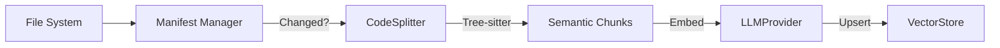

# 01_09 RAG Specification

> **Status**: DRAFT
> **Owner**: Architecture Team
> **Context**: The "brain" of the Flow Manager – semantic ingestion and retrieval.

## 1. Overview
The **Contextual Knowledge System (RAG)** enables the Agent to have "System 2" memory. It indexes the codebase and documentation to provide semantic context for every decision.

**Key Capabilities:**
1.  **Structure-Aware Ingestion**: Parsing code into semantic chunks (Classes/Functions) using Tree-sitter.
2.  **Evolution Tracking**: Only re-indexing files that have changed (Manifest-based).
3.  **Model Agnostic**: Supporting any embedding/generation provider via `LLMFactory`.
4.  **Local First**: Defaulting to `ChromaDB` for privacy and speed.

---

## 2. Ingestion Pipeline



### 2.1 Manifest Manager (`.flow/rag_manifest.json`)
Tracks the state of the codebase to prevent redundant work.
*   **Key**: File Path (relative to root).
*   **Value**: SHA256 Hash of content.
*   **Logic**:
    *   If `Hash(Current) != Hash(Manifest)`, trigger Ingestion.
    *   If `File` missing in Current but present in Manifest, trigger Deletion.

### 2.2 Semantic Chunking (`CodeSplitter`)
We do **not** use naive character splitting.
*   **Python/JS**: Use `tree-sitter` to identify function/class boundaries.
*   **Markdown**: Split by Header hierarchy (#, ##, ###).
*   **Chunk Metadata**:
    *   `source`: File path.
    *   `type`: "function", "class", "docs".
    *   `name`: "MyClass.my_method".

---

## 3. Operational Strategy

### 3.1 Incremental Indexing & Cold Start
To ensure fast boot times:
1.  **Manifest**: System maintains `.flow/rag_manifest.json` mapping `file_path -> sha256_hash`.
2.  **Cold Start Mitigation**:
    *   Base Docker images ship with **Pre-Computed Indexes** for standard libraries and stable core modules.
    *   Only the *delta* (current project changes) needs to be indexed on startup.
3.  **Delta Indexing**: Only files with changed hashes are re-embedded and upserted to Vector DB.
4.  **Bootstrap**: If no manifest exists (fresh clone), a full background index is triggered.

---

## 4. Retrieval Architecture

### 3.1 Query Processing
1.  **Input**: User Query ("How does the atom lifecycle work?").
2.  **Expansion**: (Optional) LLM expands query into search terms.
3.  **Embedding**: `LLMProvider.embed(query)`.

### 3.2 Vector Search (`ChromaVectorStore`)
*   **Collection**: `knowledge_base`.
*   **Metric**: Cosine Similarity.
*   **Top-K**: Configurable (Default: 5).

### 3.3 Reranking (Future)
*   Cross-encoder step to filter irrelevant chunks before synthesis.

---

## 4. Interfaces

### 4.1 `IngestionEngine`
```python
class IngestionEngine:
    def sync(self, target_dir: Path) -> IngestionReport:
        """
        Scans directory, checks manifest, updates VectorStore.
        Returns report of added/removed/skipped files.
        """
```

### 4.2 `KnowledgeService`
```python
class KnowledgeService:
    def ask(self, query: str, profile: str = "default") -> str:
        """
        End-to-end RAG pipeline:
        1. Embed Query
        2. Retrieve Context
        3. Synthesize Answer using LLM Profile
        """
```

---

## 5. Configuration

All RAG settings live in `flow_config.json`:

```json
"knowledge": {
  "embedding_provider": "gemini",
  "embedding_model": "models/embedding-001",
  "chunk_size": 1024,
  "manifest_path": ".flow/rag_manifest.json",
  "profiles": { ... }
}
```
