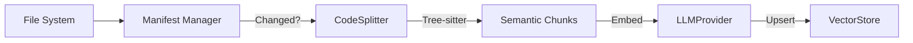

# 01_09 RAG Specification

> **Status**: DRAFT
> **Owner**: Architecture Team
> **Context**: The "brain" of the Flow Manager – semantic ingestion and retrieval.

## 1. Overview
The **Contextual Knowledge System (RAG)** enables the Agent to have "System 2" memory. It indexes the codebase and documentation to provide semantic context for every decision.

**Key Capabilities:**
1.  **Structure-Aware Ingestion**: Parsing code into semantic chunks (Classes/Functions) using Tree-sitter.
2.  **Evolution Tracking**: Only re-indexing files that have changed (Manifest-based).
3.  **Model Agnostic**: Supporting any embedding/generation provider via `LLMFactory`.
4.  **Local First**: Defaulting to `ChromaDB` for privacy and speed.

---

## 2. Ingestion Pipeline



### 2.1 Manifest Manager (`.flow/rag_manifest.json`)
Tracks the state of the codebase to prevent redundant work.
*   **Key**: File Path (relative to root).
*   **Value**: SHA256 Hash of content.
*   **Logic**:
    *   If `Hash(Current) != Hash(Manifest)`, trigger Ingestion.
    *   If `File` missing in Current but present in Manifest, trigger Deletion.

### 2.2 Semantic Chunking (`CodeSplitter`)
We do **not** use naive character splitting.
*   **Python/JS**: Use `tree-sitter` to identify function/class boundaries.
*   **Markdown**: Split by Header hierarchy (#, ##, ###).
*   **Chunk Metadata**:
    *   `source`: File path.
    *   `type`: "function", "class", "docs".
    *   `name`: "MyClass.my_method".

---

## 3. Operational Strategy

### 3.1 Incremental Indexing & Cold Start
To ensure fast boot times:
1.  **Manifest**: System maintains `.flow/rag_manifest.json` mapping `file_path -> sha256_hash`.
2.  **Cold Start Mitigation**:
    *   Base Docker images ship with **Pre-Computed Indexes** for standard libraries and stable core modules.
    *   Only the *delta* (current project changes) needs to be indexed on startup.
3.  **Delta Indexing**: Only files with changed hashes are re-embedded and upserted to Vector DB.
4.  **Bootstrap**: If no manifest exists (fresh clone), a full background index is triggered.

---

## 4. Retrieval Architecture

### 3.1 Query Processing
1.  **Input**: User Query ("How does the atom lifecycle work?").
2.  **Expansion**: (Optional) LLM expands query into search terms.
3.  **Embedding**: `LLMProvider.embed(query)`.

### 3.2 Vector Search (`ChromaVectorStore`)
*   **Collection**: `knowledge_base`.
*   **Metric**: Cosine Similarity.
*   **Top-K**: Configurable (Default: 5).

### 3.3 Reranking (Future)
*   Cross-encoder step to filter irrelevant chunks before synthesis.

---

## 4. Interfaces

### 4.1 `IngestionEngine`
```python
class IngestionEngine:
    def sync(self, target_dir: Path) -> IngestionReport:
        """
        Scans directory, checks manifest, updates VectorStore.
        Returns report of added/removed/skipped files.
        """
```

### 4.2 `KnowledgeService`
```python
class KnowledgeService:
    def ask(self, query: str, profile: str = "default") -> str:
        """
        End-to-end RAG pipeline:
        1. Embed Query
        2. Retrieve Context
        3. Synthesize Answer using LLM Profile
        """
```

---

## 5. Configuration

All RAG settings live in `flow_config.json`:

```json
"knowledge": {
  "embedding_provider": "gemini",
  "embedding_model": "models/embedding-001",
  "chunk_size": 1024,
  "manifest_path": ".flow/rag_manifest.json",
  "profiles": { ... },
  "retrieval_budget": {
    "max_chunks": 10,
    "max_tokens": 4096,
    "max_symbols": 20,
    "radius": "module"
  },
  "schema_version": "0.2"
}
```

---

## 6. Symbol-Level Manifest (Enhanced)

> **Status**: Core Requirement — Extends §2.1 with finer-grained tracking.
> **Related**: [01_11_validation_gate_spec.md](01_11_validation_gate_spec.md), [RAG Analysis §7](../analysis/rag_analysis.md)

### 6.1 Evolution from File-Level to Symbol-Level Hashing
The baseline manifest (§2.1) tracks changes at the **file** level. This causes over-indexing: a private variable rename inside a function body triggers a full re-embed, even though no public API changed.

**Enhanced manifest schema:**
```json
{
  "schema_version": "0.2",
  "generated_at": "2026-03-01T12:00:00Z",
  "files": {
    "src/flow/domain/parser.py": {
      "file_hash": "sha256(file_content)",
      "symbols": [
        {
          "name": "StatusParser.load",
          "kind": "method",
          "signature_hash": "sha256(normalized_signature)",
          "implementation_hash": "sha256(method_body)",
          "visibility": "public"
        }
      ]
    }
  }
}
```

### 6.2 Three-Level Hashing
| Level | Hash Source | RAG Action on Change |
|:---|:---|:---|
| **L1: Implementation** | Method body | No re-embed; may trigger test re-run |
| **L2: Signature** | Name + params + return type + visibility | Re-embed; alert consumers |
| **L3: Contract** | Public interface surface | Breaking change notification |

### 6.3 Content-Addressable Rename Detection
*   **Symbol ID**: `hash(fully_qualified_name + normalized_signature)`
*   If a file is renamed but symbol IDs remain unchanged, the manifest performs a **MOVE** (metadata update), NOT a re-embed.
*   If a symbol's signature changes, it is treated as a **DELETE + ADD** to maintain index accuracy.

---

## 7. Retrieval Budget

### 7.1 The Token Explosion Problem
In large codebases, RAG retrieval can overwhelm the agent's context window, reducing reasoning quality.

### 7.2 Budget Enforcement
*   **Top-K Hard Cap** (`max_chunks`): Never return more than this many results.
*   **Token Ceiling** (`max_tokens`): If the total retrieved content exceeds this, drop the lowest-relevance chunks.
*   **Retrieval Radius** (`radius`): Limit search to `module`, `package`, or `project` scope.
*   **Summary Fallback**: If raw code exceeds the token budget, replace with the L2 (signature) summary instead.

---

## 8. Integration with Validation Gate

> See [01_11_validation_gate_spec.md](01_11_validation_gate_spec.md) for full specification.

The RAG system and the Validation Gate share the **Symbol Index** (`.machine-doc/`):
*   **RAG** uses the index for **retrieval** — finding relevant code to inject into agent context.
*   **Validation Gate** uses the index for **validation** — checking that agent output references real, accessible symbols.

### 8.1 Write-Then-Index Loop
```
Agent generates code
  → Validation Gate checks code against index → PASS/FAIL
  → If PASS: LoomAtom writes the file
  → SymbolExtractor re-parses the written file
  → IndexManager updates .machine-doc/ atomically
  → RAG re-embeds only if L2/L3 hashes changed
```

---

## 9. Interfaces (Extended)

### 9.1 `IngestionEngine`
```python
class IngestionEngine:
    def sync(self, target_dir: Path) -> IngestionReport:
        """
        Scans directory, checks manifest, updates VectorStore.
        Returns report of added/removed/skipped files.
        """
```

### 9.2 `KnowledgeService`
```python
class KnowledgeService:
    def ask(self, query: str, profile: str = "default",
            agent_scope: AgentScope = None) -> str:
        """
        End-to-end RAG pipeline:
        1. Embed Query
        2. Retrieve Context (respecting retrieval budget AND agent_scope)
        3. Synthesize Answer using LLM Profile

        agent_scope: If provided, filters retrieval based on the agent's
        access tier (internal/contract/architectural). See §10.
        """
```

---

## 10. Agent Scope & Tiered Access

> **Full design**: See [RAG Analysis §13](../analysis/rag_analysis.md)

When agents query the knowledge system, their retrieval must be scoped to prevent cross-service contract violations:

| Tier | Scope | Sees |
|:---|:---|:---|
| **Internal** | Own service | All symbols (public, protected, private) |
| **Contract** | Other services | Public API only (proto, OpenAPI, Kafka schemas) |
| **Architectural** | System-wide | Service topology, event schemas, data flow |

**Metadata filtering**: All symbols carry a `namespace` (owning service) and `visibility` field. The `KnowledgeService` applies metadata filters based on `agent_scope` before returning results.

### 9.3 `SymbolExtractor` (NEW)
```python
class SymbolExtractor:
    def extract(self, file_path: Path, language: str) -> List[Symbol]:
        """
        Uses Tree-sitter/ast to extract all symbols from a file.
        Returns normalized Symbol objects with L1/L2/L3 hashes.
        """
```

